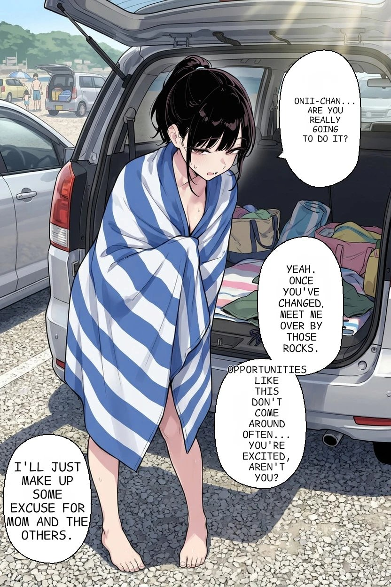
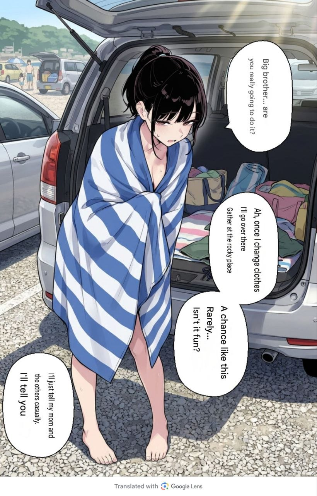
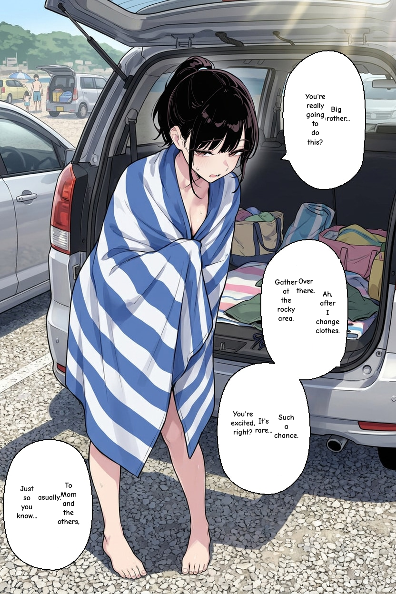

# Translation Pipeline Analysis — Improvement Opportunities

## Executive Summary

Comparing the 6 sample files for the same manga page reveals **significant quality gaps** between the system's auto-translation and the human reference. The issues span **OCR accuracy → LLM prompt quality → context assembly → typesetting**, and most are addressable with targeted code changes rather than fundamental architecture rewrites.

---

## Sample Comparison

### Original (Japanese)


[Source](https://x.com/karlinamaulidia/status/2065805669211734105)
<!-- slide -->
### Human Translation (Reference)



[Source](https://x.com/feiyang394992/status/2066095206429237264)
<!-- slide -->
### Google Translate (Baseline)


<!-- slide -->
### System Auto-Typeset


<!-- slide -->
### System Manual-Typeset


<!-- slide -->
### PP-OCRv5 Detection Demo


---

## Bubble-by-Bubble Translation Comparison

| #   | Japanese Original                       | Human TL                                                                         | Google TL                                                                | System Auto-TL                                                                            | Issues                                                                                                        |
| --- | --------------------------------------- | -------------------------------------------------------------------------------- | ------------------------------------------------------------------------ | ----------------------------------------------------------------------------------------- | ------------------------------------------------------------------------------------------------------------- |
| 1   | お兄ちゃん…本当にやるの？               | "Onii-chan... Are you really going to do it?"                                    | "Big brother... are you really going to do it?"                          | "Big brother... You're really going to do this?"                                          | ✅ Acceptable — wording differs but meaning is correct                                                         |
| 2   | ああ、着替えたら向こうの岩場に集合な    | "Yeah. Once you've changed, meet me over by those rocks."                        | "Ah, once I change clothes I'll go over there Gather at the rocky place" | "GatherOver at here. Ah, after I change clothes. / Gather at the rocky area."             | ⚠️ **Fragmented rendering** — two separate OCR regions merged poorly. "GatherOver" is a concatenation artifact |
| 3   | こんなチャンスめったに無い…楽しみだろ？ | "Opportunities like this don't come around often... You're excited, aren't you?" | "A chance like this Rarely... Isn't it fun?"                             | "You're excited, It's rare... Such a chance."                                             | ⚠️ Meaning inverted — the speaker is asking the listener, not stating. Also fragmented rendering               |
| 4   | 母さん達にはテキトーに言っとくから      | "I'll just make up some excuse for Mom and the others."                          | "I'll just tell my mom and the others casually, I'll tell you"           | "Just so you know... To Mom and the others, casually" / "To casually Mom and the others," | ❌ **Badly fragmented** — Google noise "I'll tell you" leaks in. System version reads like word salad          |

---

## 🔴 Issue 1: LLM Prompt Quality (Highest Impact)

### Current State

The batch translation prompt in [translation.py:886-918](file://./unified-workers/worker/services/translation.py#L886-L918) sends a flat list of bubbles with `panel` and `bubble` order numbers but:

```json
{
  "id": "some-uuid",
  "panel": 1,
  "bubble": 2,
  "speaker": null,    // ← Always null — never populated
  "text": "ああ、着替えたら向こうの岩場に集合な"
}
```

### Problems

1. **`speaker` is always `null`** — The field exists but is never populated. The LLM has no way to distinguish who is speaking. In this sample, there are two speakers (older brother + younger sister) and the tone/register differ significantly.

2. **No `regionType` in the prompt** — Layout analysis classifies regions as `speech`, `narration`, `sfx`, `caption`, `sign` (in [layout.py:30-100](file://./unified-workers/worker/services/layout.py#L30-L100)), but this classification is **never passed to the LLM**. Narration boxes should be translated differently from speech bubbles.

3. **No `conversationId` grouping in the prompt** — Conversations are grouped and used for chunking ([layout.py:230-262](file://./unified-workers/worker/services/layout.py#L230-L262)), but the LLM never sees which bubbles form a dialogue exchange. The checklist confirms this: *"Group regions by conversation/scene and translate cohesive dialogue blocks rather than a flat list of text bubbles"* (item 13).

4. **No spatial/visual hints** — The LLM doesn't know bubble size, position, or visual relationship to other bubbles. For the problematic bubble 2, spatial context would tell the LLM that "ああ、着替えたら" and "向こうの岩場に集合な" are part of the same speech balloon.

### Proposed Improvements

```diff
 bubbles_input.append({
     "id": r["id"],
     "panel": r.get("panelReadingOrder") or 0,
     "bubble": r.get("bubbleReadingOrder") or 0,
-    "speaker": None,
+    "speaker": r.get("speakerLabel") or None,
+    "regionType": r.get("regionType") or "speech",
+    "conversationGroup": r.get("conversationId") or None,
     "text": r["text"],
 })
```

Additionally, the system prompt should be enhanced with:

- Explicit instructions to treat connected bubbles within the same conversation as a single speaker turn
- Region type handling instructions (e.g., "SFX regions: transliterate or provide English sound effect")
- Speaker inference from context clues (honorifics like お兄ちゃん = little sister speaking to older brother)

---

## 🔴 Issue 2: OCR Region Fragmentation

### Current State

The PP-OCRv5 demo image shows that OCR correctly detects individual text lines within a speech bubble, but the system treats each line as a separate region rather than merging lines that belong to the same physical balloon.

For bubble 2 (「ああ、着替えたら向こうの岩場に集合な」), PP-OCRv5 detects:

- Region A: "ああ 着替えたら"
- Region B: "向こうの"  
- Region C: "岩場に集合な"

These should be **merged into a single region** before translation, as they are a single speech bubble with continuous text.

### Root Cause

The OCR handler ([ocr.py handler](file://./unified-workers/worker/handlers/ocr.py)) assigns each OCR detection line to a panel but doesn't merge adjacent lines within the same bubble boundary. The `conversation_grouping` in layout analysis partially addresses this by proximity heuristics, but the actual **text concatenation** doesn't happen — each line goes to the LLM as a separate bubble.

### Proposed Fix

Add a **bubble-merge pass** between OCR detection and translation:

1. After assigning regions to panels, cluster nearby regions that likely share the same speech balloon (overlapping or adjacent bounding boxes with small gap)
2. Merge their text in reading order
3. Use the convex hull of merged regions as the new bounding box
4. This would reduce the number of translation items and dramatically improve context continuity

---

## 🟡 Issue 3: Narrative Context Pipe (Partially Implemented)

### Current State

The backend's [getImageInfo](file://./backend/src/main/java/com/manga/library/controller/InternalJobController.java#L29-L121) correctly assembles:

- ✅ Series metadata (title, language, metadataJson)
- ✅ Previous page text (translated text from prior page regions)
- ✅ Previous chapter summary (`summaryJson`)

And [build_context_string](file://./unified-workers/worker/services/translation.py#L1185-L1214) formats this into a prompt prefix.

### Gaps

1. **Chapter summary generation is TODO** (checklist item 21) — so `chapterSummary` is always null in practice
2. **Character memory system is TODO** (checklist item 22) — so character rosters are empty unless manually populated in `series.metadata_json`
3. **Previous page text uses `|` pipe separator** without reading-order context — the LLM gets "line1 | line2 | line3" which doesn't convey dialogue flow
4. **No detection of which character speaks which bubble** — even with character rosters, there's no speaker-assignment pipeline

### Quick Win

Even without items 21/22, the `metadataJson` field on the series can be used as an **editorial style guide**. If the user populates it with character names, pronouns, and relationship context (e.g., "younger sister calls older brother お兄ちゃん"), the LLM prompt already includes it. This should be better documented and surfaced in the UI.

---

## 🟡 Issue 4: Typesetting Quality

### Current State

Comparing auto-typeset vs manual-typeset exports reveals:

| Problem                | Auto                               | Manual                  |
| ---------------------- | ---------------------------------- | ----------------------- |
| Text orientation       | Horizontal (forced LTR)            | Horizontal (forced LTR) |
| Word breaks            | "GatherOver" — no space            | Fixed manually          |
| Font sizing            | Too small in some bubbles          | Manually adjusted       |
| Text centering         | Vertically off-center              | Manually fixed          |
| Multi-region rendering | Each region rendered independently | Merged by editor        |

### Root Causes

1. **[fitText.ts](file://./frontend/src/utils/fitText.ts)** only does word-level wrapping with space splitting — this fails for text without spaces (common in Japanese→English translations that produce long compound words like "GatherOver")
2. The minimum font size floor is 10px — but for small bubbles this still overflows
3. No contour-aware wrapping (identified in checklist as future work item #2 in the AI Typesetting Roadmap)
4. Font family is always the same — no region-type-aware font selection (checklist roadmap item #1)

### Quick Win

Add character-level word-break as a fallback when word-level wrapping overflows:

```typescript
// In fitText.ts wrapText function — fallback for non-spaced text
if (words.length === 1 && ctx.measureText(words[0]).width > maxWidth) {
  // Character-level wrapping for long single words
  let currentLine = '';
  for (const char of words[0]) {
    const testLine = currentLine + char;
    if (ctx.measureText(testLine).width > maxWidth && currentLine) {
      resultLines.push(currentLine);
      currentLine = char;
    } else {
      currentLine = testLine;
    }
  }
  if (currentLine) resultLines.push(currentLine);
}
```

---

## 🟡 Issue 5: Translation Validation Too Permissive

### Current State

[is_valid_translation](file://./unified-workers/worker/services/translation.py#L53-L99) checks:

- ✅ Empty
- ✅ Boilerplate phrases
- ✅ Identical to source (for Japanese)
- ✅ Pathologically long (only for short source text)

### Missing Checks

1. **No length ratio check for normal-length text** — A 4-character Japanese phrase translating to 200 English characters is suspicious
2. **No semantic coherence check** — "GatherOver at here" passes validation even though it's grammatically broken
3. **No duplicate detection** — If the same translation appears for multiple different source texts, something went wrong
4. **No check for source language leaking into translation** — Japanese characters in an "English" translation should be flagged

### Proposed Addition

```python
# Check for untranslated Japanese/CJK in English translation
if contains_japanese(translated_stripped) and not contains_japanese(source_stripped[:3]):
    # Translation contains CJK when source starts with CJK → partial translation
    cjk_ratio = len(re.findall(r'[\u3040-\u9FFF]', translated_stripped)) / len(translated_stripped)
    if cjk_ratio > 0.3:
        return False
```

---

## 🟢 Issue 6: VLM Vision Pass Underutilized

### Current State

The VLM vision pass in [translate_vlm_vision](file://./unified-workers/worker/services/translation.py#L1032-L1137) sends the page image + OCR regions to a VLM, which is the **highest-quality translation tier**. However:

1. It's **opt-in** (`USE_VLM_TRANSLATION=true` env var, off by default)
2. The VLM prompt doesn't instruct the model to use visual context for **speaker identification** — the VLM can literally see who is speaking each bubble but the prompt doesn't ask for this
3. **No VLM-assisted OCR correction** — the VLM sees the original text but the prompt doesn't ask it to verify/correct OCR errors before translating

### Enhancement

Add to the VLM prompt:

```
Before translating, verify each OCR region's text against the visible text in the image.
If the OCR text appears incorrect, use the text you see in the image instead.
For each bubble, identify the speaker based on visual context (speech bubble tails, 
character positions, expressions).
```

---

## Prioritized Improvement Roadmap

| Priority | Improvement                                                                              | Impact                                     | Effort  | Files                                                                                           |
| -------- | ---------------------------------------------------------------------------------------- | ------------------------------------------ | ------- | ----------------------------------------------------------------------------------------------- |
| 🔴 P0     | **Merge OCR regions into speech balloons** before translation                            | Eliminates fragmented translations         | Medium  | [ocr handler](file://./unified-workers/worker/handlers/ocr.py), new merge utility               |
| 🔴 P0     | **Add regionType + conversationId to LLM prompt**                                        | Better context for LLM decisions           | Low     | [translation.py:870-880](file://./unified-workers/worker/services/translation.py#L870-L880)     |
| 🔴 P1     | **Enhance system prompt** with speaker inference, SFX handling, region type instructions | Significantly more natural translations    | Low     | [translation.py:33-48](file://./unified-workers/worker/services/translation.py#L33-L48)         |
| 🟡 P1     | **Fix character-level word wrapping** in fitText.ts                                      | Eliminates "GatherOver" concatenation bugs | Low     | [fitText.ts](file://./frontend/src/utils/fitText.ts)                                            |
| 🟡 P2     | **Enhance VLM prompt** for speaker ID + OCR verification                                 | Best-quality tier becomes much better      | Low     | [translation.py:1054-1088](file://./unified-workers/worker/services/translation.py#L1054-L1088) |
| 🟡 P2     | **Strengthen translation validation** (length ratio, CJK leak, grammar)                  | Catches bad translations before display    | Medium  | [translation.py:53-99](file://./unified-workers/worker/services/translation.py#L53-L99)         |
| 🟢 P3     | **Enable VLM by default** when API key is configured                                     | Higher baseline quality                    | Trivial | [translation handler](file://./unified-workers/worker/handlers/translation.py)                  |
| 🟢 P3     | **Region-type-aware font selection**                                                     | Professional typesetting                   | Medium  | Frontend renderer, new font mapping config                                                      |

---

## Open Questions

> [!IMPORTANT]
>
> 1. **Which improvements would you like me to implement first?** The P0 items (OCR merging + prompt enhancement) would have the most dramatic impact on translation quality.
> 2. **Is VLM vision mode being used in production?** If not, enabling and improving it may be the single highest-ROI change.
> 3. **Are there more sample pages** (especially multi-panel pages) to test conversation grouping improvements against?
