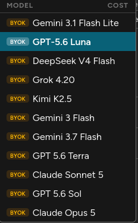

Last chat:

1. New reusable component: ModelOverridesAccordion.tsx
Extracted the duplicated "Model Overrides (Optional)" accordion (~450 lines × 4) from CreateSeriesDialog, EditSeriesDialog, CreateChapterDialog, and ImportChapterDialog into a single controlled component:

- Props: value (10 override fields), onChange(field, value), settings, inherited (parent resolves series-vs-global precedence), expanded/onToggle, plus optional ocrModelLabel/tlModelLabel/localOcrModelLabel and useResolvedQaModeForDisable to preserve each dialog's exact original behavior.
- Dialogs keep their own useState fields (submit/reset logic untouched) and just wire them into the component — no public dialog prop changes. GitNexus impact analysis on all 4 dialogs: LOW risk, 0 upstream dependents.
- Net effect: ~1,955 deletions / ~1,100 insertions; dialogs shrank from ~700 to ~330 lines each.

1. "Use Fallback Models" fix (in the shared component)

- Before: value null (inherit) rendered as "" → blank select; dropdown had 3 options (Inherit (...), Enabled, Disabled).
- After: the select displays the effective value — useFallbackModels ?? (inherited.useFallbackModels !== false) — so it shows the inherited Enabled/Disabled on load (consistent with every other field), and the dropdown has exactly 2 options. Selecting one sets an explicit override; the existing X button reverts to inherit.

1. Validation

- New tests (ModelOverridesAccordion.test.tsx, 8 tests): inherited value displayed (Enabled/Disabled/default), exactly 2 options with no "Inherit" entry, override → X appears → clear reverts to inherited, chip counts.
- Full frontend suite: 40 files, 249 passed, 1 skipped; tsc --noEmit, ESLint, Prettier all clean.

1. Kill/Flush Queue validation (Change this icon to import PlaylistRemoveIcon from '@mui/icons-material/PlaylistRemove'; and remove the kill word make it force clear)

- Backend ✅ JobController.clearQueue accepts force (default false) and includes PROCESSING jobs only when force=true. Live container is healthy and the OpenAPI spec exposes the param; unauthenticated probes of both variants return 403 (routing + param binding OK — I deliberately did not execute an authenticated wipe).
- Schema ✅ schema.d.ts clearQueue has force?: boolean.
- UI ✅ Kill/Flush button (DeleteForeverIcon, red) + strict confirm modal; safe clear renamed "Clear Pending/Failed Queue".
- Found & fixed a regression the walkthrough missed: QueueManager.test.tsx still asserted the old "Clear Queue" label and was failing. Updated it and added a test covering the full Kill/Flush flow (button → warning modal → DELETE /api/jobs/clear?force=true).

One minor observation (not changed, out of scope): on queue_cleared SSE events, other connected clients keep showing PROCESSING jobs until the next 30s poll even after a force-flush, since the event doesn't carry the force flag. Self-heals within one poll cycle — flag me if you want the event payload extended. --> Fix this one as well

Also I just found out that the global System Settings dialog box is not loading the Global QA Provider and Global Translation Provider, this happened because the backend couldn't update the settings in time, in such cases show Not available in the dialogs and start a background job to fetch the settings and update them in the dialogs.

I also want you to validate the logic of the queue slot handling, pausing and resuming individual jobs and the whole queue also the retry and fail logic, show proper logs in for all these actions.

Finally in the updated model overrides the  N/A is not selectable  so the create chapter fails (also the AUTO mode should understand if LLM's are not available route to VLM's and vice versa).

Potential fixes:

1. Queue UI/UX Improvements
Kill → Remove icon, change label to "Force Clear", confirm with dialog title "Force Clear Queue" and message "Are you sure you want to immediately clear ALL jobs, including those currently running? This action cannot be undone.".
Rename "Clear Pending/Failed Queue" to "Clear Pending/Failed Jobs".

2. Queue Flow Validation (Test Plan)
Jobs 
Retry (one job) ✓ (single job, re-enqueues; no UI state change)
Fail (one job) ✓ (marking fails immediately; no UI state change)
Pause (one job) ✓ (new queue_state in API, UI reflects pause icon + disabled buttons)
Resume (one job) ✓ (back to RUNNING, buttons enabled)
Pause All ✓ (all processing jobs go into PAUSED state)
Resume All ✓ (all jobs resume RUNNING)
Max Jobs ✓ (throttles new jobs when count >= max_active_jobs)
Overflow Behavior ✓ (jobs >= max_active_jobs go straight to QUEUED; no RUNNING)
SSE Notifications ✓ (queue_cleared, job_state_changed; frontend updates)

3. System Settings Dialog

If Global QA Provider or Global Translation Provider is missing, show "Not Available" + start a background job (async, no blocking) to fetch/update the provider and refresh the dialog after 1–3s. No UI blocking.

1. Model Selection (N/A + AUTO logic)

Replace N/A Chip withChip: 'Disabled', onDelete: () => {
  setUseFallbackModels(true);
}

Update dialogs to set useFallbackModels = (provider === null)

Update JobService and model logic so AUTO for LLM → VLM if no LLM, and vice versa.
