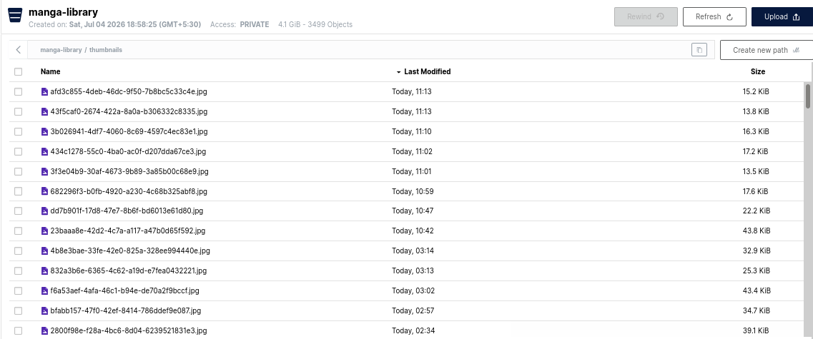

# More things I have noticed

1. We are saving the costs in a `costs.json` in data/worker/rendered_cache this adds an extra over head of reading and writing files. Stores the costs in the DB and update them regularly using the same meachime used to generate them
2. all images rendered for qa are saved to `data/worker/rendered_cache` as well this is no longer needed as we can just see them in the minio web GUI
3. The thumbnail in the bucket are still jpg 
4. No way to clean up the [old chapter exports](../examples/no-way-to-clean-up-old-chapter-exports.png)
5. The UI sucks, I don't like this transpert design, make something that uses material UI as base and the coulur scheme talked bout in previous plans, use the
   1. https://mui.com/material-ui/getting-started/
   2. https://mui.com/material-ui/material-icons
   3. Use as many pre-built components as possible with the theme providers to offload the burden of choice on them
