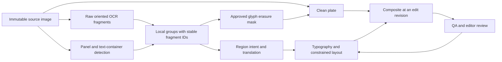

# Canvas and pipeline output quality execution plan

Status: investigation and implementation plan prepared on 2026-09-09; production overhaul **not implemented**. Start with the [investigation](output-quality-investigation.md), which contains checkout revisions, measured fixtures, current reproductions, historical observations, and validation limits. This is a sequence of small deliverable changes, not a request to rerun the entire corpus or replace every model at once.

## Objective and evidence

Preserve each text block's owner, original artwork, and composition while producing readable translated text consistently in the editor, PNG export, project archive, and worker output. Six named samples and the four-page PDF are the initial acceptance set. Torii is a useful visual/vendor baseline; its text, grouping, and incomplete translations are not ground truth.

The main failure chain is: lost/locality-free OCR grouping → oversized erasure region → solid-color repaint → generic style and unconstrained layout. Fixing font size cannot undo artwork erased earlier. Stale rendered artifacts and incompatible archive serialization also prevent trustworthy comparisons, so the first implementation batch repairs those boundaries.

## Intended pipeline boundaries



This is the **proposed contract**, not a diagram claiming every stage already exists. Do not add redundant stores for fields already in `ocr_regions`; extend existing typed payloads incrementally. Keep detection geometry, glyph-erasure geometry, layout containers, and editor handles separate. Never expand erasure merely because English needs a wider line.

## Implementation batches, in order

| Batch | Scope and concrete change | Acceptance and saved checkpoint |
| --- | --- | --- |
| 1 — output freshness | Fix `update_layer_element` passing an element UUID to the layer UUID helper. Give queued render, completed artifact, and edited revision separate meaning; remove success-at-enqueue behavior without creating duplicate jobs. Cover edits during render and old callbacks. | Real temporary PostgreSQL/API test: save text/rotation → correct page edit revision advances → one debounced render → artifact revision matches. A failed render remains pending/retryable; old completion cannot mark newer edits rendered. Save request/response and timestamps, no secrets. |
| 2 — archive and render intent | Align fractional width/height conversion between regular save and ZIP restore. Preserve region type, container geometry, source identity, blank-mask intent, and effective render settings in portable archives. Old archives load with explicit unknown provenance. Apply one decision for text and its cleanup at the final renderer as well as translation. | 186.43×187.91 at 12.5° no longer becomes 150×80; rounding follows the ordinary API contract. Save/reload/import retains angle, owner, visibility and intent. Automatic empty/whitespace, rejected SFX, and preserved SFX change zero source pixels. Explicit manual mask plates behave identically in browser and worker. |
| 3 — raw-stage replay and annotations | Capture raw OCR quads, recognition text/confidence, image scale, detector masks, fragment-to-container overlap, grouping edges/vetoes, and stable fragment IDs before merging. Replay these artifacts with no inference. Annotate the six samples' independent owners, containers and intended preservation policy. | Repeating a captured stage gives identical group IDs/geometry under the same config. Every output maps back to source fragments. `sample177` has six separately owned illustration labels plus separately annotated headings. No positional guesses become verified labels. |
| 4 — bounded grouping | Replace unrestricted unmatched connected components with grouping constrained by owner/container, orientation, text-line scale, and component extent. Evaluate candidate edge rules against both true joins and false joins. Retain existing bubble waist/containment checks. A failed split must not fall back to a whole fused bubble. | Zero cross-owner/panel/container merges on the reviewed six. All labelled same-unit fragments retained or explicitly unresolved. Distant ends of an adversarial bridge cannot become one unbounded group. `sample61` must pass container-boundary tests even though its individual masks are small. Save old/new grouping overlays and merge/split confusion counts. |
| 5 — artwork-preserving cleanup | Implement a glyph-mask-to-clean-plate seam. Use flat fill only for a validated uniform interior bounded by the correct container. For artwork/textured backgrounds, reconstruct only approved glyph pixels with a local cleanup provider; preserve source and request local review when confidence is inadequate. Keep providers/config replaceable. | Outside the approved erasure support, clean plate is pixel-identical to the immutable source. On annotated glyph support, measure residual source text and preservation jointly. `sample222/83/93/99` must lose their large flat plates while retaining readable translations and declared unresolved regions. A skip is not a successful translation. |
| 6 — source style and constrained typography | Retain oriented OCR quads/angles and estimate source fill, stroke, weight, orientation and relative size. Add explicit style overrides; avoid unconditional Comic Neue/bold/B&W. Fit English within the approved layout container using actual font metrics, line spans, polygon geometry and neighbor exclusions. Keep horizontal English orientation distinct from rotation and vertical writing mode. | Sample177 ownership and relative title/label hierarchy survive; sample222 local colors/angles survive; sample61 text stays inside separate dark containers; sample99/93 colored outlines are reviewable and retained. No unreported overflow or automatic glyph overlap. Angle survives each boundary to within 0.1° in synthetic tests; safe geometry within 1px, subject to documented integer rounding. |
| 7 — canvas/export parity and editing | Share a render specification for center, inset, line breaks, baseline, stroke, capitalization, effective font identity, mask intent, visibility and ordering. Align raw-vs-inset placement. Define whether manual overlapping objects intentionally occlude earlier objects. Keep auto cleanup from erasing already drawn translated glyphs. Add per-object padding and simple handles without replacing detailed erasure masks. | Chromium editor/PNG/ZIP and worker replay use the same spec/settings. Compare geometry and actual glyph alpha bounds, not only helper return values. Allow documented font rasterizer edge differences, never missing text, wrong angle, crop, mask or line breaks. Simple rectangles expose four corner handles; rounded rectangles expose a radius control; detailed paths remain available when requested. |
| 8 — visual QA and release | Add deterministic geometry/identity gates before optional visual-language QA. QA inspects the current artifact and neighboring context, with distinct text correctness, ownership, cleanup, style and layout verdicts. Regenerate the six samples as new runs, then test a stratified holdout before rollout. | Review complete page and crops at native/reading size. Record before/after metrics for every requested sample, including missing/empty translations as failures or explicit abstentions. No replacement of historical exports. Release only when artifact revision, benchmark inputs and model/config/font versions are recorded and all required gates pass. |

Batch 1 is the next implementation task. Batches 2–3 make subsequent work reproducible. Batch 4 precedes tuning cleanup or typography; batches 5–7 can be developed behind separate switches after those contracts are stable. Do not start with broad model substitutions, a global merge-threshold decrease, or a single page-area cap: those cannot establish local ownership and can trade false merges for false splits.

## Specific acceptance fixtures

| Fixture | Required invariant | Current baseline and missing annotation |
| --- | --- | --- |
| sample177 | Each of six labels remains linked to its illustration, including reading order; headings are distinct. | Four OCR regions. Source/project-original pixels differ slightly; choose one exact image lane for new gold data. Torii metadata contains 11 text objects, not an expected OCR count. |
| sample222 | Cover blocks preserve their local placement, angle, color and artwork; page bounds hold. | Largest OCR box 72.65%, mask polygon 84.02%; one saved text box crosses the bottom edge. Annotate individual cover blocks and protected artwork before setting erasure budgets. |
| sample61 | Each paragraph belongs to one dark container; glyphs do not cross the white borders. | 50 OCR regions, active polygon union 36.19%, largest polygon only 3.14%. Owner/container annotation is essential. |
| sample99 | Separate dialogue/decorative text/SFX policy; preserve colored/stroked text and background detail. | Largest polygon 24.62%; define glyph masks and styled-text/SFX labels on crops. |
| sample93 | Zero grouping across the composition boundary; rejected/hidden elements restore source. | Largest visible polygon 31.29%; 4 of 11 translation elements visible. Retain visibility in all scores. |
| sample83 | Left/right local text regions remain separate; their cleanup does not remove the central art. | Largest polygon 81.94%, union 88.55%; current archive replay still has destructive cover/overlap. |
| PDF-derived synthetic suite | Fractional rotation, narrow/connected bubble fit, padding, simple handles, blank/rejected masks, save/render freshness. | The PDF has screenshots, not editable geometry. Persist a synthetic fixture now; request/capture a real project only if a specific remaining runtime issue cannot be reproduced otherwise. |

## Measurement contract

Do not use whole-image similarity to Torii or raw region count as a quality score. A source left untranslated can score well visually; a complete but destructive translation can score well on text metrics. Report separate metrics:

- **Ownership:** cross-owner merge count, false-split count, omitted fragments, label-to-illustration mapping, panel/container boundary violations. Proposed gate: zero known cross-owner merges on the acceptance fixtures; broader precision/recall thresholds are set only after annotation.
- **Cleanup:** glyph removal recall on annotated glyphs; modified pixels outside approved cleanup support; texture/edge preservation on annotated surrounding art. Proposed gate: zero off-support changes in a lossless clean plate. Do not treat polygon area as artwork damage.
- **Layout:** glyph alpha outside allowed container, neighboring text intersection, line breaks, font size relative to the source/container, upper/lower/side whitespace. Underfill is a review flag tied to intended composition, not a universal demand to fill every bubble.
- **Style:** angle/orientation, foreground/stroke colors, stroke width, relative weight and hierarchy. Record requested and resolved font file hash. Geometric tolerance and style review must not be hidden by anti-aliasing allowances.
- **Policy:** preserved SFX pixel invariance; rejected/empty automatic text has no cleanup; manual mask intent survives. A drawing called SFX by a weak heuristic must not erase dialogue or suppress its translation silently.
- **Consistency:** saved/imported field differences, artifact revision vs edit revision, browser-vs-worker placement/line-break/mask differences. Two differently edited texts are not renderer parity inputs.
- **Cost and reliability:** elapsed stage time, CPU/GPU use where measured, provider/model calls and spend, retry/abstention counts. Cache by source hash, stage inputs, config/model revision and prompt version. Reuse translations while evaluating grouping/layout when region mapping permits it.

Before learned-model choices, run the free deterministic geometry and render checks. The current evidence does not establish which replacement detector or inpainting model is best; benchmark candidates locally on the same approved masks before selecting one. Run expensive services only for the smallest failed fixture set, then expand once the local gates pass.

## Existing fixes to retain

Normal save accepts fractional rotation-derived geometry; PNG/ZIP text rotation code exists; OCR rasters are excluded while OCR metadata is retained; browser automatic blank masks are suppressed; global text inset settings exist; free-text squaring has been replaced with bounded widening; QA `reject_sfx` hides elements and can queue a final render. Preserve these behaviors and verify them through the relevant boundary. They do not imply archive restoration, whitespace rendering, preexisting SFX, or edit freshness are solved.

## Risks and implementation discipline

The current `touch_page` helper has **CRITICAL** GitNexus impact across six operations. The initial narrow caller fix can avoid changing its contract, but still needs HTTP-consumer analysis and real database coverage. Grouping/text-box changes have a low graph fan-out yet broad visual consequences. Run upstream impact before each changed symbol and `detect_changes` for the correct repository before committing; worker changes require the `manga-tl-worker` index separately.

Version any changed project/API contract. Preserve old archive import with explicit defaults, and round-trip new style/region/render intent fields. For backend API changes, synchronize frontend OpenAPI types using the repo's live schema workflow and validate the resulting diff; do not assume the documented endpoint matches a different runtime. Keep worker/corpus changes in their own repositories and coordinate parent submodule pointers only after validation.

Do not replace historical user projects or regenerate the corpus in place. Produce a new run directory per source/config/revision, preserving manual edits unless the user explicitly chooses a reset. Keep simplified editor control geometry separate from the detailed mask; reducing handles must not broaden erasure. Keep cleanup and typesetting switches separable for regression isolation and rollback.

## Commands and next-session handoff

From the repository root, existing deterministic evidence can be refreshed with:

```bash
git status --short
git submodule status
.venv/bin/python docs/quality-evidence/measure_fixtures.py
.venv/bin/python docs/quality-evidence/backend-sync-repro.py
node docs/quality-evidence/canvas-clamp-repro.mjs
node docs/quality-evidence/canvas-zip-fractional-repro.mjs
PYTHONPATH=worker/src .venv/bin/python docs/quality-evidence/worker_repro.py
PYTHONPATH=worker/src .venv/bin/python docs/quality-evidence/worker_render_replay.py
```

The full render replay uses archived geometry, synthetic no-detected-bubble context, local font resolution, and no network/storage services. It is not fresh OCR or a production-stack replay. The two JavaScript probes are source/helper reproductions, not Chromium or database integrations. Read their limits before interpreting their outputs. Python diagnostics follow the root-venv environment standard.

Start the next session with: “Read `docs/output-quality-investigation.md` and this plan, compare current revisions, reproduce Batch 1 with temporary PostgreSQL/API coverage, run GitNexus impact for the affected handler/API, then implement and validate only Batch 1.” If revisions changed, rerun the smallest relevant repro before modifying code.

At every batch boundary append: date/revisions, input hashes, config/fonts, commands, pass/fail/skip counts, metrics, artifact paths, changed files, unresolved hypotheses, and the exact next command. Mark a batch complete only when its acceptance checks pass; record blockers and partial results before usage limits interrupt work.
