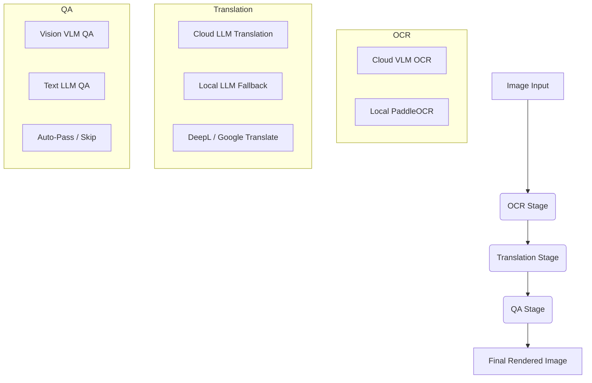

# Manga Library Worker Configuration Guide

This guide explains how to configure the unified worker pipeline. The worker handles three distinct stages using dedicated configuration singletons: **OCR**, **Translation (TL)**, and **Quality Assurance (QA)**.

> [!NOTE]
> To configure and set up a **remote worker** (e.g., on a LAN device with a GPU) to offload OCR/Bubble detection tasks, please refer to the [Remote Worker Setup & OCR Offloading Guide](file:///home/sagnik/Projects/docker-composes/manga-library/docs/remote_worker_guide.md).

---

## 🗺️ Pipeline Architecture

The worker processes image jobs through three stages:



---

## ⚙️ Environment Variables Reference

### 1. API Keys
* `OPENROUTER_API_KEY`: Key for OpenRouter.
* `GEMINI_API_KEY`: Direct API key for Google Gemini.
* `NVIDIA_API_KEY`: Key for Nvidia NIM.
* `ANTHROPIC_API_KEY`: Direct API key for Anthropic Claude.
* `OPENAI_API_KEY`: Direct API key for OpenAI.
* `API_KEY`: Generic fallback key used if a provider-specific key is missing.

---

### 2. OCR Configuration
Controls speech bubble text extraction.

| Variable | Description | Recommended Default |
| :--- | :--- | :--- |
| `OCR_MODEL_PROVIDER` | Cloud provider (`openrouter`, `gemini`, `nvidia`, `openai`, `anthropic`, or `local`) | `openrouter` |
| `OCR_VLM_MODEL` | The default vision model used for Cloud OCR | `qwen/qwen3-vl-8b-instruct` |
| `OCR_VLM_MODEL_LIST` | Fallback model list (comma-separated). Index 0 is default. | `qwen/qwen3-vl-8b-instruct,nvidia/nemotron-nano-12b-v2-vl` |
| `DISABLE_LOCAL_OCR` | If `true`, skips local PaddleOCR and forces Cloud VLM OCR | `false` |

---

### 3. Translation (TL) Configuration
Controls translation of extracted Japanese texts to target languages.

| Variable | Description | Recommended Default |
| :--- | :--- | :--- |
| `TL_MODEL_PROVIDER` | Cloud provider for translation (`openrouter`, `gemini`, `nvidia`, `openai`, `anthropic`, `ollama`, `lmstudio`) | `openrouter` |
| `TL_LLM_MODEL` | The default text model used for Cloud translation | `deepseek/deepseek-v4-pro` |
| `TL_LLM_MODEL_LIST` | Fallback model list (comma-separated). Index 0 is default. | `deepseek/deepseek-v4-pro,google/gemma-4-31b-it:free` |

---

### 4. Quality Assurance (QA) Configuration
Performs safety/formatting checks on the translations before final rendering.

| Variable | Description | Recommended Default |
| :--- | :--- | :--- |
| `QA_MODE` | QA Mode (`auto` = auto-detect capabilities, `vlm` = image + text, `hybrid` = llm + vlm, `llm` = text-only, `none` = skip) | `auto` |
| `QA_MODEL_PROVIDER` | Cloud provider for QA (`openrouter`, `gemini`, `nvidia`, `openai`, `anthropic`, `ollama`) | `openrouter` |
| `QA_LLM_MODEL` | The default model for text-only QA checks | `deepseek/deepseek-v4-flash` |
| `QA_LLM_MODEL_LIST` | Fallback text models (comma-separated) | `deepseek/deepseek-v4-flash` |
| `QA_VLM_MODEL` | The default vision-model for layout/rendering QA checks | `google/gemini-3.1-flash-lite` |
| `QA_VLM_MODEL_LIST` | Fallback vision models (comma-separated) | `google/gemini-3.1-flash-lite,google/gemma-4-26b-a4b-it:free` |

> **Note on `auto` mode:** If `QA_MODE=auto` and both VLM and LLM models are available, it will default to **`vlm`** (to save on the extra API calls of the two-step `hybrid` pipeline). You must explicitly set `QA_MODE=hybrid` if you want to use the two-step LLM + VLM pipeline.

---

### 5. Local Fallbacks
These are fallback runtimes used when cloud servers time out or rate-limit (429), or when running in 100% local mode.

* `DISABLE_LOCAL_LLM`: Set to `true` to completely disable local fallbacks (saves local CPU/GPU memory).
* `LOCAL_LLM_PROVIDER`: `ollama` or `lmstudio`.
* `LOCAL_LLM_ENDPOINT`: The URL of your local inference server (e.g. `http://host.docker.internal:11434/v1/chat/completions`).
* `LOCAL_LLM_MODEL`: Local LLM model tag (e.g. `gemma4:e4b`).
* `LOCAL_VLM_MODEL`: Local VLM model tag (e.g. `qwen2.5-vl-3b-instruct`).

---

## 📋 Common Configurations

### Option A: 100% Cloud (Low Local Resources)
Ideal if you have a slow local computer but a valid OpenRouter API key. Fast and highly accurate.

```ini
# Providers
OCR_MODEL_PROVIDER=openrouter
TL_MODEL_PROVIDER=openrouter
QA_MODEL_PROVIDER=openrouter

# Models
OCR_VLM_MODEL=qwen/qwen3-vl-8b-instruct
TL_LLM_MODEL=deepseek/deepseek-v4-pro
QA_LLM_MODEL=deepseek/deepseek-v4-flash
QA_VLM_MODEL=google/gemini-3.1-flash-lite

# Disable local fallbacks to save RAM/GPU
DISABLE_LOCAL_LLM=true
DISABLE_LOCAL_OCR=true
```

---

### Option B: Hybrid (Recommended Balance)
Uses cloud services for high-quality translation and vision-QA, but falls back to local execution to save API costs or bypass rate limits.

```ini
# Providers
OCR_MODEL_PROVIDER=openrouter
TL_MODEL_PROVIDER=openrouter
QA_MODEL_PROVIDER=openrouter

# Models
OCR_VLM_MODEL=qwen/qwen3-vl-8b-instruct
TL_LLM_MODEL=deepseek/deepseek-v4-pro
QA_LLM_MODEL=deepseek/deepseek-v4-flash
QA_VLM_MODEL=google/gemini-3.1-flash-lite

# Enable Local Fallbacks
DISABLE_LOCAL_LLM=false
LOCAL_LLM_PROVIDER=ollama
LOCAL_LLM_ENDPOINT=http://host.docker.internal:11434/v1/chat/completions
LOCAL_LLM_MODEL=gemma4:e4b
LOCAL_VLM_MODEL=qwen2.5-vl-3b-instruct

# Keep Local OCR active det/rec fallback
DISABLE_LOCAL_OCR=false
```

---

### Option C: 100% Offline / Local-Only
No internet required. Everything runs locally on your machine via Ollama and PaddleOCR.

```ini
# Providers
OCR_MODEL_PROVIDER=local     # Strictly local PaddleOCR
TL_MODEL_PROVIDER=ollama      # Skips cloud tiers
QA_MODEL_PROVIDER=ollama      # Skips cloud tiers

# Local Config
DISABLE_LOCAL_LLM=false
LOCAL_LLM_PROVIDER=ollama
LOCAL_LLM_ENDPOINT=http://host.docker.internal:11434/v1/chat/completions
LOCAL_LLM_MODEL=gemma4:e4b
LOCAL_VLM_MODEL=qwen2.5-vl-3b-instruct

DISABLE_LOCAL_OCR=false
```

---

## 🚨 Troubleshooting

* **VLM OCR is too slow or times out**: If cloud VLM is failing, set `DISABLE_LOCAL_OCR=false` to fall back to the ultra-fast local PaddleOCR.
* **OpenRouter costs are high**: Set `TL_LLM_MODEL` to a `:free` model (e.g. `google/gemma-4-31b-it:free`) to run translation completely free of charge on OpenRouter.
* **Ollama Connection Refused inside Docker**: Ensure `LOCAL_LLM_ENDPOINT` uses `http://host.docker.internal:11434` instead of `localhost` so the Docker container can resolve the host machine.
