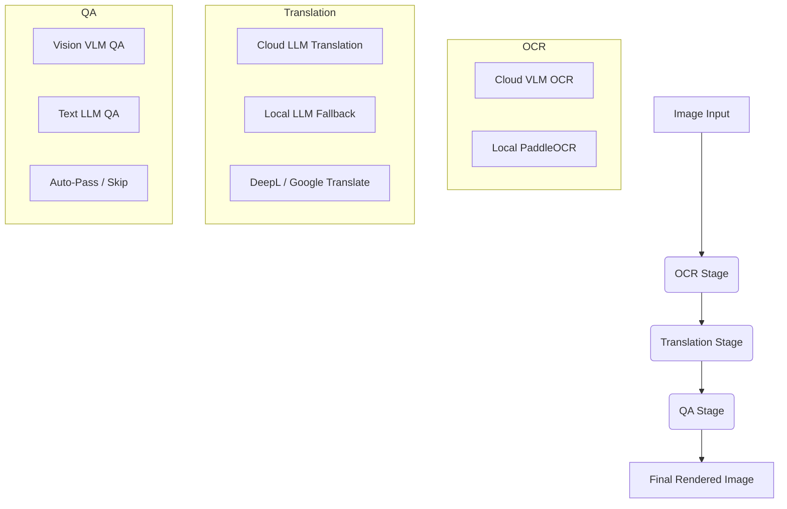

# Manga Library Worker Configuration Guide

This guide explains how to configure the unified worker pipeline. The worker handles three distinct stages using dedicated configuration singletons: **OCR**, **Translation (TL)**, and **Quality Assurance (QA)**.

---

## 🗺️ Pipeline Architecture

The worker processes image jobs through three stages:



---

## ⚙️ Environment Variables Reference

### 1. API Keys

* `OPENROUTER_API_KEY`: Key for OpenRouter.
* `GEMINI_API_KEY`: Direct API key for Google Gemini.
* `NVIDIA_API_KEY`: Key for Nvidia NIM.
* `ANTHROPIC_API_KEY`: Direct API key for Anthropic Claude.
* `OPENAI_API_KEY`: Direct API key for OpenAI.
* `API_KEY`: Generic fallback key used if a provider-specific key is missing.

---

### 2. OCR Configuration

Controls speech bubble text extraction.

| Variable | Description | Recommended Default |
| :--- | :--- | :--- |
| `OCR_MODEL_PROVIDER` | Cloud provider (`openrouter`, `gemini`, `nvidia`, `openai`, `anthropic`, or `local`) | `openrouter` |
| `OCR_VLM_MODEL` | The default vision model used for Cloud OCR | `qwen/qwen3-vl-8b-instruct` |
| `OCR_VLM_MODEL_LIST` | Fallback model list (comma-separated). Index 0 is default. | `qwen/qwen3-vl-8b-instruct,nvidia/nemotron-nano-12b-v2-vl` |
| `DISABLE_LOCAL_OCR` | If `true`, skips local PaddleOCR and forces Cloud VLM OCR | `false` |

---

### 3. Translation (TL) Configuration

Controls translation of extracted Japanese texts to target languages.

| Variable | Description | Recommended Default |
| :--- | :--- | :--- |
| `TL_MODEL_PROVIDER` | Cloud provider for translation (`openrouter`, `gemini`, `nvidia`, `openai`, `anthropic`, `ollama`, `lmstudio`) | `openrouter` |
| `TL_LLM_MODEL` | The default text model used for Cloud translation | `deepseek/deepseek-v4-pro` |
| `TL_LLM_MODEL_LIST` | Fallback model list (comma-separated). Index 0 is default. | `deepseek/deepseek-v4-pro,google/gemma-4-31b-it:free` |

---

### 4. Quality Assurance (QA) Configuration

Performs safety/formatting checks on the translations before final rendering.

| Variable | Description | Recommended Default |
| :--- | :--- | :--- |
| `QA_MODE` | QA Mode (`auto` = auto-detect capabilities, `vlm` = image + text, `hybrid` = llm + vlm, `llm` = text-only, `none` = skip) | `auto` |
| `QA_MODEL_PROVIDER` | Cloud provider for QA (`openrouter`, `gemini`, `nvidia`, `openai`, `anthropic`, `ollama`) | `openrouter` |
| `QA_LLM_MODEL` | The default model for text-only QA checks | `deepseek/deepseek-v4-flash` |
| `QA_LLM_MODEL_LIST` | Fallback text models (comma-separated) | `deepseek/deepseek-v4-flash` |
| `QA_VLM_MODEL` | The default vision-model for layout/rendering QA checks | `google/gemini-3.1-flash-lite` |
| `QA_VLM_MODEL_LIST` | Fallback vision models (comma-separated) | `google/gemini-3.1-flash-lite,google/gemma-4-26b-a4b-it:free` |

> **Note on `auto` mode:** If `QA_MODE=auto` and both VLM and LLM models are available, it will default to **`vlm`** (to save on the extra API calls of the two-step `hybrid` pipeline). You must explicitly set `QA_MODE=hybrid` if you want to use the two-step LLM + VLM pipeline.

---

### 5. Local Fallbacks

These are fallback runtimes used when cloud servers time out or rate-limit (429), or when running in 100% local mode.

* `DISABLE_LOCAL_LLM`: Set to `true` to completely disable local fallbacks (saves local CPU/GPU memory).
* `LOCAL_LLM_PROVIDER`: `ollama` or `lmstudio`.
* `LOCAL_LLM_ENDPOINT`: The URL of your local inference server (e.g. `http://host.docker.internal:11434/v1/chat/completions`).
* `LOCAL_LLM_MODEL`: Local LLM model tag (e.g. `gemma4:e4b`).
* `LOCAL_VLM_MODEL`: Local VLM model tag (e.g. `qwen2.5-vl-3b-instruct`).

---

### 6. Concurrency & Slot Allocation

The worker uses a **dual-slot concurrency model** to maximize throughput. Instead of a single job queue, jobs are classified as **heavy** (GPU-bound) or **light** (cloud API / fast local), and each type has its own concurrency slot.

This means a GPU-intensive OCR job and a cloud-only translation job can run **in parallel** on the same worker, instead of waiting for each other sequentially.

#### Queue Classification

| Slot Type | Queues | Why |
| :--- | :--- | :--- |
| **Heavy** | `panel-detection`, `ocr`, `qa-re-ocr`, `region-redo-ocr` | Use local GPU models (YOLO, PaddleOCR). Serialized by GPU locks — running 2+ heavy jobs simultaneously causes lock contention with no throughput gain. |
| **Light** | `layout`, `translation`, `render`, `qa`, `region-redo-tl` | Cloud API calls or fast local processing. I/O-bound, genuinely parallelizable. |

#### Environment Variables

| Variable | Description | Default |
| :--- | :--- | :--- |
| `CONCURRENT_WORKERS`| Total max concurrent jobs/pages (heavy + light combined). Alias: `CONCURRENT_JOBS` | `1` |
| `MAX_HEAVY_SLOTS` | Max concurrent heavy (GPU-bound) jobs | `1` |
| `MAX_LIGHT_SLOTS` | Max concurrent light (cloud/fast) jobs | `CONCURRENT_WORKERS - MAX_HEAVY_SLOTS` |
| `REUSE_IDLE_SLOTS`| When `true`, light jobs can use idle heavy slots for extra throughput. | `true` |

#### Default Slot Allocation

| `CONCURRENT_JOBS` | Heavy Slots | Light Slots | Effect |
| :--- | :--- | :--- | :--- |
| `2` | 1 | 1 | 1 OCR + 1 Translation in parallel |
| `3` | 1 | 2 | 1 OCR + 2 cloud jobs in parallel |
| `4` | 1 | 3 | 1 OCR + 3 cloud jobs in parallel |

> **Why default to 1 heavy slot?** Heavy jobs are serialized by the GPU lock (`acquire_lock("ocr")`). Even with 2 heavy slots, only one can use the GPU at a time — the second blocks on the lock. Increasing heavy slots only helps if you have multiple GPUs or run heavy jobs that don't all need the same lock.

#### How Dispatch Works

The backend's `WorkerDispatcherService` polls Redis queues every 2 seconds and dispatches jobs to workers via HTTP push. It dispatches heavy and light queues **independently**:

1. Try dispatching from heavy queues (in priority order)
2. **Independently**, try dispatching from light queues (in priority order)
3. If the heavy slot is full (worker returns 429), light dispatch still proceeds
4. If the light slot is full, heavy dispatch still proceeds

This ensures maximum parallelism — a full heavy slot never blocks light jobs and vice versa.

---

## 📋 Common Configurations

### Option A: 100% Cloud (Low Local Resources)

Ideal if you have a slow local computer but a valid OpenRouter API key. Fast and highly accurate.

```ini
# Providers
OCR_MODEL_PROVIDER=openrouter
TL_MODEL_PROVIDER=openrouter
QA_MODEL_PROVIDER=openrouter

# Models
OCR_VLM_MODEL=qwen/qwen3-vl-8b-instruct
TL_LLM_MODEL=deepseek/deepseek-v4-pro
QA_LLM_MODEL=deepseek/deepseek-v4-flash
QA_VLM_MODEL=google/gemini-3.1-flash-lite

# Disable local fallbacks to save RAM/GPU
DISABLE_LOCAL_LLM=true
DISABLE_LOCAL_OCR=true
```

---

### Option B: Hybrid (Recommended Balance)

Uses cloud services for high-quality translation and vision-QA, but falls back to local execution to save API costs or bypass rate limits.

```ini
# Providers
OCR_MODEL_PROVIDER=openrouter
TL_MODEL_PROVIDER=openrouter
QA_MODEL_PROVIDER=openrouter

# Models
OCR_VLM_MODEL=qwen/qwen3-vl-8b-instruct
TL_LLM_MODEL=deepseek/deepseek-v4-pro
QA_LLM_MODEL=deepseek/deepseek-v4-flash
QA_VLM_MODEL=google/gemini-3.1-flash-lite

# Enable Local Fallbacks
DISABLE_LOCAL_LLM=false
LOCAL_LLM_PROVIDER=ollama
LOCAL_LLM_ENDPOINT=http://host.docker.internal:11434/v1/chat/completions
LOCAL_LLM_MODEL=gemma4:e4b
LOCAL_VLM_MODEL=qwen2.5-vl-3b-instruct

# Keep Local OCR active det/rec fallback
DISABLE_LOCAL_OCR=false
```

---

### Option C: 100% Offline / Local-Only

No internet required. Everything runs locally on your machine via Ollama and PaddleOCR.

```ini
# Providers
OCR_MODEL_PROVIDER=local     # Strictly local PaddleOCR
TL_MODEL_PROVIDER=ollama      # Skips cloud tiers
QA_MODEL_PROVIDER=ollama      # Skips cloud tiers

# Local Config
DISABLE_LOCAL_LLM=false
LOCAL_LLM_PROVIDER=ollama
LOCAL_LLM_ENDPOINT=http://host.docker.internal:11434/v1/chat/completions
LOCAL_LLM_MODEL=gemma4:e4b
LOCAL_VLM_MODEL=qwen2.5-vl-3b-instruct

DISABLE_LOCAL_OCR=false
```

---

## 🚨 Troubleshooting

* **VLM OCR is too slow or times out**: If cloud VLM is failing, set `DISABLE_LOCAL_OCR=false` to fall back to the ultra-fast local PaddleOCR.
* **OpenRouter costs are high**: Set `TL_LLM_MODEL` to a `:free` model (e.g. `google/gemma-4-31b-it:free`) to run translation completely free of charge on OpenRouter.
* **Ollama Connection Refused inside Docker**: Ensure `LOCAL_LLM_ENDPOINT` uses `http://host.docker.internal:11434` instead of `localhost` so the Docker container can resolve the host machine.
