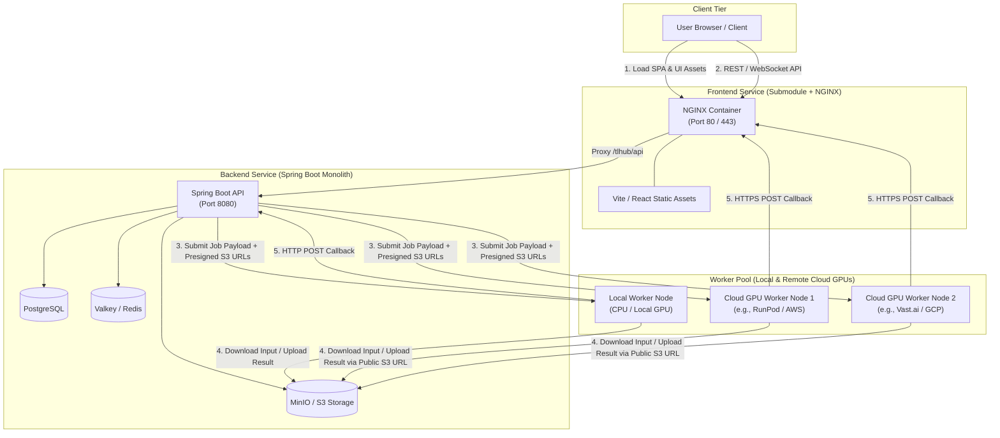
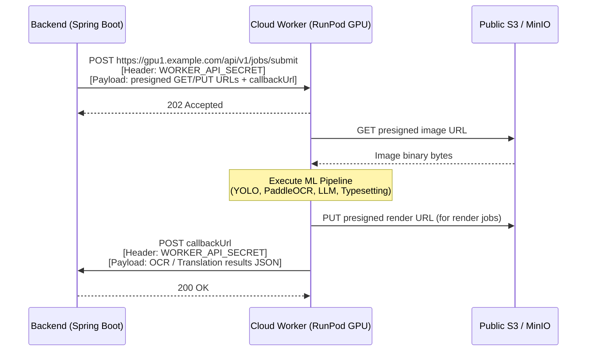

# Architecture Plan: Decoupled Multi-Component Topology

> Strategic blueprint for decoupling **Frontend**, **Backend**, and **Worker Nodes** into independently deployable, modular components capable of running locally via Docker Compose or distributed across cloud infrastructure (e.g. remote GPU instances).

---

## 1. Executive Vision & Target Architecture

Currently, the system uses a hybrid model: the Frontend is built inside the Backend container, and the Worker relies on private Docker bridge DNS (`http://backend:8080`, `http://minio:9000`, `http://redis:6379`). 

The target architecture decouples all three components into **clean, independent micro-services**:



---

## 2. Component 1: Frontend Decoupling

### 2.1 Git Submodule Structure
- Extract `frontend/` into a dedicated repository (e.g. `github.com/sagniKdas53/manga-tl-frontend.git`).
- Add to main repo as a submodule at `frontend/`.

### 2.2 Dedicated NGINX Container

Replace Spring Boot's static file serving with a lightweight NGINX Alpine container.

#### [NEW] `frontend/Dockerfile`
```dockerfile
# Stage 1: Build static assets
FROM node:26-alpine AS build
WORKDIR /app
ARG VITE_BASE_PATH=/tlhub/
ENV VITE_BASE_PATH=${VITE_BASE_PATH}

COPY package*.json ./
RUN --mount=type=cache,target=/root/.npm npm ci

COPY . .
RUN npm run build

# Stage 2: Serve via NGINX
FROM nginx:alpine
COPY nginx.conf /etc/nginx/conf.d/default.conf
COPY --from=build /app/dist /usr/share/nginx/html/tlhub
EXPOSE 80
CMD ["nginx", "-g", "daemon off;"]
```

#### [NEW] `frontend/nginx.conf`
```nginx
server {
    listen 80;
    server_name _;

    # Client body size limit for chapter/image uploads
    client_max_body_size 100M;

    # Gzip Compression
    gzip on;
    gzip_types text/plain text/css application/json application/javascript text/xml application/xml image/svg+xml;

    # Serve static SPA assets
    location /tlhub/ {
        alias /usr/share/nginx/html/tlhub/;
        try_files $uri $uri/ /tlhub/index.html;
        expires 1y;
        add_header Cache-Control "public, immutable";
    }

    # Proxy REST API requests to Backend
    location /tlhub/api/ {
        proxy_pass http://backend:8080/tlhub/api/;
        proxy_set_header Host $host;
        proxy_set_header X-Real-IP $remote_addr;
        proxy_set_header X-Forwarded-For $proxy_add_x_forwarded_for;
        proxy_set_header X-Forwarded-Proto $scheme;
    }

    # Proxy WebSockets / SSE to Backend
    location /tlhub/api/ws {
        proxy_pass http://backend:8080/tlhub/api/ws;
        proxy_http_version 1.1;
        proxy_set_header Upgrade $http_upgrade;
        proxy_set_header Connection "Upgrade";
        proxy_set_header Host $host;
    }
}
```

---

## 3. Component 2: Backend Decoupling & Remote Orchestration

### 3.1 Strip Static Frontend from Backend

#### [MODIFY] `backend/Dockerfile`
Remove Node.js build stage completely. Spring Boot becomes a lean Java 25 microservice without static web assets.

```dockerfile
FROM maven:3-eclipse-temurin-25 AS build
WORKDIR /app
COPY pom.xml .
RUN --mount=type=cache,target=/root/.m2 mvn dependency:go-offline -q
COPY src ./src
RUN --mount=type=cache,target=/root/.m2 mvn clean package -DskipTests

FROM eclipse-temurin:25-jre-alpine
RUN addgroup -S spring && adduser -S spring -G spring
WORKDIR /app
COPY --from=build /app/target/library-0.0.1-SNAPSHOT.jar app.jar
USER spring
EXPOSE 8080
ENTRYPOINT ["java", "-jar", "app.jar"]
```

### 3.2 Self-Contained Job Payloads (No Callback GETs)

Eliminate the worker's need to make HTTP GET calls back to `http://backend:8080/api/internal/images/{id}` to fetch image info and OCR regions.

**Target Payload Format sent by Backend to Worker:**
```json
{
  "queue_name": "queue:translation",
  "job_data": {
    "jobId": "job-1234",
    "imageId": "img-5678",
    "pageId": "page-9012",
    "chapterId": "chap-3456",
    "attempt": 1,
    "maxAttempts": 3,
    "sourceLanguage": "ja",
    "targetLanguage": "en",
    "callbackUrl": "https://manga.example.com/tlhub/api/internal/jobs/callback",
    "callbackToken": "bearer-secret-token",
    "assets": {
      "imageGetUrl": "https://s3.example.com/manga/pages/page-9012.jpg?X-Amz-Signature=...",
      "renderPutUrl": "https://s3.example.com/manga/rendered/page-9012.png?X-Amz-Signature=..."
    },
    "context": {
      "ocrRegions": [...],
      "conversations": [...],
      "narrativeContext": "Series: One Piece, Chapter 1000..."
    }
  }
}
```

### 3.3 Public URL Configuration

Add explicit configuration for public-facing domain names so the backend generates presigned S3 URLs and callback URLs accessible from outside the local network:

```yaml
# Spring Boot application.yml / env vars
app:
  public-url: ${PUBLIC_BACKEND_URL:http://localhost:8080}
  s3:
    public-url: ${PUBLIC_MINIO_URL:http://localhost:9000}
```

### 3.4 Multi-Worker Pool & Health Router

Update Spring Boot's `WorkerClientService` to manage a pool of dynamic worker endpoints:

```yaml
worker:
  nodes:
    - id: "local-worker-1"
      url: "http://worker:8000"
      weight: 1
    - id: "cloud-gpu-runpod"
      url: "https://gpu1.example.com:8000"
      secret: "${CLOUD_WORKER_SECRET}"
      weight: 4
```

---

## 4. Component 3: Cloud GPU Worker Pool Decoupling

To allow workers to run anywhere (local Docker, AWS EC2, RunPod GPU, Google Cloud):

### 4.1 Asset Access via Presigned S3 URLs
- Workers **never** access `http://minio:9000`.
- Instead, workers download input images via `assets.imageGetUrl` and upload rendered outputs via `assets.renderPutUrl`.
- **Result:** MinIO does not need to be exposed internally or linked via Docker bridge network.

### 4.2 Dynamic Callback Routing
- Workers **never** call hardcoded `http://backend:8080`.
- Workers post completion/failure payloads directly to `job_data.callbackUrl` using the `job_data.callbackToken` for HTTP Bearer auth.

### 4.3 Redis Isolation per Worker Node
- Remote cloud workers do **not** connect to the backend's internal Redis.
- Rate limiting and model TTL eviction (`model_manager.py`) operate **in-memory** within the worker process (or via an optional local Redis container co-located with the GPU node).
- OpenRouter model prices are fetched directly from OpenRouter API or passed in the job payload.

### 4.4 Worker Authentication & Security



---

## 5. Comparative Analysis: Current vs. Decoupled

| Metric / Capability | Current Architecture | Decoupled Architecture |
|---|---|---|
| **Frontend Deployment** | Embedded in Spring Boot JAR | Standalone NGINX container (SPA) |
| **Backend Responsibilities** | REST API + Static Asset Host | Pure REST API & Task Orchestrator |
| **Remote Cloud GPUs** | ❌ Fails (hardcoded `backend:8080`, `minio:9000`, local secrets) | ✅ Fully supported (presigned S3 + HTTPS callbacks) |
| **Worker Storage Access** | Direct MinIO container access | Presigned GET/PUT S3 URLs |
| **Worker Queue Connection** | Backend Valkey / Redis binding | Pure HTTP/S API or isolated local memory |
| **CI/CD Build Speed** | Slow (Frontend rebuilds trigger JAR rebuilds) | Fast (Independent concurrent builds) |
| **Git Repositories** | Monorepo + 1 Submodule (`worker`) | Monorepo + 2 Submodules (`frontend`, `worker`) |

---

## 6. Phased Implementation Roadmap

### Phase 1: Payload & Asset Self-Containment (Backend & Worker)
1. Add presigned GET/PUT URL generation to Spring Boot S3 service.
2. Update job submit payload schema to include `assets`, `context`, `callbackUrl`, and `callbackToken`.
3. Update worker handlers (`ocr`, `render`, `qa`, `translation`) to download/upload via presigned URLs if present.

### Phase 2: Frontend Extraction & NGINX Setup
1. Create `frontend` repository/submodule.
2. Add `frontend/Dockerfile` and `frontend/nginx.conf`.
3. Strip `frontend-build` stage from `backend/Dockerfile`.
4. Add `frontend` service to `docker-compose.yml`.

### Phase 3: Remote Worker Security & Router
1. Implement worker pool router in Spring Boot (`WorkerPoolManager`) supporting multiple worker URLs with health checking.
2. Add Bearer token authentication to worker endpoints and callback endpoints.
3. Deploy a remote GPU worker instance (e.g. RunPod) to verify cloud execution over HTTPS.
