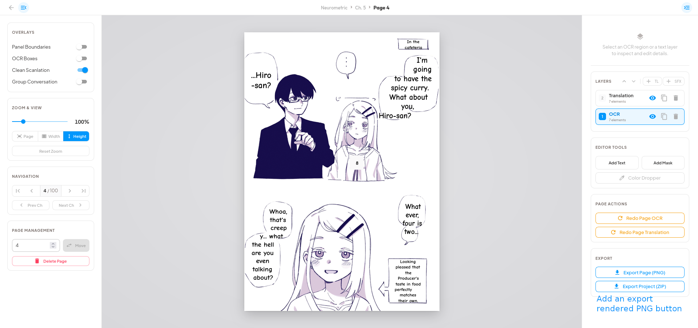

# Issues and What I want for them

## CI failing (done)

### Build and test backend

```log
[INFO] Recompiling the module because of changed source code.
[INFO] Compiling 78 source files with javac [debug parameters release 25] to target/classes
[INFO] ------------------------------------------------------------------------
[INFO] BUILD FAILURE
[INFO] ------------------------------------------------------------------------
[INFO] Total time:  12.738 s
[INFO] Finished at: 2026-07-30T03:54:02Z
[INFO] ------------------------------------------------------------------------
[ERROR] Failed to execute goal org.apache.maven.plugins:maven-compiler-plugin:3.15.0:compile (default-compile) on project library: Fatal error compiling: error: release version 25 not supported -> [Help 1]
[ERROR] 
[ERROR] To see the full stack trace of the errors, re-run Maven with the -e switch.
[ERROR] Re-run Maven using the -X switch to enable full debug logging.
[ERROR] 
[ERROR] For more information about the errors and possible solutions, please read the following articles:
[ERROR] [Help 1] http://cwiki.apache.org/confluence/display/MAVEN/MojoExecutionException
Error: Process completed with exit code 1.
```

### Install, lint, and build frontend

```log
⎯⎯⎯⎯⎯⎯⎯⎯⎯⎯⎯⎯⎯⎯⎯⎯⎯⎯⎯⎯⎯⎯⎯⎯[1/1]⎯


 Test Files  1 failed | 39 passed (40)
      Tests  1 failed | 248 passed | 1 skipped (250)
   Start at  03:53:57
   Duration  49.67s (transform 1.86s, setup 4.98s, import 21.88s, tests 61.75s, environment 42.70s)


Error: AssertionError: expected false to be true // Object.is equality
```

## Same image handling had not worked for a long time now (done)

Idea [duplicate_handling](./duplicate_handling.md)

## The queue manangemt has become absolute shit

It takes 2 hours to process 50 images, just check the logs.

Log in question [run-3-fresh.log](../logs/run-3-fresh.log) for details.

Atlest the OCR which has a deidated slot as described in [slot_allocation](./slot_allocation.md) should have been prioritized and completed.

Also check if the queue docs are upto date [queue_management_system](./translation_pipeline_phases.md) and if there are any optimizations not yet uncovered.

Check out the provider intgeration guide as well [workers_providers](./worker_provider_integration.md) same idea check if outdated and update also check for optimizations, I believe this was created before the `providers.json` was added so more likely outdated.

## `index.js` is still too big

```log
#33 1.753 vite v8.1.5 building client environment for production...
transforming...✓ 1007 modules transformed.
#33 2.544 rendering chunks...
#33 2.786 computing gzip size...
#33 2.797 dist/index.html                                1.40 kB │ gzip:   0.58 kB
#33 2.797 dist/assets/index-25aYWvJ6.css                19.82 kB │ gzip:   4.19 kB
#33 2.797 dist/assets/Add-D2elZn0Y.js                    0.15 kB │ gzip:   0.15 kB
#33 2.797 dist/assets/ChevronRight-BbxKGv4f.js           0.17 kB │ gzip:   0.17 kB
#33 2.797 dist/assets/Delete-q3BXIOR3.js                 0.19 kB │ gzip:   0.18 kB
#33 2.797 dist/assets/CardContent-COFQLqYd.js            0.99 kB │ gzip:   0.49 kB
#33 2.797 dist/assets/CardMedia-CDWC0WiR.js              1.90 kB │ gzip:   0.85 kB
#33 2.797 dist/assets/Divider-D9Ns4fN2.js                3.45 kB │ gzip:   1.22 kB
#33 2.797 dist/assets/MenuItem-DKQP0Xf7.js               3.73 kB │ gzip:   1.57 kB
#33 2.797 dist/assets/Upload-C0VoJ9V1.js                 4.03 kB │ gzip:   1.67 kB
#33 2.797 dist/assets/TextField-BxS6ZWMI.js              4.16 kB │ gzip:   1.77 kB
#33 2.797 dist/assets/Grid-BEwsF91D.js                   4.73 kB │ gzip:   1.93 kB
#33 2.797 dist/assets/Auth-DB-yZvzM.js                   5.24 kB │ gzip:   2.25 kB
#33 2.797 dist/assets/UserManagementModal-CxinLifm.js    7.18 kB │ gzip:   2.91 kB
#33 2.797 dist/assets/FormControlLabel-56vLE-I7.js       7.57 kB │ gzip:   2.92 kB
#33 2.797 dist/assets/SettingsModal-DBfmqmJx.js          8.60 kB │ gzip:   2.51 kB
#33 2.797 dist/assets/Dashboard-GcV4I_73.js              9.10 kB │ gzip:   3.45 kB
#33 2.797 dist/assets/Edit-BDoM0XnO.js                  13.40 kB │ gzip:   3.95 kB
#33 2.797 dist/assets/ChapterGallery-DWF3ROVN.js        19.17 kB │ gzip:   6.23 kB
#33 2.797 dist/assets/SeriesDetails-Dzbh-P6w.js         19.76 kB │ gzip:   5.95 kB
#33 2.797 dist/assets/Select-DIbBijrF.js                56.21 kB │ gzip:  17.61 kB
#33 2.797 dist/assets/useSlotProps-EjgVaUNX.js         159.72 kB │ gzip:  54.07 kB
#33 2.797 dist/assets/Reader-c57_Ipdj.js               220.20 kB │ gzip:  65.52 kB
#33 2.797 dist/assets/index-qL-64He4.js                375.16 kB │ gzip: 120.29 kB
#33 2.797 
#33 2.798 ✓ built in 1.04s
#33 2.826 npm notice
#33 2.826 npm notice New major version of npm available! 11.17.0 -> 12.0.2
#33 2.826 npm notice Changelog: https://github.com/npm/cli/releases/tag/v12.0.2
#33 2.826 npm notice To update run: npm install -g npm@12.0.2
#33 2.826 npm notice
#33 DONE 3.2s
```

---

```log
#32 [backend frontend-build 5/6] COPY frontend/ ./
#32 DONE 0.2s

#33 [backend frontend-build 6/6] RUN npm run build
#33 1.814 
#33 1.814 > frontend@0.0.0 build
#33 1.814 > vite build
#33 1.814 
#33 2.447 vite v8.1.5 building client environment for production...
transforming...✓ 1007 modules transformed.
#33 3.338 rendering chunks...
#33 3.643 computing gzip size...
#33 3.673 dist/index.html                                    1.67 kB │ gzip:   0.63 kB
#33 3.673 dist/assets/index-25aYWvJ6.css                    19.82 kB │ gzip:   4.19 kB
#33 3.673 dist/assets/ConfirmModal-BUBVeALP.js               0.91 kB │ gzip:   0.49 kB
#33 3.673 dist/assets/rolldown-runtime-VI8nWfbz.js           0.95 kB │ gzip:   0.56 kB
#33 3.673 dist/assets/Auth-AWwyR39r.js                       3.29 kB │ gzip:   1.53 kB
#33 3.673 dist/assets/CreateChapterDialog-DMcBS7wo.js        3.92 kB │ gzip:   1.60 kB
#33 3.673 dist/assets/UserManagementModal-CTg7iqu_.js        4.36 kB │ gzip:   1.62 kB
#33 3.673 dist/assets/NotificationCenter-ClrYgZnQ.js         5.31 kB │ gzip:   2.25 kB
#33 3.673 dist/assets/ModelOverridesAccordion-CuQGCXgi.js    7.19 kB │ gzip:   1.89 kB
#33 3.673 dist/assets/SettingsModal-DjOGBkPW.js              8.55 kB │ gzip:   2.49 kB
#33 3.673 dist/assets/Dashboard-PP5SmUkw.js                  9.01 kB │ gzip:   3.42 kB
#33 3.673 dist/assets/QueueManager-BVQudvOs.js              16.86 kB │ gzip:   5.87 kB
#33 3.673 dist/assets/ChapterGallery-CqfXBGJN.js            18.71 kB │ gzip:   6.04 kB
#33 3.673 dist/assets/SeriesDetails-BOKSXjWN.js             19.51 kB │ gzip:   5.82 kB
#33 3.673 dist/assets/index-CzuOeM61.js                     22.74 kB │ gzip:   8.01 kB
#33 3.673 dist/assets/vendor-router-DfqQ43_2.js             47.94 kB │ gzip:  17.03 kB
#33 3.673 dist/assets/Reader-BuoVjdvd.js                    94.09 kB │ gzip:  26.03 kB
#33 3.673 dist/assets/lib-jszip-tkj_gTQH.js                 97.29 kB │ gzip:  29.96 kB
#33 3.673 dist/assets/vendor-react-CLntpiwb.js             179.29 kB │ gzip:  57.10 kB
#33 3.673 dist/assets/vendor-mui-Dsrvn5RX.js               381.24 kB │ gzip: 119.66 kB
#33 3.673 
#33 3.675 ✓ built in 1.23s
#33 3.741 npm notice
#33 3.741 npm notice New major version of npm available! 11.17.0 -> 12.0.2
#33 3.741 npm notice Changelog: https://github.com/npm/cli/releases/tag/v12.0.2
#33 3.741 npm notice To update run: npm install -g npm@12.0.2
#33 3.741 npm notice
#33 DONE 3.8s

#34 [backend backend-build 2/7] WORKDIR /app
```

These files can't possibly be that complex, something funky is going on.

## The UI is laggy and loads slow

General observation, will do a proper firefox profile analysis later.

Most probably the backend holding it back, but it's probably just the inhertiatnace and overrides + the logic bugs.

The previously described bug where the older chapter content remains visible for a slit second when loading a new one seems to still exist

Also when there are too many jobs the queue and notification managers have noticeable lag.

## UI fixes needed

### Add lazy loading of thumbs for all surfaces, like series, chapters and pages

Loading all of them is a waste, this is implemented wrongly as the lazy-image initiator seems to load full image and not the thumbs.

### Add bi-direction 2 page cache for the reader, if possible add a hard memory cap

That way the UX would be much better. this is also wrongly implemented, because when going forward it loads the next image but when going back it doesn't load the previous image. Also the hard memory cap seems to be doing more harm than good, it should be a soft cap. The act of calculating it might be causing more issues than good.

### Every Chapter shows the spinner now

Even with cache turned on, looks like the entire component is getting unmounted and re-mounted again.

### The UI is so loaggy and shitty now that it caused firefox to crash

Impressive work really, revert the last commit, and do all of these again but slowly and properly this time.

## Add an export rendered PNG button (done)

See: 

---

## Add Free Provider for Testing

[uncloseai](https://uncloseai.com/python-examples.html)
also [free-ollama](https://github.com/mfoud444/ollamafreeapi/tree/main)

### Available Endpoints

- Hermes: <https://hermes.ai.unturf.com/v1> - General purpose conversational AI
- Qwen 3 Coder: <https://qwen.ai.unturf.com/v1> - Specialized coding model
- TTS: <https://speech.ai.unturf.com/v1> - Text-to-speech generation

## Plan a better backend one that doesn't use java

I am tired of the boilerplate and bug factory that is java, it serves no real purpose and has no real benefit other than being looking good in indian resumes, I hoesnly don't want to look at java anymore.

For the love of god, do something use go or python idk if the [plan](./migration.md) is still upto date or good, so maybe remake it when tackling this issue.

## Do we really need a separate worker?

like what does the backend do that cannot be done by the worker, why do we need this split?

## validate if the testing is really testing or just mocking everything and calling it a day

Check the [test-guide](./testing_isolation_guide.md) and make sure the tests are actually testing the code and not just mocking everything and calling it a day.

## Update the `configuration_guide.md` once everything is done

We need to document how to setup the whole app like what needs to be populated in `.env` and what needs to populated in the secrets, how to set up the `providers.json` and other small stuff.
