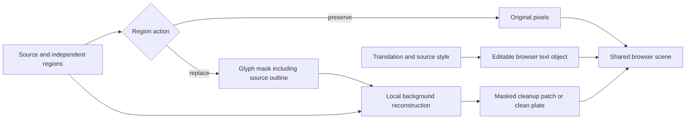

# Output quality architecture recommendations

Checkpoint: 2026-09-09, implementation planning. These decisions define the requested new pipeline; implementation has not started. App HEAD is `ac13387`; worker remains `3a7b46c`; corpus remains `607b78b8`. The app change since the baseline is the committed investigation documentation. No application symbols were edited during this follow-up.

The [implementation tracker](output-quality-implementation-tracker.md) is authoritative for task order, checkpoints and quality gates; the [plan overview](canvas-output-quality-plan.md) summarizes it. The central recommendation is one browser text renderer, early region intent, independent text owners, and worker-generated cleanup artifacts. Keep OCR, masks and image processing in Python; remove its separate final typography implementation after the new pipeline passes its cutover gates.

## 1. Use one browser renderer for preview and final output

Recommend a reusable TypeScript layout module and a DOM/SVG scene component, shared between the editor and a small headless Chromium render service. The editor adds selection handles and controls in a separate overlay. The server mounts the same content scene at source pixel dimensions and captures it without editor UI. Final PNG/chapter exports and QA should consume that canonical artifact. Project ZIP retains the editable scene, cleanup artifacts, source identity, settings, and font references.

Putting the existing PNG `fillText` loop inside Chromium is insufficient: the current reader preview uses SVG/HTML (`Reader.tsx:3982-4067`), while PNG and ZIP use separate Canvas drawing loops (`Reader.tsx:2411-2515`, `2606-2716`). Extract and unify those browser paths too. Keep Pillow for crops, masks, image IO and thumbnails; retire its text fitting/drawing path rather than porting further typography features into Python.

The previous host replay resolved Comic Neue to DejaVu Sans. It did not prove that Pillow is intrinsically unable to render good manga text. The reason to unify is the observed disagreement in layout, fonts, styles, mask ordering and policy, and the recurring cost of implementing each feature several times. Changing the engine will not fix merged OCR regions or destructive cleanup by itself.

Implementation contract:

- Pin the render-service browser build, font files, scene/layout version, viewport, device scale and color/export settings. Explicitly load requested fonts and images, await layout, and treat a missing required font as a visible diagnostic. A single codebase does not guarantee bit-identical text across arbitrary user browsers/operating systems; the pinned service defines final output.
- Use a trusted static render entry point accepting scene data and local/scoped image assets; do not render arbitrary user-supplied web pages. Reuse browser processes with bounded job contexts. Measure resident memory, throughput and large-page limits before choosing concurrency; no performance advantage over Pillow is claimed without measurement.
- Render each edit revision once, cache the artifact, and reuse it for download, chapter assembly, thumbnails and QA. Cache keys include active regions/cleanup, source, fonts, layout version and settings. A text edit invalidates layout/render; it should not rerun OCR, translation or background restoration unless their inputs changed.
- Prototype one ordinary and one large page after the new scene/intent contract is stable. Validate all six samples plus rotation, stroke, blank and overlap fixtures before removing Pillow typography. Do not implement an old-renderer fallback or legacy parity layer. Historical renders remain comparison files; remove obsolete typography implementations at the cutover gate.

Supporting capability checks: Playwright documents [element/region screenshots](https://playwright.dev/docs/screenshots) and [browser-version dependencies](https://playwright.dev/docs/browsers). Font loading/layout readiness is exposed through [FontFaceSet.ready](https://developer.mozilla.org/en-US/docs/Web/API/FontFaceSet/ready). These establish tooling capabilities, not benchmark results for this app.

## 2. Separate OCR detection, translation intent and permission to alter pixels

Broad OCR detection is useful evidence. It must not automatically create a translation request, cleanup patch or visible text object. Recognize enough to classify text where needed, but make the decision before paid translation, cleanup and per-region QA. Do not simply drop all small/kana/vertical text: ordinary dialogue shares those properties.

Current code correction: `process_translation` checks `should_typeset_region` before adding a region to the model targets (`worker/src/worker/handlers/translation.py:98-110`). Correctly labelled SFX with TYPESET_SFX=false already gets an empty resolved translation and avoids target translation. However, the page manifest loops over **all** OCR regions at lines 142-157 and is supplied to each translated chunk at lines 170-179. Preserved SFX can therefore still add prompt tokens. This is a source-confirmed prompt-content path; exact provider token cost has not been measured. The final renderer can also paint already-persisted visible SFX, as established by the earlier replay.

Proposed persisted intent has separate region kind, confidence/reason, action, and user override. Example actions:

| Action | Translation targets/context | Source cleanup | Page text object |
| --- | --- | --- | --- |
| Preserve SFX (default) | No translation target; exclude raw SFX from repeated page manifests unless explicitly needed as compact narrative context | None | None; OCR evidence remains available in metadata |
| Explain SFX (opt-in) | Translate only selected effects | None | A separate note/transcript or deliberately placed annotation |
| Replace SFX (opt-in) | Translate selected effects | Approved glyph cleanup | Styled SFX object with explicit render permission |
| Uncertain region | Review or a cached/batched classifier for ambiguous candidates; no silent claim of success | Preserve while unresolved | No destructive automatic replacement |

Use cheap local features jointly: bubble membership/confidence, source lettering/color/orientation, size relative to surrounding dialogue, recognized content, and panel context. Visual/semantic evidence should distinguish decorated dialogue from SFX. A classifier that marks something uncertain must keep it discoverable, rather than losing dialogue. Evaluate SFX precision/recall and dialogue false-suppression separately on reviewed labels.

Apply the same intent at translation target creation, prompt-manifest construction, cleanup generation, scene construction, import and final rendering. Preserve local OCR metadata without rasterizing it. Bulk imports and re-renders must respect explicit user overrides and must not revive previously rejected masks. Separate skipped-by-policy from translation failure, so retries do not repeatedly request deliberately preserved regions.

Cost gates: zero preserved-SFX translation target IDs; no raw preserved-SFX entries in normal repeated manifests; zero cleanup/render objects for preserved SFX; report actual prompt/completion tokens, chunk/retry counts and ambiguous-classification costs. Region counts are not API-call counts because requests are batched. Full-page VLM inputs can still contain visible SFX; excluding text targets does not remove those image tokens.

## 3. Keep nearby text owners separate; solve collisions in layout

Maintain distinct relationships: fragment-to-text-block ownership; text-block-to-container/panel ownership; and reading-order/conversation links between blocks. Two blocks can share a conversation or panel without sharing a mask or layout rectangle. Preserve original fragment IDs and split/merge provenance.

Proximity is one candidate signal. Merge only with positive evidence of a common text unit: a validated common container or continuous text line, compatible orientation/scale/style and no owner boundary. Bubble membership alone is insufficient when detector masks are fused or a bubble contains separate statements. Unmatched blocks default to separate when evidence is ambiguous. Bound complete components, not just pairwise edges, so an A-B-C chain cannot span the page. A cropped contour failure must remain unresolved instead of claiming the whole shared detector mask.

Overlapping OCR rectangles do not establish overlapping glyphs or common ownership. Use the actual glyph/polygon geometry, owner boundaries and source orientation. Resolve automatic translated-text collisions by rewrapping, adjusting within the owner's allowable area, and modest size/spacing changes subject to a readable minimum. If the content still cannot fit, flag overflow/review; do not merge captions, cover neighboring artwork, silently clip text or shorten the translation without a separately reviewed translation change.

For sample177 the invariants are six separately owned illustration labels and separately owned headings, even if adjacent captions share a row. For sample61 each paragraph stays within its dark container. Preserve manual intentional overlap/z-order separately from automatic layout constraints. All cleanup should be composited before translated glyphs within an automatic scene; later cleanup must not erase previously rendered text.

## 4. Worker produces glyph masks AND reconstructed background patches

Recommend the user's worker split, with a precise meaning of “mask.” A binary/alpha mask identifies which pixels may change; it does not supply the missing background. A more detailed polygon filled with a sampled color still destroys texture. The worker should produce a glyph removal mask plus the actual restored pixels, or a clean plate assembled from those patches.

For uniform bubble interiors, fill only the glyph support with the validated interior color. For textured/art backgrounds, generate a local reconstruction and composite only within approved support: `clean = source * (1 - alpha) + reconstruction * alpha`. Restoration can use surrounding context, but unapproved output pixels are discarded. Include glyph strokes/outlines in the removal mask and use conservative, scale-aware edge margins. Poor reconstruction must remain reviewable; a new slab is not a successful fallback.

Return source-space glyph mask, cleanup patch bounds/image, source digest, stable region IDs, owner/container and allowed layout geometry, source style estimate, intent, confidence/warnings and generator/config revision. Cache cleanup independently of English text/font placement. The English layout area may use available space in its owner container; it must not enlarge the removal mask. Source cleanup stays anchored when the user moves or rotates the replacement text.

Expose these as one selectable region object with linked, independently editable cleanup and text, plus a simple selection frame. Do not expose every mask pixel/contour vertex as a normal resize handle. Keep detailed mask editing as a separate mode. Hiding/rejecting an automatic replacement removes its cleanup too by recomposing from immutable source and the remaining active cleanup set. Where cleanup supports overlap, reconstruct/composite the joint active support coherently; independent overlapping patches must not resurrect removed source glyphs or overwrite each other's backgrounds.

Acceptance gates: reviewed source glyphs removed, protected art outside support unchanged, preserved SFX unchanged, source outlines not left behind, object transforms/visibility round-trip, close independent owners never become one object, and all final outputs use the same scene renderer. Capture both cleanup-only and final-text images so visual QA can distinguish reconstruction damage from typesetting mistakes.

## Scope and execution checkpoint

The user has explicitly excluded backward compatibility. Target new images and a regenerated corpus: no old-project converters, historical-output migration or old-renderer fallback. New-format archive round trips and installation of the new DB schema remain required. Preserve immutable source images, references and historical evidence while creating the new run.

ARM64/RapidOCR is a POC, not a release requirement. Its existing build/import workflow does not prove real-page quality. Acceptance and resource measurements target the current Linux amd64 route; record the actual runtime instead of assuming a specific GPU.

The [timestamp/Git investigation](quality-evidence/corpus-cutoff.md) places the latest active embedded processing at August 28, before selected later layout/rotation fixes. The six requested fixtures' OCR stages were recorded August 13–22. Historical exports and current renderer replays of old geometry cannot prove today's OCR behavior. Exact deployed versions are not recoverable from dates alone.

Begin with tracker A01–A09: isolate services, capture current raw stages, reproduce the six originals, and freeze reviewed acceptance labels. Then freeze the new contract, repair revision freshness, and prototype Chromium early. Policy/grouping precede cleanup; typography is implemented once in the shared scene. The tracker splits all work into Luna task packets with dependencies and saved evidence. No cleanup model is selected by this document; candidate evaluation and selection are explicit later checkpoints.

No fresh processing, model installation, paid inference, browser implementation or production code change was performed during this architecture/planning follow-up.
