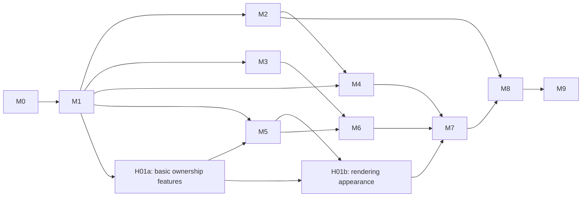

# Output quality implementation tracker

Planning checkpoint: 2026-09-09; G0 closure: 2026-09-14; user-review checkpoints added: 2026-09-15; ownership plan realigned: 2026-09-16; **live-path realignment: 2026-09-17 — see the section below; R1 render cutover DONE 2026-09-18, the pipeline now renders through `page-renderer` (M3/M4/M5 are live from that date).** **M0–M4 are complete; M5 is in REVIEW. H01a and F01–F03 are DONE; F04 normal-runtime integration is in REVIEW while a one-page correction run verifies the user-reported zero-object Translation layer regression.** The regression came from policy scheduling that skipped every unreviewed region before translation; the correction restores OCR → translation → visual QA → render/export while retaining explicit source-preserving overrides. The separate current immutable-render artifact remains unavailable until M8's canonical-scene cutover and is not used as evidence for this legacy editor pipeline. G0–G2 are `PASSED`; G3 is `PASSED` for request/object boundaries only, not end-to-end pixel quality. Historical A01–A09 and A06-C evidence remains retained; A09 is unscored. This is the authoritative execution tracker for the user's requested unified renderer, SFX policy, quality gates, and corpus run. **2026-09-19: branch cleanup done** — history purged of run artifacts (full history on pi5 `feat/output-quality-evidence`), `main` merged in (`57a9a92`), dependabot merged on both repos, provider-catalog refresh moved from a GitHub Action into the worker (`services/catalog_refresh.py`), lint green on all three trees; the bug register was mapped onto the R tasks — see the [resume packet](#resume-packet).

## 2026-09-17 realignment — one live path

**Why.** The user reported no visible improvement after M0–M5. Checked against the six fixtures in [`g5-20260917-final-six`](quality-runs/g5-20260917-final-six/) and the August baselines in `corpus/samples/ja/*/export.png`: the outputs are the same failure class as in August. Four of six pages (`sample83`, `sample93`, `sample99`, `sample222`) have 50–90 % of the art replaced by one flat rounded rectangle. `sample61` has 214 OCR and 209 translation elements for roughly 15 text blocks and cost US$0.25 / 800 k prompt tokens. `sample222` regressed: the translation model refused and the refusal text was typeset onto the page.

**What the code says.** The milestone code is not on the `docker compose up` request path:

- Every pipeline render went through the worker's PIL `render_image_core` (`[Render] N element(s) to draw, M skipped` in the log). `services/page-renderer` was healthy and received zero requests; nothing live writes a `page_scene_snapshots` row, so `recovery::process_pending_renders` polls every 5 s, enqueues nothing, and logged 3,130 lines in `logs/run-1.log`. M4 / G4 are true for tests and the E06 harness only.
- `select_region_action` runs on the live translation path as provenance only (`handlers/translation.py:78`); `review` preserves nothing. M3 / G3 are true for the canonical scene only, which is never produced.
- Each QA retry inserts a new Translation layer and hides the old one; elements duplicate on the OCR layer too. This is what drives the sample61 cost and the overlapping text.
- The wipe is one chain: OCR merges a free-standing column with everything near it into a region covering most of the page (`sample83` region `6773cd07`: 1011×1617 on 1412×2000) → the translation element gets `boxShape: elliptical` and a flat `backgroundColor` over its whole bbox → nothing stops it.

**Rule from here.** A task is DONE only when it changes the pixels of the six fixtures and the 24 controls through `docker compose up`, and its checkpoint shows those pixels next to source and Torii. A test suite, a harness or an isolated service run does not close a task. Existing M3/M4/M5 statuses stay as history and are re-read as *DONE (tests) — NOT LIVE*.

**Torii as machine reference.** `corpus/samples/*/sample*/torii/` holds 270 bundles: `metadata.json` with 2,880 text boxes (geometry, translated text, font px, stroke, rotation) and `inpainted.png` for 256 pages (cleaned background). Human references still win; Torii is the machine baseline for region count, box matching, cleanup delta and text fit on every page, at zero provider cost.

### Realigned order (replaces M6–M8 sequencing until R3 lands)

| ID | What changes on the page | Allowed seams | Gate |
| --- | --- | --- | --- |
| R1 — render cutover (I03 + I05 pulled forward; `DONE` 2026-09-18; [checkpoint](quality-checkpoints/R1.md)) | Pipeline renders go through Chromium; QA judges the same pixels the editor shows. | Backend: translation/QA callbacks write the scene snapshot and dispatch `render` with `logicalScene`; render callback sets `pages.last_rendered_at`; `process_pending_renders` only selects pages with a snapshot at the current revision. Worker: delete `render_image_core` typography; keep image IO/masks/thumbnails. Backend: QA retry updates the existing Translation layer instead of inserting a new one. | Six fixtures: zero `[Render] … skipped` lines; page-renderer receives one job per revision; export PNG digest equals the artifact digest; element count per page equals region count. |
| R2 — stop the wipes (`DONE` 2026-09-19 on the six fixtures + the p5 named case, [checkpoint](quality-checkpoints/R2.md), run [`r2-20260919-six`](quality-runs/r2-20260919-six/reference-compare.md); **the 24 controls are deferred to the R3 gate by user decision** — see the packet) | No flat patch larger than a balloon; free-standing text keeps the art. | Worker `merge_regions` / `ocr.py`: a candidate region larger than 25 % of the page or spanning more than one detector container is split back to its fragments. `translation.py` / backend layer creation: policy `review` and free-standing text produce no full-bbox patch; text is drawn with the existing halo (LOCK-1) over untouched source until R3. Refusal detection: a translation matching a refusal pattern makes the region `review`, never a text object. Stroke rule, read from Torii's client on 2026-09-18 (`renderPipelineVectorText`): stroke pass for every line first, then the fill pass, `lineJoin: round`, stroke width 15–25 % of the font px (Torii sends 6 px at 24 px, 8–12 px at 40–77 px), stroke colour = local background, fill = source text colour; `ContentScene.ts` has the order right and the width at 4 % — about 5× too thin. The scene object should carry the resolved line breaks and font px (Torii's does; R4's `ours font px` column is empty because ours does not). R1 live run: `sample61`'s OCR callback delivered **214 regions in one pass** (63 distinct boxes) — the duplication is in the worker's OCR stage, not in cross-pass row accumulation (which R1's `purge_page_regions` now prevents); it belongs to the `merge_regions` seam here. **Folded in 2026-09-19:** `AUDIT-R19` — the plate for free-standing text is `cover_balloon_polygon` (`ocr.py:366`, pad 18 % of the short side, corner radius 22 %) while the backend grows the text box by a separate 10 px (`coordinator.rs:1690`) and labels `box_shape` from `region_type` (`:2131`); decision (2) removes that plate, so what R2 keeps of R19 is one geometry for box and plate where a patch survives, and `box_shape` set from what was detected. `AUDIT-R10` (touching balloons erased as one) is the same `merge_regions` split. `AUDIT-R12` (SFX shrinking a balloon's mask) is measured by the R4 harness on this run and decided in `R2.md`. | Six fixtures + 24 controls: no patch > 25 % of page; pixels outside the union of region bboxes identical to source; region count within ±30 % of Torii box count; `sample222` shows no refusal text.  Plus the *19th Sept ch.1 p5* left caption as a named acceptance case: no plate wider than the glyph extent + halo, `box_shape = rectangular`, ≤ 8 vertices if a polygon is stored at all. |
| R3 — glyph-mask cleanup (M6 compressed) | Only the strokes are removed; background is reconstructed. | CTD glyph mask (already validated on 21 pages) + one reconstruction candidate, as a `cleanup_artifact` the R1 scene consumes. | Masked SSIM/PSNR against Torii `inpainted.png` inside each region on the six fixtures + 24 controls, reported per page; UR04 decides the provider. |
| R4 — reference harness (`DONE` 2026-09-17; [checkpoint](quality-checkpoints/R4.md)) | Nothing on the page; makes R2/R3 measurable. | New script under `scripts/quality/`: for a run manifest, per page: our regions vs Torii boxes (count, IoU matching), cleanup delta vs `inpainted.png`, font px vs Torii font px, cost/tokens. One table per run. Mechanical sweeps go to Gemini per the runbook practice. | Runs on `g5-20260917-final-six` and on the August baselines and shows the same wipes the eye sees. |
| R5 — provider hygiene | Pages stop failing for config reasons. | `config/providers.json`: qaVLM model for `neurometric`; `clawpack` pricing; NSFW-half translation model (user decision). Also from the R1 live run (2026-09-18): `recovery.rs` re-queues a `PROCESSING` translation job after ~10 minutes with no heartbeat, so `sample61`'s 27-chunk DeepSeek translation ran as three concurrent copies (attempts 1–3) and all three callbacks were accepted — a long job needs a heartbeat or a per-type stale window, and a callback for a superseded attempt must be dropped. `capture_quality_baseline.cjs` treats *any* active job as "not idle" and can only `--register` on an empty database (second registration must pass `role: translator`; see `capture_existing_page.cjs`). **Folded in 2026-09-19:** the catalog now refreshes inside the worker (`CATALOG_REFRESH_INTERVAL_HOURS`, Redis `system:providers:document`; `scripts/dump_provider_catalog.py` for a manual commit) — R5 uses that instead of editing `providers.json` by hand. Prompt simplification in `services/translation.py`: region identifiers become a 1-based index instead of UUIDs, and a plain list-of-strings response is accepted as a fallback for models without structured output (`llm_client.py` response-healing hook), so the cheap/free models the refresh surfaces are usable. `AUDIT-F28` (settings modal deadlocks on an empty catalog). `AUDIT-B21` (a retryable translation outage consumes the exactly-once callback claim) and `AUDIT-B23` (429 cooldown never escalates) — same family as the stale-requeue finding above. `AUDIT-W14`'s unambiguous half only: decrement the dispatcher's capacity snapshot per dispatched job; the 2-light/1-heavy split is a W10 re-measurement, not a revert. | No `no longer valid` / `Cost unknown` warnings in a six-fixture run; page 1 of a run gets VLM QA like the others.  Plus: a six-fixture run with a free OpenRouter model configured as TL completes without a schema-validation failure; the settings modal shows providers after a cold start. |

Order: R4 first (one packet, unblocks measurement — done; every later checkpoint includes its `reference-compare.md`), then R1 (done 2026-09-18: [R1.md](quality-checkpoints/R1.md), run [`r1-20260918-six`](quality-runs/r1-20260918-six/reference-compare.md) — flattened within noise of August on all six, zero refusals with DeepSeek, export = ledger artifact on every page), then R2, R3, R5 alongside. UR03 is retargeted: show the six fixtures after R2 next to source, August baseline and Torii. M7 typography and M9 corpus work wait for R3.

**User decisions, 2026-09-17.** (1) **Translation model: DeepSeek V4 Pro** (`deepseek/deepseek-v4-pro`, already the `.env` / `providers.json` default). `gpt-5.6-luna` refuses the NSFW half; Torii with DeepSeek BYOK translated `sample222` fully — reference saved as `corpus/samples/ja/sample222/ref-torii-deepseek.png` (bundle in `torii-deepseek/`). The capture harness pins Luna (`scripts/playwright/capture_quality_baseline.cjs` `PIPELINE_SETTINGS`, `export_pending.cjs` `--tl-model` default) and must run with the deployment default instead; R5 covers it. (2) **Free-standing text is handled the way Torii does it:** the source strokes are removed from the plate, then the text is drawn with a fill colour taken from the source text and a thick stroke in the surrounding background colour (Torii: `lineWidth` 6–12 px at 30–77 px font, i.e. roughly 15–20 % of the font size). No rectangle, no flat fill. This is the R2 rendering rule and it stays after R3; R3 only improves the plate under it. (3) **`page-renderer` stays, accepted by the user on 2026-09-17** after the plain-language explanation now recorded in [architecture decisions §1a](output-quality-architecture-decisions.md#1a-why-the-renderer-is-a-server-service-plain-words-accepted-2026-09-17). Short form: the pipeline must draw finished pages when no editor tab is open (QA, chapter ZIP, thumbnails, corpus run), so a server-side renderer is unavoidable; the choice is only Pillow (a second, drifting typography implementation) versus Chromium running the editor's own layout code. R1 also changes the worker's `depends_on` so a missing renderer fails render jobs with a clear error instead of stopping OCR/translation from starting.

## Scope overrides from the user

- Target newly processed images and a regenerated corpus. Do not implement compatibility readers, old-project converters, legacy output migrations, old renderer fallbacks or legacy rendering parity. New-format save/import/export must still round-trip correctly. Database schema migrations needed to install the new schema are normal implementation work, not legacy artifact support.
- Preserve immutable source images, reference baselines and the historical investigation evidence. Regeneration creates a new run and then promotes its manifest; dropping compatibility is not an instruction to delete sources or old evidence now.
- ARM64/RapidOCR is a proof of concept. Preserve its existing files unless a task specifically needs a change, but exclude native ARM deployment, ARM quality parity, QEMU benchmarks and ARM performance promises from this release. Establish the acceptance baseline on the existing Linux amd64 route; record actual CPU/GPU/runtime before comparing results.
- Corpus outputs are historical. Use embedded OCR/translation/QA timestamps, then Git chronology; export/import time and filesystem mtime do not establish generation time. Historical screenshots are regression prompts, not proof the same issue persists today.
- Use `gpt-5.6-luna` at medium reasoning for bounded implementation tasks and low/medium for inventory or documentation. The coordinating agent owns contract decisions, decomposition and milestone review. No larger-model subagent is required by this plan.
- Conventional speech bubbles, clean panels and ordinary manga/manhua/webcomic pages must be explicit acceptance controls, not incidental holdout coverage. Retain the six adversarial regressions and add the [24 source-reviewed JA/KO/ZH controls](quality-evidence/style-coverage-review.md), eight per language. Do not tune only against free-standing text/unconventional compositions. Report language/style slices separately; source selection does not imply fresh processing, reviewed region labels or a passed gate.
- Human-authored reference images and direct human review take precedence over machine references. When no human reference exists, inspect the immutable source first and use Torii and Ichigo/mangatranslator.ai only as comparative translation evidence. Preserve all reference artifacts and never infer that untranslated machine-reference text is a translation pass.

## Evidence cutoff and starting checkpoint

App: `ac13387`; worker: `3a7b46c`; corpus: `607b78b8`. These identify the inspected checkouts, **not the versions that generated the corpus**. The app change since the original investigation is documentation. Recheck all three heads before starting a task.

The [timestamp/Git comparison](quality-evidence/corpus-cutoff.md) covers all 262 active projects (211 JA, 29 KO, 22 ZH). Their exports span August 5–28. Of 261 projects with embedded stage dates, the latest recorded processing timestamp is **2026-08-28 19:11:44 UTC**; the latest export is eleven seconds later. `ja/sample1` has no stage date. The six requested fixtures' OCR dates are August 13–22. Selected August 29–September 8 layout, rotation and OCR changes postdate these outputs. Import commits and file mtimes do not establish when processing ran; dates alone cannot recover deployed image hashes.

The old August 13 OCR cutoff is a historical corpus freshness policy, not proof that current geometry is correct. Existing saved-layout replays prove current rendering behavior on those inputs; they do not reproduce current OCR. **G0 must obtain fresh current-checkout stage outputs before any behavior fix.** If a reported defect no longer reproduces, retain its regression case and omit the obsolete fix.

Planning evidence is complete: [investigation](output-quality-investigation.md), [architecture](output-quality-architecture-decisions.md), [implementation entry points](quality-evidence/implementation-boundaries.md), and [timestamp summary](quality-evidence/corpus-cutoff-summary.json). No implementation gate is passed by those documents.

## Tracker and execution order

Task statuses: `TODO`, `READY`, `ACTIVE`, `REVIEW`, `DONE`, `BLOCKED`. A01–A08, source-only A06-C0 and A06-C retain their completed historical work. A09's [roster and manifest](quality-runs/a09-20260913-holdout/A09-holdout-manifest.json) are preserved: 30 pages at 10 per language, 346 reviewed labels and [retained stage evidence](quality-runs/a09-20260913-stages/stage-manifest.json) for 77 roster/reserve pages. **G0 is `PASSED`; A09 remains `REVIEW`/unscored.** The historical G0 audit findings, proxy/font corrections, threshold approval/enforcement and successor evaluation procedure are retained as closure evidence; do not overwrite frozen artifacts or reopen source acquisition.

A09 roster and reserve state. Coordinator rejected `sample253` and confirmed `sample229`. Ten pages per language are frozen; 47 reserve pages are pinned, processed and carry draft labels so a later top-up does not reopen G0. Every A09 page has an English reference: 13 human-only, 8 human plus Torii, 56 Torii-only. Source SHA-256 comparison against all 30 A06/A06-C development fixtures shows zero ID and zero byte overlap.

| Complete | Milestone | Task IDs | Entry condition | Exit gate | Checkpoint |
| --- | --- | --- | --- | --- | --- |
| [x] | M0 — current baseline and reviewed acceptance data | A01–A09, A06-C | A01–A09 complete | G0 | Historical A01–A08/A06-C work retained; [A09 remains unscored](quality-checkpoints/A09.md); [G0 PASSED](quality-checkpoints/G0.md); approved successor protocol and independent sign-off retained |
| [x] | M1 — new artifact and API contract | B01–B05 | G0 | G1 | **DONE** — [B01 contract](quality-checkpoints/B01.md), [B02 persistence](quality-checkpoints/B02.md), [B03 backend mapping](quality-checkpoints/B03.md), [B04 standalone worker](quality-checkpoints/B04.md), [B05 live API](quality-checkpoints/B05.md), and [G1 contract gate](quality-checkpoints/G1.md) are complete; G0/A09 evidence and explicit unresolved identities remain unchanged |
| [x] | M2 — revision-safe output lifecycle | C01–C05 | G1 | G2 | **DONE** — [C01](quality-checkpoints/C01.md), [C02](quality-checkpoints/C02.md), [C03](quality-checkpoints/C03.md), [C04](quality-checkpoints/C04.md), [C05](quality-checkpoints/C05.md), and [G2 freshness gate](quality-checkpoints/G2.md) are complete |
| [ ] | M3 — SFX decisions before paid/destructive work | D01–D05; D03a | G1 | G3 | **REVIEW** — [D01](quality-checkpoints/D01.md), [D02](quality-checkpoints/D02.md), and [D05](quality-checkpoints/D05.md) remain retained. [D03a](quality-checkpoints/D03a.md) corrects the live scheduling regression that made every unreviewed region produce a zero-object Translation layer. The prior D03/D04/G3 provider-exclusion claim is superseded for the legacy editor pipeline and G3 needs fresh request/object-boundary evidence before M6; no source-pixel or holdout-quality claim. |
| [x] | M4 — shared browser scene and render service | E01–E06 | G1; G2 before queue integration | G4 | **DONE** — [E01](quality-checkpoints/E01.md) through [E06](quality-checkpoints/E06.md); [G4 passed](quality-checkpoints/G4.md) after UR02 approval |
| [ ] | M5 — independent owners and bounded grouping | H01a; F01–F04 | G1 | G5 | **REVIEW** — [H01a](quality-checkpoints/H01a.md) and [F01](quality-checkpoints/F01.md) through [F03](quality-checkpoints/F03.md) are **DONE**. [F04](quality-checkpoints/F04.md) has normal-runtime owner wiring and the user-reported zero-object Translation layer correction has passed a fresh one-page OCR → translation → VLM QA → standard-export run. Resume the bounded ownership capture; paid six-page expansion remains paused until G5 and UR03. |
| [ ] | M6 — glyph masks and reconstructed backgrounds | G01–G07 | G3 and G5 | G6 | Pending |
| [ ] | M7 — source style, fitting and editor objects | H01b; H02–H06 | G4; G6 before editor integration | G7 | Pending; H01a supplies basic ownership features earlier, not M7 appearance acceptance |
| [ ] | M8 — export/QA cutover and renderer retirement | I01–I06 | G2, G3, G6, G7 | G8 | Pending |
| [ ] | M9 — acceptance, holdout and corpus regeneration | J01–J05 | G8 | G9 | Pending |

### User review checkpoints and realignment

These are **user decision points attached to existing work**, not additional implementation milestones or quality passes. All start `TODO`; no approval is implied by adding this table. At each boundary, present the evidence and mark the review `REVIEW`; record the user's dated decision and evidence links here before marking it `DONE`. An agent's gate sign-off is not the user's approval. Pause the dependent work named below while awaiting that decision; unrelated already-ready work may continue within its existing scope and budget.

| Review | Status | When to stop and show progress | Evidence and user decision |
| --- | --- | --- | --- |
| UR01 — first renderer pixels | DONE | After E03, before E04 queue integration | **2026-09-15 user decision: approved direction.** Proceed with E04 immutable queue/callback transport. Retained synthetic seam evidence: [E03 checkpoint](quality-checkpoints/E03.md), [ordinary](quality-runs/e03-20260915-browser-renderer/ordinary.png), [rotated/blank](quality-runs/e03-20260915-browser-renderer/rotated-blank.png), [preserve](quality-runs/e03-20260915-browser-renderer/preserve.png), and [diagnostics/provenance](quality-runs/e03-20260915-browser-renderer/evidence.json). This approval does not approve cleanup quality, capacity, corpus execution, or release. |
| UR02 — renderer capacity | DONE | At G4, before expanding typography in H03–H04 | **2026-09-15 user decision: approved capacity.** Accepted final measured one-context amd64 configuration: 1 CPU, 2 GiB, `sample93` completes at 6764×4961 in 28.408/28.286 s cold/warm with 824 MiB sampled peak RSS; concurrent second job fails explicitly. Evidence: [G4](quality-checkpoints/G4.md), [E06](quality-checkpoints/E06.md), [capacity JSON](quality-runs/e06-20260915-renderer-capacity/evidence.json). This approval does not approve higher concurrency, silent downsampling, cleanup quality, typography completeness, corpus execution, or release. |
| UR03 — ownership | TODO | At G5, before G01 cleanup experiments | Show source/baseline/candidate owner overlays, false merges/splits, unresolved fragments and dialogue coverage. Check independent labels and ordinary balloons separately. Approve ownership or return specific cases to F01–F04; fewer regions alone is not progress. |
| UR04 — cleanup candidate selection | TODO | After G01 before adopting its mask provider, and after G04 before adopting its reconstruction provider | Record two decisions under this review: mask selection and reconstruction selection. Show identical-input development comparisons, failures, runtime and dependencies for at most two candidates per comparison. Approve each provider separately or block its adoption; finish this review only after both decisions. No claim that a candidate will necessarily meet G6. |
| UR05 — integrated cleanup | TODO | At G6, before H05 editor integration | Show cleanup-only full pages and native-resolution crops alongside source/baseline, including outlines, texture, protected art and preserved SFX. Approve the demonstrated cleanup or reopen the responsible G-task. Intact but untranslated dialogue is not a quality improvement. |
| UR06 — usable editor and dialogue workflow | TODO | At G7, before M8 cutover | Let the user exercise real staging edits: authorize reviewed dialogue, translate/render, move/rotate text, hide/reject, undo and save/reload. Show missing-dialogue and unresolved/review counts plus manual actions required. Approve composition and a usable authorization workflow; do not imply unattended translation is solved by fail-closed policy. |
| UR07 — release-candidate quality | TODO | After G8 and J01–J02 pass, before J03–J05 | Show canonical export/round-trip evidence and signed development/holdout results by language/style, including failures and review burden. Decide whether the staging candidate is useful enough to proceed to capacity/cost and corpus work. This is not production approval; preserve J02's holdout-retirement rule if tuning follows exposure. |
| UR08 — corpus spend and canary | TODO | After J04 before starting J05, then after the J05 canary before the remaining batch | Obtain separate approvals for the manifest/canary budget and for expanding after actual canary results. Show page counts, estimated paid work, measured capacity, supported sizes, failures/review rate and actual canary spend. Record a maximum spend and stop conditions; estimates or a prior run's budget are not authorization. |
| UR09 — release and promotion | TODO | After full-run accounting and required checks, before J05 manifest promotion and production deployment | Show coverage, unresolved required pages, final revisions, measured cost/runtime and all G9 prerequisites. The user approves promotion/deployment; the coordinator then performs the authorized promotion and records G9 completion. Required failures block release, even if aggregate scores look good. |

**Review packet:** reuse the existing task/gate checkpoint and run artifacts; no separate report or paid rerun solely for a review meeting. Provide a short “better / unchanged / worse / unknown” summary, source/baseline/candidate views appropriate to the changed stage, exact revisions and artifact links, failures, and one recommended next action. Label synthetic scenes and historical baselines. For an early visual walkthrough, select a bounded set of relevant regressions and available ordinary JA/KO/ZH development controls; disclose omitted coverage. This selection never replaces a gate's full required evidence. Do not inspect or score A09 for an early demonstration.

**When the user reports a regression:**

1. Record the reported case and candidate revision immediately; do not dismiss it because a test or aggregate passed. Preserve the candidate and prior evidence; mark the affected review/gate `REVIEW` or `BLOCKED` and pause dependent integration, paid batch expansion and promotion.
2. Map the problem to ownership, policy/dialogue completeness, cleanup, layout, freshness or output identity. Open one bounded correction packet at the responsible existing task, with the smallest observable acceptance case. Do not reopen baseline acquisition, redesign unrelated stages or sweep failures into `review` to inflate success.
3. After correction, exercise that case and affected conventional controls, then rerun the invalidated gate evidence. Reuse unchanged evidence only where its inputs/dependencies remain valid. Follow J02's reserve/review protocol for an exposed holdout; never tune and rescore it as independent.
4. Present the before/after and remaining limitations to the user again. Resume the paused dependency only after recorded approval. Any scope reduction or changed acceptance requirement needs explicit user agreement; never silently relax a hard gate or edit frozen evidence.

### Commitment and deployment boundaries

- Commit to the **next bounded task and its evidence**, not a calendar release date, percentage of visual quality delivered, automatic model success or completion of a whole milestone in one session. Re-estimate remaining work from observed blockers at user reviews.
- Keep existing task scope, candidate limits and full acceptance requirements. These reviews add decision records, not new renderers, compatibility work, model searches, annotation campaigns or mandatory full-corpus reruns. A failed comparison yields a narrowly proposed next experiment and explicit approval for expansion, not an open-ended search.
- M3 currently defaults every unreviewed region, including dialogue, to `review`; only explicit per-region `replace` authorizes replacement. Preserve that safety boundary. Demonstrate the reviewed-dialogue workflow at UR06 and report translation completeness/manual burden at UR07; better SFX safety alone is not better translation. Unattended authorization is not promised by this plan.
- E03/G4 permits an isolated demonstration; G6 demonstrates cleanup; G7 permits an integrated editor preview; G8 plus J01–J02 supports a staging release candidate. None is production sign-off. UR09 authorizes manifest promotion, which is then recorded as part of G9 completion; production deployment requires user approval and the completed G9 record. No deployment has been authorized by this tracker update.
- Newly processed pages and the separately regenerated manifest receive the new behavior. Deployment does not upgrade historical outputs automatically. Preserve sources/evidence; no legacy conversion or fallback is added.
- Set resource/cost limits from actual G4/J03 measurements and the chosen manifest before corpus execution. Stop on required quality failures, the approved spend cap or capacity limits; preserve resumable state rather than continuing automatically. Do not reuse G0's historical US$3 authorization for later runs.

### M1 checkpoint register

| Task | Status | Commit | Evidence |
| --- | --- | --- | --- |
| B01 | DONE | `614e2eb` | [Contract, fixtures and canonical digest rules](quality-checkpoints/B01.md) |
| B02 | DONE | `473deb2` | [Fresh/install-upgrade storage migration](quality-checkpoints/B02.md) |
| B03 | DONE | `cb3f9de` | [Backend DTO and strict fixture mapping](quality-checkpoints/B03.md) |
| B04 | DONE | worker `5a97868`; parent `0e5c407` | [Standalone worker validation and schema digest pin](quality-checkpoints/B04.md) |
| B05 | DONE | `701dd6d`, `963abf0` | [Live API mapping, generated TypeScript and round-trip verification](quality-checkpoints/B05.md) |


### M3 checkpoint register

| Task | Status | Commit | Evidence |
| --- | --- | --- | --- |
| D01 | DONE | worker `1c1b9e1` | [Development-only classifier evaluation and frozen rules](quality-checkpoints/D01.md) |
| D02 | DONE | worker `1c1b9e1` | [Pure region policy and callback metadata](quality-checkpoints/D02.md) |
| D03 | DONE | worker `1c1b9e1` | [Provider target and repeated-manifest exclusion](quality-checkpoints/D03.md) |
| D04 | DONE | worker `1c1b9e1` | [Retry and per-region QA exclusion](quality-checkpoints/D04.md) |
| D05 | DONE | worker `1c1b9e1`; parent M3 commit | [Shared automatic-replacement validation](quality-checkpoints/D05.md) |
| G3 | PASSED | worker `1c1b9e1`; parent M3 commit | [Current request/object boundary evidence](quality-checkpoints/G3.md) |
Default order is the table order. To conserve usage, run one Luna at a time unless two ready tasks have disjoint files and useful independent outputs. After G1, the policy, grouping and browser foundations can proceed independently; do not hold the browser prototype until cleanup is finished. No final typography features go into Pillow.



## Rules for Luna task packets

1. Assign **one task ID**, a frozen input contract, exact allowed paths, one expected behavior, a focused validation command and its checkpoint path. Each table row is a packet specification; select concrete files from its stated seams before dispatch. Normally limit a packet to three production files plus relevant tests. If exploration reveals more than one independent behavior or a large shared-handler rewrite, checkpoint and split it into numbered child tasks before editing. There is no requirement to finish a whole milestone in one session.
2. Use Luna medium for implementation; low/medium for inventories and evidence reports. The coordinator makes interface/model choices and reviews visual gates. A task asking for a candidate comparison produces measurements and a recommendation, not an autonomous model replacement. No larger-model subagent is a prerequisite.
3. At task start: inspect worktree status and heads, read applicable AGENTS/skills, reproduce the relevant behavior on that checkout, and run GitNexus upstream impact on each symbol to be changed. Use the worker index for worker flows. Report HIGH/CRITICAL findings before edits. `touch_page` currently has CRITICAL fan-out across six operations; keep its first fix at the incorrect caller. If the index is stale, refresh it or record why graph results are incomplete and inspect actual callers.
4. Serialize shared files: `Reader.tsx`, `coordinator.rs`, `models.rs`, `ocr.py`, `schemas.py`, API generation, manifests/lockfiles and submodule pointers. At most two concurrent Luna agents, with disjoint worktrees or explicit file ownership. The coordinator owns this tracker and integration; agents own their task checkpoint documents.
5. Save `docs/quality-checkpoints/<TASK-ID>.md` after reproduction, after the change, after validation and before stopping. Save partial failures too. Put artifacts in a run-specific directory; never overwrite the historical evidence. A worker-only checkout keeps its checkpoint locally and the coordinator copies it into the parent report.
6. Focused tests run first. At the milestone, run the relevant full repository gates once. A test that returned early because PostgreSQL/Redis/storage was absent is **not executed**, even if the test command exits zero. Do not install global Python packages. Backend API changes require live OpenAPI regeneration. Before any eventual commit, run `detect_changes` for every changed repository; coordinate worker/corpus commits and parent pointers separately.
7. Honor the [user review checkpoints](#user-review-checkpoints-and-realignment) before crossing their dependent boundaries. Save the evidence, request the user's decision and mark waiting work blocked; do not treat agent review, a passing test or silence as user approval. Apply the commitment/deployment limits above without adding work outside the active packet.

## Contract to freeze at B01

These decisions bound downstream tasks; B01 supplies exact field names, examples and validation rules. Proposed **new paths**, not existing modules: `contracts/page-scene-v1.schema.json`, `packages/page-scene/`, `services/page-renderer/`, `docs/quality-checkpoints/`. The parent schema is authoritative; worker distribution must include a real versioned copy or generated models with a digest check, not a parent-path symlink.

| Record | Required semantics |
| --- | --- |
| Run provenance | Source SHA-256, source pixel dimensions, stage inputs/outputs and their hashes, app/worker/renderer commits, model/config/prompt versions, font files/hashes, actual runtime, timings and warnings. |
| OCR fragment | Stable ID, unmerged oriented quad, recognition text/confidence, detector-to-source transform and optional glyph evidence. Confidence `0` is valid; it is not missing. |
| Text owner | Stable block ID, member fragment IDs, independent container/panel IDs, grouping evidence and vetoes. Conversation/reading-order links never imply a shared mask. |
| Region policy | Kind, confidence, reason, action `preserve / explain / replace / review`, and explicit user override. Only `replace` authorizes cleanup; unresolved `review` preserves pixels and remains visible in the review list. `explain` creates a note, not destructive page replacement. |
| Cleanup artifact | Source-space alpha mask, bounded reconstructed patch, source digest, owner IDs, generator/config digest, active-set dependency and diagnostics. Mask geometry, restoration pixels and text layout geometry are different fields. |
| Editable object | Owner/cleanup links, text, allowed layout container, source-anchored cleanup, independently movable text geometry, visibility and style. Coordinates/dimensions are finite source-pixel floats; signed rotation degrees, writing mode and alignment are separate. Fill/stroke/weight/font ID and padding are explicit. Manual cleanup is an explicit kind, not an empty automatic text object. |
| Render job/result | Immutable logical scene snapshot at a monotonic page revision, source and render-input digest. The service resolves layout once and returns layout diagnostics, lossless PNG/hash, browser/font provenance and the same revision/digest. Assets use revision/digest paths; latest pointers update only on matching completion. |
| New project archive | Versioned editable records, immutable source, referenced cleanup assets, settings and fonts by digest. New-format round trip only. Reject unsupported versions clearly; no converter, legacy default geometry or old-renderer fallback. |

Keep one live editable source of truth in the backend. Assemble immutable scene snapshots from it; do not maintain an independently editable duplicate scene JSON alongside normalized rows. All auto cleanup composites before replacement glyphs. Selection handles/OCR metadata never enter the content scene. Preserve intentional manual z-order and explicit manual cleanup as separate object semantics.

Cache dependencies: source/model/preprocess change invalidates OCR and dependent stages; owner changes invalidate policy, affected translations and cleanup; action changes invalidate affected targets/cleanup/scene; English/font/position changes invalidate layout/render only; active overlapping cleanup changes invalidate the joint patch. Record dependencies, not a universal “rerun page” flag.

## Task cards

Paths in each row are permitted starting seams, not permission to rewrite every listed module. Tests named as new are deliverables to add, not commands already available. Every task must also satisfy the task-packet rules above.

### M0 — reproduce and freeze the evaluation inputs

| ID | Depends on | Bounded output / allowed seams | Task gate |
| --- | --- | --- | --- |
| A01 (`DONE`; [checkpoint](quality-checkpoints/A01.md)) | — | Add a fail-fast local quality-run preflight and isolated test-service recipe under `scripts/` and `docs/quality-checkpoints/`; inventory actual heads, containers, model/font hashes and hardware. Use existing Compose definitions only as inputs. | Passed: isolated DB sentinel, Redis and MinIO checks succeeded without production DB mutation. Effective runtime fonts remain an environment finding for later baseline capture. |
| A02 (`DONE`; [checkpoint](quality-checkpoints/A02.md)) | A01 | Add a capture/replay harness around current OCR/grouping stage seams (`worker/` test tooling plus a narrowly bounded hook if needed). Save raw quads, scale transforms, detector masks, recognition, grouping edges and final owners; no algorithm change. | Passed: deterministic capture/replay test retains stable IDs, geometry, edges and owners; paths state `live`, `cached` or `stubbed`. |
| A03 (`DONE`; [checkpoint](quality-checkpoints/A03.md)) | A02 | Run the six current source → OCR → translation → cleanup/render baselines in a new run directory, one page at a time. Record real model calls and stage artifacts; no algorithm edit. | Six fresh, retained isolated-stack chapters completed at `a03a04-20260910-retained`; source/page snapshots, resolved settings, model calls and QA outcomes are saved. |
| A04 (`DONE`; [checkpoint](quality-checkpoints/A04.md)) | A03 | Capture actual editor and PNG/ZIP outputs for the six baseline projects using existing `scripts/playwright/` tooling. | All six live baseline chapters produced editor screenshots, browser export PNGs, rendered PNGs, ZIPs/unpacked projects, page snapshots and browser font inventories. |
| A05 (`DONE`; [checkpoint](quality-checkpoints/A05.md)) | A04 | Produce comparison sheets and the fixed/remaining/not-reproduced issue matrix from A03/A04. Evidence/report task only. | [A05 comparison](quality-runs/a03a04-20260910-retained/A05-comparison.md) records all seven reported defect classes as remaining; no issue is fixed or not reproduced. Service/model availability was verified for the retained run. |
| A06 (`DONE`; [checkpoint](quality-checkpoints/A06.md)) | A05 | Prepare independent owner/container/fragment labels for the six exact source images in evaluation data. Luna drafts; coordinator visually reviews assignments. | Six `sample177` portrait owners are coordinator-verified in [the label set](quality-runs/a03a04-20260910-retained/A06-owner-labels.draft.json). Composite regions and raw-fragment gaps remain draft/unresolved; no positional guess is verified. |
| A06-C (`DONE`; [source selection A06-C0](quality-checkpoints/A06-C0.md); [review checkpoint](quality-checkpoints/A06-C.md)) | A06 | Add fresh A03/A04-style baseline/editor/export evidence and A06-style owner labels for the [24 conventional controls](quality-evidence/style-coverage-20260910/resolved-selection.json), one fixture per bounded packet. Existing six baselines remain immutable; no whole-corpus regeneration. | All 24 source hashes and 228 final OCR boxes have reviewed source ownership: 170 dialogue owners, 47 non-dialogue elements, and 11 free-standing captions. Live fragment capture resolves `sample134-r001` as SFX and confirms `sample261-r008` correctly groups six fragments in one speech balloon. A narrow direct-text eligibility guard removes three `sample47` false-positive plates. RCA verifies the reported remaining `Not bad.` plate is absent from the fresh rendered/browser exports: its matching `大GG` translation element is empty and hidden, while the editor observation was an intentionally visible OCR overlay. The upper-left source is verified without altering the immutable baseline. |
| A07 (`DONE`; [checkpoint](quality-checkpoints/A07.md); [coverage audit](quality-runs/a07-20260911-coverage/A07-coverage-audit.json)) | A06, A06-C | Prepare region-action, glyph-support and source-style annotations for the reviewed owners across the six originals and 24 conventional controls, one fixture per bounded curation packet. Luna drafts; coordinator reviews pixels and labels. | All 30 packets account for 267 A06/A06-C labels: 14 JA, 8 KO, and 8 ZH fixtures; 172 replace candidates, 53 preserve, 5 explain, and 37 explicit pixel-preserving review actions. The audit covers dialogue/SFX, conventional balloons/panels, protected art, source styles, and the sample150 outlined-glyph review case. Supplemental user review assigns all 50 `sample61` final OCR regions to four hard containers and records `sample117` as four dialogue replace candidates plus one preserved SFX, without changing historical A06/A07 accounting. Sample177 retains six illustration labels without final OCR IDs. These are known review gaps, not cleanup authorization or a G0 pass. |
| A08 (`DONE`; [checkpoint](quality-checkpoints/A08.md); [fixtures](quality-evidence/a08-pdf-derived-scene-fixtures.json)) | A05 | Create PDF-derived synthetic scene inputs for fractional rotation, blank/manual objects, padding/handles and narrow/overlapping containers. | Fixtures encode measurable expected behavior without claiming screenshots contain editable original geometry. |
| A09 (`REVIEW`; [checkpoint](quality-checkpoints/A09.md); [holdout manifest](quality-runs/a09-20260913-holdout/A09-holdout-manifest.json); [reviewed labels](quality-runs/a09-20260913-holdout/A09-holdout-labels.reviewed.json); [thresholds](quality-runs/a09-20260913-holdout/A09-quality-thresholds.json); [stage run](quality-runs/a09-20260913-stages/stage-manifest.json)) | A07, A08 | Preserve the selected language/layout/style-diverse holdout and close the evaluation-protocol findings in [G0](quality-checkpoints/G0.md). No new source search or model tuning. | Retained: 30 frozen pages, 10 per language, 346 reviewed labels, 77 staged roster/reserve pages and zero development overlap by ID/source bytes. Pending: correctly defined/approved metrics and thresholds, explicit roster-only candidate evaluation, and no holdout tuning. Preserve existing hashes; issue a linked, versioned evaluation correction rather than editing frozen JSON in place. No holdout page is scored during closure; J02 evaluates. |

G0 checkpoint ([PASSED closure](quality-checkpoints/G0.md)): retained historical audit findings remain evidence, while the final independent closure at `quality-runs/g0-20260913-closure/` supplies the current development baseline, explicit unresolved-identity accounting and approved future-J02 protocol. Do not revise frozen G0 artifacts, score A09, or regenerate the corpus.

### M1 — define and implement the new contract

| ID | Depends on | Bounded output / allowed seams | Task gate |
| --- | --- | --- | --- |
| B01 (`DONE`; [checkpoint](quality-checkpoints/B01.md)) | A09 | Write schema, valid/invalid examples and canonical digest rules in `contracts/`; freeze logical vs resolved scene and policy semantics above. Coordinator reviews before consumers change. | Passed: fixtures cover rotated/fractional geometry, empty/manual objects, preserved SFX, overlapping cleanup and missing assets. Units/nullability/version are frozen. |
| B02 (`DONE`; [checkpoint](quality-checkpoints/B02.md)) | B01 | Install new storage fields through `database/init.sql` and the repository's actual DB update mechanism; first verify how existing installations receive schema updates. Include page revision, job input/result digest and owner/artifact references. | Passed: fresh isolated DB and existing-schema upgrade both work without deleting sources. No legacy project/output conversion. |
| B03 (`DONE`; [checkpoint](quality-checkpoints/B03.md)) | B02 | Implement the new backend DTO/serialization slice in `backend-rust/src/models.rs` and a small dedicated mapping module. | Passed: contract fixtures serialize/validate identically; unsupported versions, non-finite geometry and mismatched source assets fail explicitly. |
| B04 (`DONE`; [checkpoint](quality-checkpoints/B04.md)) | B01 | Update `worker/src/worker/schemas.py` plus one artifact-validation module; package its schema/version independently of the parent checkout. | Passed: standalone worker validates the same fixtures and digest, and its independent model is pinned to the authoritative schema digest; no parent symlink dependency. |
| B05 (`DONE`; [checkpoint](quality-checkpoints/B05.md)) | B03 | Wire the bounded API read/write mapping and regenerate `frontend/src/api/schema.d.ts` from the running backend; add a narrow frontend scene adapter. Split endpoints into child packets if more than one route family is required. | Passed: live API agrees with generated types; save/read retains all new fields. New-format floats and 12.5° rotation survive without legacy defaults. |

G1 checkpoint: approved schema/examples and storage/API/worker mapping evidence. Mark cross-repository version compatibility only for this new contract; no support matrix for historical formats.

### M2 — make output freshness reliable

| ID | Depends on | Bounded output / allowed seams | Task gate |
| --- | --- | --- | --- |
| C01 (`DONE`; [checkpoint](quality-checkpoints/C01.md)) | B05 | Reproduced the wrong-ID path through real API/DB, then corrected `update_layer_element` in `backend-rust/src/routes/layers.rs` to identify the correct page/layer. | Editing element X advances its owning page only. A deliberately different element/layer UUID catches the former bug. |
| C02 (`DONE`; [checkpoint](quality-checkpoints/C02.md)) | C01 | [C02-R1](quality-checkpoints/C02-R1.md) through [C02-R5](quality-checkpoints/C02-R5.md) are DONE. Current browser projects are versioned and reject unsupported imports: [C02-R4a](quality-checkpoints/C02-R4a.md). | Text, transform, cleanup, visibility, order and render-setting edits each invalidate output. No edit commits without its revision increment. |
| C03 (`DONE`; [checkpoint](quality-checkpoints/C03.md)) | C02 | Current revision/digest scene snapshots are queued immutably, ledger-deduplicated and carried by the exact worker payload. Enqueue never marks a page rendered; edits while queued retain a later revision. | Repeated debounce scans queue once; a missing current snapshot remains pending rather than rendering mutable state. |
| C04 (`DONE`; [checkpoint](quality-checkpoints/C04.md)) | C03 | The render callback copies output into immutable revision/digest/hash storage, records it in the ledger, and advances `current_render_job_id` only for the current scene snapshot. | Out-of-order and duplicate callbacks cannot mark a newer edit current; failed ledger jobs retry without consuming completion. |
| C05 (`DONE`; [checkpoint](quality-checkpoints/C05.md)) | C04 | Page lists, rendered-page reads, and chapter exports resolve only a ready artifact whose ledger revision/digest matches the current page scene. | Pending/failed states are explicit; no reader can fall back to a prior artifact or original image. |

G2 checkpoint: **PASSED** — [real PostgreSQL/queue/storage trace](quality-checkpoints/G2.md) covers edit → deduplicated immutable queue → callback → current-artifact read, failure/retry, and out-of-order completion. Timestamp-only helper probes remain supporting evidence, not the gate.

### M3 — preserve SFX before translation and cleanup

| ID | Depends on | Bounded output / allowed seams | Task gate |
| --- | --- | --- | --- |
| D01 (`DONE`; [checkpoint](quality-checkpoints/D01.md)) | B04 | Evaluated existing `classify_region_type` and cheap source features against A06/A06-C/A07 **development** labels only; corrected reproduced zero-confidence handling in `services/layout.py`; retained false positives/negatives and calibrated rules. A09 roster/reserve labels and outputs were not read. | Kana length alone never authorizes suppression. Decorated dialogue, vertical dialogue and low-confidence bubble cases are in the report. Coordinator rules are frozen. |
| D02 (`DONE`; [checkpoint](quality-checkpoints/D02.md)) | D01 | Pure region-action selection has explicit user override and uncertainty in a small worker policy module and one layout seam. | Preserve/review authorize no erasure; explain is note-only; explicit replace overrides only that region. All labelled dialogue remains accounted for. |
| D03 (`DONE`; [checkpoint](quality-checkpoints/D03.md)) | D02 | Policy filters target selection **and repeated page manifests** in `handlers/translation.py`; OCR records remain outside provider prompts. | Captured provider payload has zero preserved-SFX target IDs/raw repeated entries. Already-filtered typed targets stay filtered. Chunks are measured; live tokens are not inferred without a provider call. |
| D04 (`DONE`; [checkpoint](quality-checkpoints/D04.md)) | D03 | Policy filters retry and per-region translation-QA scheduling in actual handlers; policy skip remains distinct from failure. | Preserved/review regions cause no translation retries or per-region translation QA calls; selected dialogue failure remains retryable. Page-wide visual QA still receives original SFX pixels. |
| D05 (`DONE`; [checkpoint](quality-checkpoints/D05.md)) | D02, B05 | Shared contract-level authorization validates automatic replacement cleanup/text in worker and live Rust scene validation; contradictory payloads are covered. | `preserve/review` produces no automatic patch/text object, including new-format import. Empty/whitespace automatic translation cannot leave a blank patch. |

G3 checkpoint: **PASSED** — [labelled classifier, provider-boundary/token, and policy-matrix evidence](quality-checkpoints/G3.md) covers currently available request/object boundaries. Final pixel invariance remains G6/G8/J01 integration work and is not claimed from validator tests. Preserve metadata without rasterizing OCR; ambiguous dialogue remains visibly unresolved rather than reported translated.

### M4 — one browser renderer, proven early

| ID | Depends on | Bounded output / allowed seams | Task gate |
| --- | --- | --- | --- |
| E01 (`DONE`; [checkpoint](quality-checkpoints/E01.md)) | B01 | Extract reusable text metrics/layout primitives from `frontend/src/utils/fitText.ts` and `textFitBox.ts` into proposed `packages/page-scene/`; keep adapters small. | Existing fitting cases pass; callers consume one implementation. Extraction makes no unsupported quality claim. |
| E02 (`DONE`; [checkpoint](quality-checkpoints/E02.md)) | E01 | Implement a pure DOM/SVG content scene with source, explicit cleanup assets and styled text; emit resolved line boxes/diagnostics. | Synthetic rotation, stroke, blank/manual/preserve, clipping diagnostics and cleanup-before-glyph scenes render without editor handles or OCR pixels. |
| E03 (`DONE`; [checkpoint](quality-checkpoints/E03.md)) | E02 | Add proposed `services/page-renderer/` with pinned Chromium/Playwright and fonts, bounded reusable contexts, a trusted static entry and scene input validation. | Await fonts/images; render source-sized PNG plus digest/diagnostics. Missing required asset/font fails visibly. Two same-input jobs on the pinned build produce the same result. |
| E04 (`DONE`; [checkpoint](quality-checkpoints/E04.md)) | E03, C04 | Add the worker transport adapter and render-job dispatcher binding; consume the immutable snapshot rather than refetch mutable page geometry mid-render. | Queue job → browser result → callback passes revision/digest tests. Timeout/crash follows normal retry semantics. No PIL typography fallback for new jobs. |
| E05 (`DONE`; [checkpoint](quality-checkpoints/E05.md)) | E04 | Add amd64 renderer container/Compose wiring, pinned assets and explicit memory/job limits. Deployment configuration packet only. | Service starts with the expected browser/font hashes; missing assets and configured limits fail explicitly. |
| E06 (`DONE`; [checkpoint](quality-checkpoints/E06.md)) | E05 | Measure prepared ordinary and large scenes, including `sample93` (6764×4961), through the assembled service. Luna runs the harness; coordinator reviews capacity results. | Cold/warm time, RSS, dimensions and failure behavior recorded. Prototype passes before new typography work expands; no automatic high-concurrency default. |

G4 checkpoint: actual pinned-browser PNGs, layout diagnostics, working queue transport and large-page resource measurements. This proves the rendering seam, not final cleanup quality. No ARM64 job or speedup over PIL is required.

### M5 — group only fragments belonging to one text unit

#### 2026-09-16 realignment and coordinator feedback

**Decision scope:** the user requested this plan update following the recommendation to pull forward only the basic source-feature work needed for ownership. This is a planning change, not a claim that the implementation, G5, or UR03 has passed. No runtime cutover, paid run, deployment, or cleanup authorization is performed by this document update.

**Correction to the earlier blocker:** F01's implementation made matching declared source style mandatory for every multi-fragment assignment, while normal OCR does not supply that field. That implementation choice must not be treated as an unavoidable requirement to finish all of H01 first. The original H01 depends on F04; making F04 depend on full H01 creates a cycle. Split H01 into H01a below and H01b in M7, with no dependency from H01a back to F04.

**Meaning of ownership:** an owner is a record for one independent source text unit, not a person or a claim over an entire image area. It identifies the unit's raw OCR fragments and links their container/evidence to later translation, cleanup, and editable text records. Shared panels, conversations, reading order, overlapping boxes, or matching fonts do not by themselves establish ownership. Ownership does not authorize erasure; the existing explicit `replace` policy remains separate.

**Bounded work brought forward:** H01a preserves stable fragment IDs, source-space oriented quads and transforms, validated container evidence, and conservative source-relative size/angle measurements. Additional style observations are used only where reliable, with provenance and explicit unknowns. It must work without enabling an optional capture directory. Full fill/stroke/weight/writing-mode estimation for rendering stays in H01b; do not add font selection, typography, cleanup providers, editor changes, or a new model search here. Reuse these features in H01b rather than creating a second extraction path.

**Owner-decision rules to correct and verify:**

- Distinct validated containers or incompatible geometry veto a join. A detector polygon is not automatically a validated single text container, especially when fused.
- Strong evidence of one continuous text unit is evaluated jointly using container, oriented geometry, source scale, and available style observations.
- Missing style is an unknown feature: neither a fabricated match nor, by itself, proof that fragments belong apart. Matching style alone never establishes a common owner.
- Insufficient overall evidence leaves ownership explicitly unresolved. Do not enable blanket singleton splitting or silently promote legacy groups to resolved owners. Unknown ownership must remain visible through runtime/callback boundaries and must not acquire automatic cleanup authority.
- Required unresolved same-unit joins still block G5 until reviewed under the existing gate. Marking everything unknown, reducing region count, or obtaining zero merges by splitting all dialogue is not a pass.

**Status correction:** earlier “F01–F03 complete” statements exceeded the evidence. F01 and F02 are now complete with corrected style rules and direct owner-decision component tests. F03 is now complete with failed crop/split, separate dark-container, missing-container, and crossed-panel regressions. The checkpoint documents and run artifacts retain prior evidence; synthetic counts are not page-level false-merge/split measurements.

**Execution order:** freeze H01a's input/output contract and complete its bounded feature capture → correct/revalidate F01 → complete F02 component decisions and F03 local split acceptance → integrate F04 in separate OCR/layout packets as needed → run fresh six-page OCR and required conventional controls → assemble G5 evidence → pause for UR03 before G01. H01b stays in M7 after F04. F01–F03 investigation can proceed alongside H01a where file ownership permits; final F04 integration waits for all prerequisite evidence.

**Unchanged review requirements:** retain all six original regressions, conventional JA/KO/ZH dialogue controls, raw-fragment accounting, deterministic replay, false merges, false splits, unresolved counts, dialogue coverage, and sample177's six illustration-label assignments. Show source/baseline/candidate overlays with exact revisions at UR03. Do not read or score A09 for this work. If the bounded feature work is inadequate, retain the failed cases and propose a specific next experiment for user approval; do not relax acceptance or expand into full H01 automatically.

| ID | Depends on | Bounded output / allowed seams | Task gate |
| --- | --- | --- | --- |
| H01a (`DONE`; [checkpoint](quality-checkpoints/H01a.md)) | B04, D02 | Pull forward basic source features only: stable fragment IDs, source-space oriented quads/transforms, validated container evidence, source-relative size/angle, and reliable optional style observations. Use one bounded worker feature module, narrow OCR/capture adapters, and the user-authorized nullable `ocr_regions.ownership_provenance` JSONB storage boundary; split shared-handler edits into packets. Do not expose a frontend ownership UI or build the full rendering-style estimator. | Normal OCR and capture/replay retain the same source-linked evidence without requiring `OCR_CAPTURE_DIR`; isolated worker callback → stored region round-trips provenance; scale/orientation transforms round-trip; missing/unreliable observations remain explicit unknowns. No fabricated style, ownership, or cleanup permission. |
| F01 (`DONE`; [checkpoint](quality-checkpoints/F01.md)) | B04, D02 | Implement owner assignment using captured oriented fragments, validated containers, line continuity and source scale/style; preserve unknown owners. Correct the mandatory declared-style assumption under the rules above. Limit changes to a pure ownership module and its adapter. | Same panel/conversation, matching style, or overlapping boxes alone never imply one owner. Missing style alone neither proves a match nor forces a split. Diagnostics explain assignment and uncertainty; insufficient overall evidence stays unresolved. |
| F02 (`DONE`; [checkpoint](quality-checkpoints/F02.md)) | F01 | Add component-level bounds and owner vetoes in `services/fragment_grouping.py`; test graph components using actual owner decisions, not merely a stub callback or a member-count cap. | A–B–C bridge and close independent labels remain separate; labelled fragments from one true unit still join. Save both false-merge and false-split counts; distinguish synthetic cases from evaluated development pages. |
| F03 (`DONE`; [checkpoint](quality-checkpoints/F03.md)) | F02 | Bound the fused-container split path in `services/merge_regions.py`. Preserve raw memberships; unresolved contour splits keep local fragments/review status. | Failed crop/split never grants the whole fused detector mask. Separate dark containers and crossed-panel fixtures pass. Synthetic counts remain separate from evaluated development pages. |
| F04 (`REVIEW`; [checkpoint](quality-checkpoints/F04.md)) | H01a, F03 | Normal OCR paths carry F01 decisions, fragment provenance and explicit unresolved ownership without optional capture mode; conversation/read-order remain independent. Fresh isolated processing reached the first page, but G5 is **BLOCKED** on the user-reported empty/layerless export artifact and missing current rendered artifact. | After the bounded export/render or diagnostic-overlay correction: fresh six-page OCR has source/baseline/owner-overlay evidence, zero reviewed cross-owner merges, complete fragment accounting, deterministic replay, no sample-specific coordinate rules, and reported conventional controls, false splits, unresolved joins, and dialogue coverage. |

G5 checkpoint: old/current/new owner overlays, edge decisions, split/merge counts and sample177's six illustration-label assignments. Region count alone cannot pass this gate.

### M6 — mask glyphs and reconstruct their background

| ID | Depends on | Bounded output / allowed seams | Task gate |
| --- | --- | --- | --- |
| G01 | F04, D05 | Compare at most two glyph-mask approaches on A06/A06-C/A07 **development** crops with reviewed glyph support: a scale-aware local threshold/component baseline and one segmentation candidate if the baseline is inadequate. Complete missing development annotations rather than borrowing A09 roster/reserve crops. Use recorded pixels, no whole-corpus run. | Report glyph recall, off-target support, outlines, texture cases, dependencies/license/runtime. Coordinator chooses or records a blocked quality gate; no unmeasured default model. |
| G02 | G01 | Implement the selected mask provider in a dedicated worker module; retain source coordinates, alpha and conservative edge margin. | Source fill and stroked outline are included; orientation/resize transforms round-trip. Preserve/review generates no mask. Neighbor cleanup may not erase preserved SFX or protected art; conflicting support requires review. |
| G03 | G02 | Implement validated uniform-interior cleanup as a separate provider. | Flat fill changes approved glyph support only; nonuniform/art backgrounds fail classification into the reconstruction path. |
| G04 | G01 | Compare at most two local background-reconstruction candidates on **identical approved masks and source crops**. Store inputs, patches, timings and visual review. | Report gradients, halftones, line art and colored backgrounds separately. Select a pinned model/config only after review; no generative whole-page redesign. |
| G05 | G04, G02 | Implement the selected reconstruction adapter and narrowly scoped dependencies in `worker/requirements.txt`; package model provenance/cache behavior. | Offline replay with pinned inputs works. Missing model or poor reconstruction yields review/failure, never a successful flat slab. |
| G06 | G03, G05 | Implement source-space compositing and joint active-support handling in a pure cleanup module; cache by source/mask/active-set/provider digest. | Outside approved alpha support is losslessly unchanged. Hiding one of two overlapping replacements restores correct source/remaining cleanup; moving English does not rerun cleanup. |
| G07 | G06, B05 | Wire bounded artifact upload/callback/reference persistence, one boundary per child packet if needed. Connect the browser scene to the cleanup asset contract. | Source/owner/hash validation catches wrong patches. Cleanup-only PNG and final scene use the same active assets. Rejected/empty automatic objects leave no orphan cleanup. |

G6 checkpoint: chosen providers with comparison evidence, glyph/support metrics and full-page cleanup-only images for all six. Model selection is an explicit decision checkpoint. If no candidate passes, save failed crops and narrow the next experiment; do not quietly relax the gate or replace the source with a generated page.

### M7 — match composition and keep objects editable

| ID | Depends on | Bounded output / allowed seams | Task gate |
| --- | --- | --- | --- |
| H01b (`TODO`; remainder of H01) | H01a, F04 | Complete source appearance estimation in a bounded worker module, reusing H01a features: angle, fill/stroke, relative weight/size, writing mode and confidence. Do not duplicate basic extraction or force H01b ahead of ownership integration. | Reviewed plain/decorated/colored/rotated examples have traceable estimates; unknown values stay explicit instead of unconditional bold black/white. H01a completion does not establish this appearance gate. |
| H02 | H01b, B05 | Wire source style and explicit overrides through the backend-to-scene mapping; remove unconditional style replacement at that seam. | Save/read/job snapshot retain style and font IDs/hashes. Manual override wins; source vertical writing does not force vertical English. |
| H03 | E02, F04 | Add allowed-container line spans, neighbor exclusions and overflow diagnostics to the shared TS fitter. | Rotated glyph bounds stay within owner geometry; separate containers never merge to make room. Impossible fits produce review, not silent clipping or translation truncation. |
| H04 | H03, H02 | Add per-object padding, spacing and source-relative hierarchy constraints to the shared layout module. | Minimum readability, title/label hierarchy and reviewed whitespace bands pass; no universal “fill 100%” rule. |
| H05 | H04, G07 | Mount the shared content scene in the editor via a small Reader adapter; implement a separate simple selection frame and linked cleanup/text object panel. Split scene adapter and controls into child packets if necessary. | Four corner handles in normal mode; detailed mask mode separate. Text move/rotation leaves source cleanup anchored. Selection highlights the corresponding layer/order. |
| H06 | H05, D05 | Wire object actions: preserve/explain/replace/review override, hide/reject, cleanup adjustment, undo/redo and explicit manual cleanup. | Hide/reject recomposes source plus remaining patches; empty auto text hides its cleanup; manual cleanup remains intentional. Actions persist and advance page revision. |

G7 checkpoint: actual browser editing at normal zoom and native resolution, screenshots and new-format state snapshots. The PDF-derived blank/rotation/padding/handle/overflow cases must be exercised through save/reload, not only helpers.

### M8 — route all outputs through the canonical artifact

| ID | Depends on | Bounded output / allowed seams | Task gate |
| --- | --- | --- | --- |
| I01 | H06, C05 | Implement **new-format archive export** at the backend packaging boundary: editable records plus hashed source/cleanup/font assets. | Archive manifest is complete and assets match source/digests; no legacy export mode or converter. |
| I02 | I01 | Implement new-format archive import/validation and field mapping at the backend import boundary; split asset validation from persistence if needed. | Export → import → edit → render preserves floats, angle, style, owner, action and visibility. Unsupported old versions fail clearly. |
| I03 | I02, E04 | Route page PNG, chapter/ZIP rendered images, thumbnails and frontend download actions to the matching canonical artifact. Dispatch backend packaging and Reader download wiring as separate child packets. | Same page revision uses the same PNG digest everywhere. Pending/failed output is explicit; save/export cannot silently use a previous revision. |
| I04 | I03, D04 | Bind deterministic/optional visual QA to artifact revision/digest and separate correctness, owner, cleanup, style and layout verdicts. | Old QA cannot approve a new edit. Missing translations count as missing, policy skips separately, and visual QA never revives rejected SFX. |
| I05 | I04 | Remove unused PIL text-fitting/drawing code and final-render-only dependencies after checking callers in `manga-tl-worker`; preserve image IO/masks/thumbnails. | New pipeline, retries and QA have no Python typography caller. Relevant worker full checks pass. |
| I06 | I03, I05 | Remove duplicate browser Canvas export typography and obsolete layout switches/helpers; retain the shared scene renderer and justified image operations. | Preview and all export entry points have one content/layout implementation. Frontend full checks and real-browser tests pass. |

G8 checkpoint: new-format save/export round trip, current-artifact identity across consumers, renderer call-graph audit and relevant full test results. Retire obsolete renderers in the implementation branch before release; historical evidence remains static files, not a fallback runtime.

### M9 — validate, regenerate and promote

J01–J03 and J05 are **coordinator-owned acceptance runs**, not code-rewrite assignments. Luna may execute one existing harness/batch and write one report per packet; the coordinator reviews visuals, failures, spend and promotion. J04 is bounded Luna tooling work. A run requiring a code fix returns to a separate task with reproduction and impact analysis. Long-running jobs save progress to disk; they do not require a single long agent turn.

| ID | Depends on | Bounded output / allowed seams | Task gate |
| --- | --- | --- | --- |
| J01 | I06 | Run all six originals, all 24 conventional controls and synthetic PDF cases end to end on the assembled amd64 stack; save source/reference/current-baseline/candidate sheets plus cleanup-only views. | All hard quality gates below pass; reviewer signs per-case ownership, cleanup, style, layout and policy. Conventional balloons/panels must pass independently of free-text/adversarial cases; report each language/style slice. Old export comparisons are labelled historical. |
| J02 | J01 | Evaluate newly generated candidate outputs for the manifest-selected A09 roster only, without tuning on its labels or outputs. Validate candidate source hashes, revisions, required artifacts and per-language/style quotas before scoring; never recursively score the historical 77-page stage directory or include reserves by default. | At least 24 independent held-out pages, 8 per language, with A09 layout/style quotas verified; use the frozen 30-page roster unless an explicit reviewed replacement is recorded. Per-language/style failures cannot be hidden by the aggregate. Any failure returns to the responsible task with a new regression; retire the exposed evaluation set and evaluate a separately recorded, source-reviewed reserve set after tuning. |
| J03 | J02 | Measure stage cache behavior, provider tokens/retries, throughput and memory under a bounded batch. | English edit reruns no OCR/translation/cleanup; preserve-SFX targets zero. Record p50/p95/cost per completed page and review rate. Bound memory/concurrency; do not claim hypothetical savings. |
| J04 | J03 | Add a corpus run manifest and dry-run enumerator in the corpus's standalone tooling. Inventory current sources again; choose new run paths and record expected IDs/hashes and estimated paid work. | No existing originals/references/evidence overwritten. Invalid source/reference lanes quarantined, not guessed. Resume skips only matching successful stage digests. |
| J05 | J04 | Execute the staged regenerated run, first a small canary then the remaining manifest; validate output coverage, archive format and provenance, then promote the run manifest. Coordinator owns promotion/submodule coordination. | Every requested page accounted for as pass/failure/review; required failures block promotion. Full-run metrics/actual spend and final app/worker/corpus revisions saved. No ARM64 gate. |

G9 checkpoint: signed six-regression/conventional-control/holdout/full-run reports, required repository checks, coverage and cost accounting, manifest promotion and resumable run state. Corpus regeneration is a later execution task, not performed by creating this plan.

## Quality gate registry

These are acceptance requirements, not measured achievements. The A09 threshold artifact is retained but its approval and measurement semantics are under review in [G0](quality-checkpoints/G0.md). A baseline non-regression bound is not a replacement for later glyph, cleanup, ownership or policy requirements. Missing evidence is unknown/not executed, never a pass. Six curated cases are hard regression gates; the 24 conventional controls are additional required checks, not replacements. Report controls by language/style separately from the adversarial regressions and independent holdout. Larger-set scores cannot hide a failing curated case or conventional-page slice in an average.

| Gate | Required evidence and pass rule |
| --- | --- |
| G0 — credible baseline | Fresh current-checkout stages for six original and 24 conventional-control source hashes; runtime/font/model provenance; real service preflight; reviewed labels and language/layout/style-diverse held-out IDs. Unknown mappings/timestamps/languages remain unknown. |
| G1 — contract | Same valid/invalid fixtures accepted/rejected by backend, worker and browser. Finite fractional geometry retained; angle error ≤0.1°; policy/asset/source identity checked. Only new-format round trip required. |
| G2 — freshness | Real service tests for all edit kinds, deduplication, failure, retry, concurrent edit and out-of-order completion. Artifact revision/digest equals the requested revision; old callbacks never mark newer state complete. |
| G3 — SFX | Preserved/review SFX has zero translation target IDs/raw repeated-manifest entries; contract-level cleanup/object authorization denies it. Integrated zero-asset/object and preserved-pixel checks repeat at G6/G8/J01. Zero falsely suppressed reviewed dialogue. Record classifier precision/recall, review rate, actual tokens and skipped-policy counts. Full-page image inputs may still carry SFX visually. |
| G4 — renderer | Pinned browser/fonts and repeated-input render; actual ordinary/large PNGs; geometry diagnostics; no UI/OCR layers. A service limit/timeout produces a failure, not a fallback render. |
| G5 — ownership | Zero known cross-owner/panel/container merges in six fixtures and adversarial tests; all annotated fragments accounted for. All reviewed same-unit joins correct, or explicitly unresolved and blocking acceptance until reviewed. Track false splits as well as false merges. |
| G6 — cleanup | Clean plate identical to source outside approved alpha support, excluding no arbitrary rectangle. Proposed glyph-mask recall ≥98% on reviewed masks with a fixed 1px boundary tolerance; off-target support reviewed before reconstruction. No visible source lettering/outline remnants or unacceptable invented/broken art in reviewed crops. Pixel recall alone cannot pass visual cleanup. |
| G7 — composition/editor | Zero unreported automatic glyph overflow/collisions on curated owners; test actual glyph bounds with ≤1px raster-edge tolerance. Angle ≤0.1°, resolved geometry ≤1px across preview/export, identical line breaks for the same fonts. Reviewed minimum size, hierarchy, colors/strokes and whitespace pass. Moves, visibility, undo and padding persist; handles are separate from masks. |
| G8 — output consistency | PNG/chapter/ZIP/thumbnail/QA derive from the same current canonical artifact; editor uses the same scene/layout. New archive round trip works. Required tests actually execute. Call audit finds no alternate final typography loop. |
| G9 — release/regeneration | Six regressions, 24 conventional controls, ≥24 independent frozen holdout pages (8 per language with A09 style quotas), then full regenerated manifest accounted for. Zero hard invariant failures, including ordinary balloon/panel cases; unresolved required regions/pages block promotion. Record stage time/tokens/retries/review rate, effective fonts and runtime. Set throughput/cost ceilings from measured G0/G4 and available hardware before J03; do not invent a speedup target. |

For G4/J03 resource checks, test the largest source in the chosen manifest as well as sample93, at one and then two concurrent renders only if capacity permits. Reserve headroom (target peak RSS ≤80% of the configured memory limit), record cold start and warm p95, and check a repeated batch returns to a bounded idle footprint. Failure is a capacity finding to fix or an explicit supported-size limit to review, not permission to downsample silently. ARM64 import/QEMU smoke tests cannot satisfy these quality or performance gates.

Do not use Torii whole-image similarity, polygon area, raw region count or total changed pixels as the primary score. Torii is a comparison baseline. Untouched untranslated text and missing translations must not improve the quality score. Capture cleanup-only and final images separately; report model/recognition failures and abstentions rather than burying them in visual metrics.

## Per-fixture acceptance checklist

| Fixture | Required outcome |
| --- | --- |
| sample177 | Six illustration labels retain six owners and illustration associations; headings separate. Use one verified source lane: its historical project original differs slightly from the corpus source. Do not set total OCR count to Torii's object count. |
| sample222 | Cover text blocks retain local position/angle/style; no page-spanning automatic cover. Annotated artwork survives; replacement glyphs stay in their allowed containers. |
| sample61 | Every paragraph stays within its own dark container; supplemental user review assigns all 50 final OCR regions 8/11/21/10 across the upper-left, upper-middle, lower-left, and right containers. No border crossing or owner merging despite nearby/overlapping boxes. Readable size and intentional spacing, not maximal fill. |
| sample99 | Source outline cleanup and replacement stroke/color reviewed separately; preserved SFX unchanged; no large automatic polygon replacing the background. |
| sample93 | No cross-composition owner grouping. Visibility/rejection restores the correct original or remaining cleanup; large-page rendering completes within the measured capacity. |
| sample83 | Left/right local owners separate, central art protected, cleanup cannot overpaint translated glyphs. |
| 24 conventional controls ([IDs and source hashes](quality-evidence/style-coverage-20260910/resolved-selection.json)) | Every reviewed balloon retains its dialogue and independent owner; bubble outlines, tails, gutters and neighboring art survive. White-interior cleanup stays inside approved glyph support; readable placement/whitespace and reading order remain local to the panel. Preserve SFX without suppressing dialogue. Check JA/KO/ZH and B&W/color/strip slices separately. Three single-panel controls and one collage do not count toward multi-panel quotas. |
| PDF-derived scenes | Automatic whitespace has no blank plate; explicit manual cleanup works; 186.43×187.91 geometry at 12.5° survives new-format save/import/export; narrow/connected containers, four normal corner handles, padding/overflow/underfill and edit-during-render tested. Screenshots alone do not establish hidden source geometry. |

## Commands and verification discipline

Starting commands, from the parent root:

```bash
git status --short
git submodule status
git log -1 --format=fuller
git -C worker log -1 --format=fuller
git -C corpus log -1 --format=fuller
```

Existing deterministic investigations can be rerun with the root `.venv`; read their limits in the investigation. A01/A02 must add the missing real-service/current-stage coverage. Do not equate replaying archived elements with rerunning OCR.

Existing focused test commands (choose the affected set; new gates need new tests):

```bash
# frontend/ cwd
npm test -- src/__tests__/utils/fitText.test.ts src/__tests__/utils/textFitBox.test.ts
npm test -- src/__tests__/utils/maskPaint.test.ts src/__tests__/components/ReaderExportZip.test.tsx

# worker/ cwd; project root venv only
../.venv/bin/python -m pytest -q tests/test_translation_pipeline.py tests/test_translation_flow_e2e.py
../.venv/bin/python -m pytest -q tests/test_merge_regions.py tests/test_fragment_grouping.py tests/test_ocr_grouping_wiring.py

# backend-rust/ cwd; isolated services must be verified first
cargo test --test jobs_endpoints recovery_reset_stale_and_debounced_render
cargo test --test pages_endpoints rendered_output_reaches_the_page_grid
```

Backend integration tests currently use `SPRING_DATASOURCE_URL` in JDBC PostgreSQL form, separate username/password variables, and some require `REDIS_TEST_ADDR`. Several return early without those services. A01 must inspect the exact test's storage/env requirements, provision an isolated database/queue/bucket, verify a sentinel, and report **executed/passed/failed/not-executed** separately. Do not print credentials or use the user's normal database for test cleanup.

At an affected milestone, run frontend `npm run typecheck`, `npm run lint`, `npm test`, `npm run build`; worker root-venv `ruff check .`, `ruff format --check .`, `pyright .`, `pytest -q`; backend `cargo fmt --check`, applicable lint/build and full tests with required services. Use the repository CI's actual flags and record preexisting failures separately. New renderer package/service gets its own typecheck, focused tests and real Chromium smoke suite in E03. Run real browser editing/export scenarios in M7–M9. No docs-only planning change requires these application suites now.

For backend API changes, run the backend container and `npm run generate-api` from `frontend/`, checking the live OpenAPI URL and generated diff. Do not hand-edit generated schemas. Every code task ends with focused verification; broaden at milestone boundaries or when failures/new changes justify it.

## Durable checkpoint template

Each agent fills this in `docs/quality-checkpoints/<TASK-ID>.md` and returns a short handoff. Link larger reports instead of copying the entire task history into every agent context.

```markdown
# <TASK-ID>: <one behavior>
Status: ACTIVE | REVIEW | DONE | BLOCKED
Date / app head / worker head / corpus head:
Allowed files and actual changed files:
Prerequisites and input artifact hashes:
Current-checkout reproduction (command, observed result):
GitNexus impact (repo, symbols, callers/processes, risk, freshness):
Implementation decision and schema/config/model/font versions:
Validation commands and executed/pass/fail/not-executed counts:
Before/after metrics and artifact paths:
Quality-gate result and reviewer:
Remaining uncertainty or blocker:
Exact next command and expected result:
Files/worktree that must be preserved:
```

For every model/browser/batch run also persist a machine-readable manifest with per-stage hashes, timing, cache-hit reason, token/call counts and outcome per expected region/page. Save before starting another major checkpoint so a usage interruption loses no diagnostic state.

## Resume packet

> Immediate task (2026-09-18): follow the [realignment](#2026-09-17-realignment--one-live-path). R4 and R1 are done; the live path is Chromium only (no Pillow typography left in the worker). Next is R2 (stop the wipes) in its own checkpoint `quality-checkpoints/R2.md`: (a) worker `merge_regions` — split regions > 25 % of the page or spanning containers, and stop the in-pass duplication that gave `sample61` 214 rows for 63 boxes; (b) `page_scene_builder.rs` — a `review` policy or free-standing text gets no full-bbox patch; (c) `packages/page-scene/ContentScene.ts` — Torii stroke rule (round joins, stroke pass then fill pass, width 15–25 % of font px, background-colour stroke), and persist resolved font px + line breaks in the scene object; (d) refusal → `review`. Start with `impact()` on `merge_regions`, `build_pipeline_scene` and `ContentScene` (reindex first: `node .gitnexus/run.cjs analyze` from the repo root, and from `worker/`). Gate: six fixtures + 24 controls through `docker compose up`, `reference_compare.py` next to [`r1-20260918-six`](quality-runs/r1-20260918-six/reference-compare.md). No task closes on tests or an isolated harness; every checkpoint shows the six fixtures next to source, August baseline and Torii. Preserve frozen G0/A09 evidence; do not score A09, regenerate the corpus or deploy.

> **User decision 2026-09-19 (night) — controls run once, after R3.** The 24-control sweep is not run on R2 alone: R3 changes the same pixels R2 changed (what is under the English), so a 3–4 hour sweep now would be measured again after R3. The gate wording on rows R2 and R3 is read as one combined gate: **six fixtures + 24 controls after R3**, with R2's six-fixture result as its own checkpoint. Until then, per-checkpoint verification is the six fixtures plus a **user-selected short list** — the user picks the pages; the default suggestion is three conventional-balloon controls, one per language (`sample7` ja, `sample197` ko, `sample206` zh, ~15 minutes on the running stack), because the six are all Japanese free-text pages and the R2 merge gate has not yet touched a ko/zh balloon page. The [controls runbook](quality-checkpoints/R2-controls-runbook.md) stays as written and is executed once, after R3, with R3's numbers.
>
> **Next steps, in order.** (1) **R3 — glyph-mask cleanup** in `quality-checkpoints/R3.md`: CTD glyph mask (validated on 21 pages, see the erasure notes: it leaves text behind and forced four design changes) as a `cleanup_artifact` the R1 scene consumes, plus one reconstruction candidate; seams are the worker's mask producer, `page_scene_builder.rs`'s patch step (the same `legacy_patch_and_mask` site R2 gated), and the asset upload. Gate: masked SSIM/PSNR against Torii `inpainted.png` inside each region on the six, then the combined six + 24 sweep; UR04 decides the provider. Start with `impact()` on `build_pipeline_scene`, `legacy_patch_and_mask`, `cover_fill_for_region`. (2) **Pull the 72 px font cap into R3's packet** as a one-line M7 advance: after R2 it is the loudest defect on the six (sample93 unreadable at 6764 px, Torii 139 px) and it changes output, not maintenance — find the cap in the fitter (`packages/page-scene/src/layout.ts` / `frontend/src/utils/fitText.ts`) and scale it with page size; measure with the `font px ours / torii` column that R2 filled. (3) **R5 alongside**, small packets: `AUDIT-B24` (dedup → bare render, `clone.rs:369`), the stale-requeue of long jobs, the harness `--skip-rendered`/idle-window notes. (4) Stack `manga-quality-r2-20260919` stays up for the short-list run; take it down before building R3 images (same project name is fine — new volumes only if the schema changes).

> **Addendum 2026-09-19 (evening) — R2 code in, six-fixture gate passed.** [R2.md](quality-checkpoints/R2.md). What changed the pixels: sample61's 214 rows were one mis-indented loop in `handlers/ocr.py` (63 rows now); a 25 % area gate in `fragment_grouping` regroups oversized components at a tighter budget; free-standing text gets **no synthesised plate** (`cover_fill_for_region(container_detected=False)`), the builder refuses any patch over 25 %, the editor no longer fills the text box; Torii stroke rule live at 18 % of font px in two passes; resolved font px/line breaks persisted (`page_render_jobs.layout_json`, `layer_elements.size`); refusals fail validation → `review`; `box_shape` from detection (R19 §3). Six fixtures: 0 regions > 25 %, `outside bbox %` (new harness metric) ≤ 0.67 on every page (was 26.2 / 12.7 / 12.4 on 83 / 93 / 99), flattened on sample83 25.7 → 0.16, zero refusals, font px filled. p5 caption: no plate, `rectangular`, 0 vertices. **Next (superseded by the user decision above — controls run once, after R3):** (1) the 24 controls per the [runbook](quality-checkpoints/R2-controls-runbook.md); they also decide `AUDIT-R10`/`R12`, which had no instance on the six. (2) Then R3 (glyph-mask cleanup) — with no plate, the source strokes under the English are now the visible defect. (3) M7 fitting moved up the list by what the R2 pixels show: the 72 px font cap (sample93 at 6764 px wide is unreadable; Torii 139 px), narrow column boxes for vertical text, unrotated banner text — `R8`/`R16`/`R6`. New for R5: a re-uploaded image is deduplicated onto a processed one and gets a bare render job with no scene (fails 3×). B16 answered with evidence in R2.md: a redo always inserts a new translation layer. Stack stays up for the controls; take it down with `DEV_PROJECT_NAME=manga-quality-r2-20260919 docker compose -f docker-compose.dev.yml down` afterwards (volumes can stay).

> **Addendum 2026-09-19 — cleanup done, bug register mapped.** The branch is clean (see header). Before R2: reindex GitNexus (`manga-library` last indexed `3e1407b`, `manga-tl-worker` `93bb7aa`). R2 carries `AUDIT-R19`, `R10`, `R12` and the page-5 caption case (row above). R5 carries the prompt simplification, `F28`, `B21`, `B23` and the `W14` snapshot fix (row above). **Verify against R1 and close, no new work unless they survive:** `AUDIT-B15` — `last_rendered_at` is now set by the render callback (`routes/internal.rs:1234`), not when the sweeper enqueues, so the lost-edit path is gone; write the one lost-render test and close. `AUDIT-B16` — R1 makes a QA retry update the existing Translation layer instead of inserting one; reproduce the "redo made no new layer" report once on the R1 stack, it may be the intended behaviour now. Reader layer freshness (`AUDIT-F17`, fixed in code, still reported on 09-18) — reproduce on the R1 stack; if it holds it is a C05 correction packet under the regression rule. **Waits for R3 / M7:** per-element padding (`AUDIT-F16` follow-up) after `AUDIT-B18` — do B18 as a small packet alongside R2 since M7's editor objects need new columns anyway; `R8`/`R16` fitting, `R9` collision, `R6` vertical text, `F22`/`F23` workflow actions at UR06. **Outside the plan, frontend-only, any time:** dark mode (`AUDIT-F21` reopened, `F24` palette dedupe; branch `fix/dark-mode-stops-glaring`), Queue Manager refresh cadence. `AUDIT-P10` SSE→WS stays declined. Object storage: AIStor is [documented, not scheduled](minio-aistor-migration.md).

Current checkpoint: historical A01–A08/A06-C work is retained; G0 now has current all-30 evidence, explicit unresolved identity coverage, and an approved future-J02 successor protocol. The [original planning validation record](quality-evidence/implementation-plan-validation.json) remains historical; the [coverage review](quality-evidence/style-coverage-review.md) supplies language/layout/style requirements. Later milestones remain pending.

### G0 closure execution — 2026-09-14

G0 is **PASSED**. Fresh current development evidence is retained at [`quality-runs/g0-20260913-closure/`](quality-runs/g0-20260913-closure/): 30/30 manifest-pinned source-to-export captures passed the completion audit; isolated service checks passed; the current development-only measurement is candidate-validated; and [`G0-independent-review-20260914.md`](quality-runs/g0-20260913-closure/G0-independent-review-20260914.md) records the independent PASS. This did not score A09 or start a quality fix.

All 267 source-reviewed actions are **explicitly unresolved** in the fresh OCR identity map, rather than inferred by UUID/order/proximity/OCR text. That is valid baseline coverage and preserves source pixels/actions; it intentionally fails future J02 candidate ownership/policy evaluation until source-pixel reconciliation. The approved v2 correction and 24-control-derived bounds are in `quality-runs/g0-20260913-closure/`; applying them to the unresolved baseline exits nonzero as designed. Retained page metadata records US$0.1819514999999999996 estimated spend, 222,219 prompt tokens, 90,903 completion tokens and three QA retries—below the one user-approved US$3 cap, but not a provider invoice.
