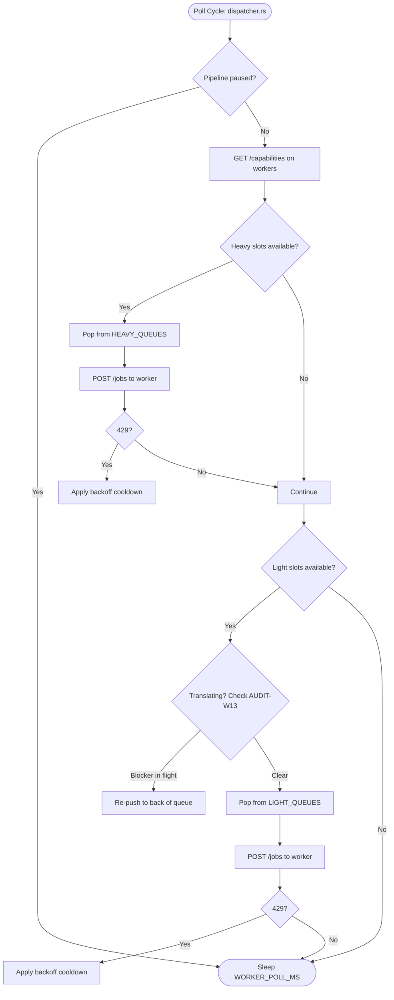

# Concurrency & Slot Allocation Guide

This document describes the design, configuration, and runtime behavior of the dual-slot concurrency model in the backend dispatcher (`backend-rust/src/jobs/dispatcher.rs`) and Python worker (`worker/src/worker/concurrency.py`).

## 1. Architecture & Rationale

Pipeline steps have distinct resource characteristics:

- **GPU-bound (Heavy) Tasks**: OCR and panel detection use local neural models (YOLO, PaddleOCR). Because GPU execution is serialized by CUDA locks, running multiple GPU tasks concurrently creates lock contention with no throughput gain.
- **I/O-bound / Network (Light) Tasks**: Translation, rendering, and QA are network API calls or CPU-bound image manipulation that scale with concurrent execution.

To prevent GPU locks from stalling network tasks, jobs are divided into **Heavy** and **Light** tiers with dedicated capacity limits.

---

## 2. Queue Classification

Queues are defined in `backend-rust/src/jobs/mod.rs`:

| Slot Type | Queues | Characteristics |
| :--- | :--- | :--- |
| **Heavy** | `queue:panel-detection` `queue:ocr` `queue:qa-re-ocr` `queue:region-redo-ocr` | Local GPU inference. Serialized by worker GPU lock. Concurrency is kept low (default `1`) to avoid lock contention. |
| **Light** | `queue:layout` `queue:translation` `queue:render` `queue:qa` `queue:region-redo-tl` | Cloud API requests and CPU text/image layout. Network-bound and parallelizable. |

---

## 3. Configuration & Environment Variables

Tuned via environment variables:

| Variable | Description | Default |
| :--- | :--- | :--- |
| `CONCURRENT_JOBS` | Maximum total concurrent jobs worker processes. | `5` |
| `MAX_HEAVY_SLOTS` | Slot allocation reserved for GPU/Heavy queues. | `1` |
| `MAX_LIGHT_SLOTS` | Slot allocation reserved for Cloud/Light queues. | `4` |
| `REUSE_IDLE_SLOTS` | When `true`, light jobs can use idle heavy slots without exceeding `CONCURRENT_JOBS`. | `true` |
| `WORKER_POLL_MS` | Dispatcher poll interval in milliseconds (`dispatcher.rs`). | `2000` |

---

## 4. Dispatch Execution Flow

The Rust dispatcher (`backend-rust/src/jobs/dispatcher.rs`) executes a polling loop every `WORKER_POLL_MS`:

### Key Dispatch Rules

1. **Independent Slot Checks**: The dispatcher queries worker capacity via `GET /capabilities` and checks heavy and light slot counts independently.
2. **Context Serialization (`AUDIT-W13`)**: Before dispatching a job from `queue:translation`, `earlier_page_is_still_translating` verifies whether an earlier page in the same chapter is currently in-flight. If so, the job is pushed to the back of the queue and dispatch pauses for that queue to avoid polluting translation context.
3. **Queue Re-push on Delay (`AUDIT-P3`)**: Undispatchable jobs are pushed back to their originating queue without blocking independent queues.
4. **429 Exponential Backoff**: When a worker answers with HTTP 429, the dispatcher applies exponential cooldown (10s base, doubling to 60s cap) before probing that worker again.
