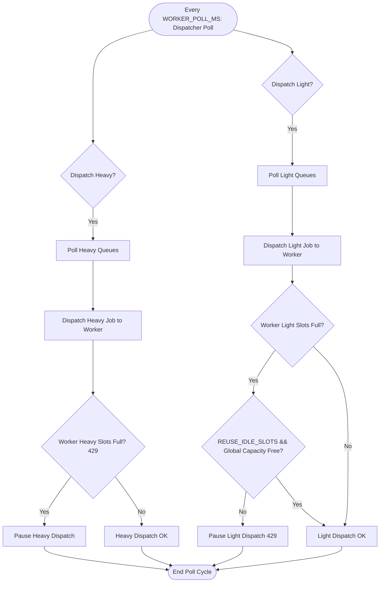

# Concurrency & Slot Allocation Guide

This document describes the design, configuration, and runtime behavior of the **dual-slot concurrency model** in the Manga Library worker and dispatcher system.

---

## 1. Overview & Rationale

Historically, the system dispatched all jobs through a single flat queue processing system. However, different steps in the translation pipeline have vastly different resource requirements:

- **GPU-bound (Heavy) Tasks**: OCR and panel-detection use local machine learning models. Because they are execution-constrained by the GPU, running multiple GPU tasks concurrently leads to resource contention and lock blocking (via the `acquire_lock` mechanisms in Python), yielding no throughput improvement.
- **I/O-bound / Network (Light) Tasks**: Translation, rendering, and QA are either cloud API calls or rapid lightweight local processes. These can easily be parallelized.

To prevent a slow/blocked heavy job from stalling light jobs (and vice versa), the system classifies jobs into two tiers—**Heavy** and **Light**—and manages them in independent concurrency slots.

---

## 2. Queue Classification

Jobs are routed to distinct Redis queues and categorized as follows:

| Slot Type | Queues | Description & Rationale |
| :--- | :--- | :--- |
| **Heavy** | `panel-detection` `ocr` `qa-re-ocr` `region-redo-ocr` | Run local GPU models (YOLO, PaddleOCR). Operations are serialized by GPU locks. Concurrency limit is typically kept low (default `1`) to avoid lock contention. |
| **Light** | `layout` `translation` `render` `qa` `region-redo-tl` | Cloud API requests or lightweight image manipulation. Network-bound and parallelizable. |

---

## 3. Configuration & Environment Variables

You can tune slot allocation using environment variables defined in the worker's environment or the `.env` file:

| Variable | Description | Default Value |
| :--- | :--- | :--- |
| `CONCURRENT_JOBS` | The maximum total number of jobs the worker can process at once. | `2` |
| `MAX_HEAVY_SLOTS` | The subset of concurrent jobs reserved for GPU/Heavy queues. | `1` |
| `MAX_LIGHT_SLOTS` | The subset of concurrent jobs reserved for Cloud/Light queues. | `CONCURRENT_JOBS - MAX_HEAVY_SLOTS` |
| `REUSE_IDLE_SLOTS` | When `true`, light jobs can use idle heavy slots for extra throughput without exceeding `CONCURRENT_JOBS`. | `true` |
| `WORKER_POLL_MS` | Backend dispatcher poll interval (milliseconds). **This is the single biggest throughput lever** — see §5. | `2000` |

### Default Slot Allocation Matrix

If `MAX_HEAVY_SLOTS` and `MAX_LIGHT_SLOTS` are not set explicitly, they default based on the value of `CONCURRENT_JOBS`:

| `CONCURRENT_JOBS` | Heavy Slots | Light Slots | Concurrency Effect |
| :---: | :---: | :---: | :--- |
| **2** | 1 | 1 | 1 local GPU job + 1 cloud/API job in parallel |
| **3** | 1 | 2 | 1 local GPU job + 2 cloud/API jobs in parallel |
| **4** | 1 | 3 | 1 local GPU job + 3 cloud/API jobs in parallel |

> [!NOTE]
> **Why default to 1 heavy slot?**
> Heavy jobs are serialized by the GPU lock (`acquire_lock("ocr")`). Running multiple heavy jobs on a single GPU setup leads to the second job blocking on the lock. Increasing `MAX_HEAVY_SLOTS` is only beneficial for multi-GPU setups or custom environments.

---

## 4. How Dispatching Works

The backend `WorkerDispatcherService` checks the worker availability and dispatches jobs:

1. **Independent Dispatch**: The dispatcher processes heavy and light queues independently.
2. **Non-Blocking 429s**: If the worker returns a `429 Too Many Requests` status because its heavy slots are full, dispatcher logic for light slots still proceeds.
3. **Idle Slot Overflow**: If `REUSE_IDLE_SLOTS` is enabled, the worker will accept light jobs beyond `MAX_LIGHT_SLOTS` as long as `CONCURRENT_JOBS` isn't exceeded, effectively reusing idle heavy slots.
4. **Failover & Isolation**: A rate limit or failure on heavy queues never delays or blocks the execution of light queues.

---

## 5. Dispatch Cadence & Throughput (why the pipeline is slow)

The dispatcher is a **push** scheduler running on a fixed interval
(`@Scheduled(fixedDelayString = "${WORKER_POLL_MS:2000}")` in
`WorkerDispatcherService.java:78`). It is **not** event-driven. This has two consequences:

1. **A free slot is only refilled at the next poll.** If a job finishes in 13s but the poll
   interval is 30s, the slot sits idle for the remaining ~17s. Every pipeline phase waits on
   average `WORKER_POLL_MS / 2` before it is dispatched.
2. **Per-poll dispatch cap.** Each cycle dispatches at most `maxHeavySlots + maxLightSlots`
   jobs (2 by default), regardless of how many queues are non-empty.

Because each image runs a strictly chained pipeline
(`panel-detection → ocr → layout → translation → render → qa`), the minimum wall-clock time
for a single image is **6 × `WORKER_POLL_MS`** — even if every job were instant.

### Measured impact (run-3-fresh.log, 304 images)

| Phase | Actual processing | Idle-wait per phase (30s poll) |
| :--- | :---: | :---: |
| panel-detection | 0.3s | up to 30s |
| ocr (CPU PaddleOCR) | 13.7s avg | up to 30s |
| layout | 0.7s | up to 30s |
| translation (LLM) | 7.4s avg | up to 30s |
| render | 2.7s | up to 30s |
| qa | 0.2s | up to 30s |

Observed throughput: ~2–3 minutes per image, of which only ~25s is real processing
(~85% of wall time is dispatch-poll waiting). No provider 429s/cooldowns and no queue
backlog were present — the poll interval is the bottleneck.

> [!IMPORTANT]
> The default poll was **2s** (`@Scheduled(fixedDelay = 2000)`) and was changed to 30s in
> commit `9c54b70` ("optimize … polling with pre-check"). The pre-check
> (`anyQueueHasItems()`, `WorkerDispatcherService.java:285`) already skips expensive
> `/capabilities` HTTP calls when queues are empty, so a fast interval is cheap.
>
> **Applied 2026-08-01: default restored to `WORKER_POLL_MS=2000`** (code default +
> `docker-compose.yml` pass-through + `.env`). This alone removes ~85% of the per-page idle
> time. A worker-pull model (see `worker_pull_model.md`) would remove the residual
> poll-boundary latency.

---

## 6. OCR & the "dedicated slot" misconception

OCR does **not** have a slot reserved exclusively for it. It shares the single **Heavy** slot
with `panel-detection`, `qa-re-ocr`, and `region-redo-ocr`. What *is* prioritized is the
**polling order** within the heavy tier: `WorkerDispatcherService.HEAVY_QUEUES` is ordered
`[qa-re-ocr, region-redo-ocr, ocr, panel-detection]`, so re-OCR and fresh OCR are popped
before panel-detection on each cycle.

In practice OCR is dispatched on the poll immediately after the preceding `panel-detection`
job completes (measured queue depth at OCR time was always `0`). If a chapter feels like OCR
is the bottleneck, it is almost always the `WORKER_POLL_MS` latency (up to 30s of idle slot
time per page), not OCR throughput. On CPU, PaddleOCR runs ~13.7s/page; cloud OCR via the
`ocrProvider` setting is available but has the same dispatch latency.
