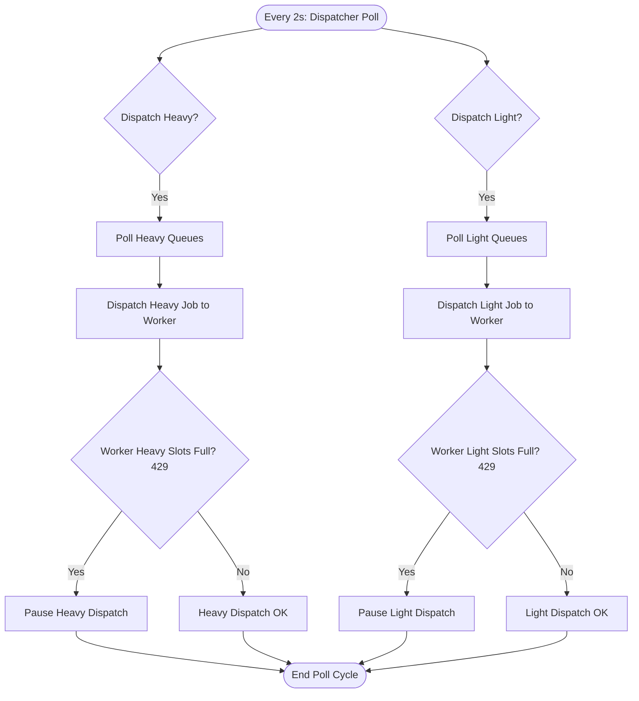

# Concurrency & Slot Allocation Guide

This document describes the design, configuration, and runtime behavior of the **dual-slot concurrency model** in the Manga Library worker and dispatcher system.

---

## 1. Overview & Rationale

Historically, the system dispatched all jobs through a single flat queue processing system. However, different steps in the translation pipeline have vastly different resource requirements:

- **GPU-bound (Heavy) Tasks**: OCR and panel-detection use local machine learning models. Because they are execution-constrained by the GPU, running multiple GPU tasks concurrently leads to resource contention and lock blocking (via the `acquire_lock` mechanisms in Python), yielding no throughput improvement.
- **I/O-bound / Network (Light) Tasks**: Translation, rendering, and QA are either cloud API calls or rapid lightweight local processes. These can easily be parallelized.

To prevent a slow/blocked heavy job from stalling light jobs (and vice versa), the system classifies jobs into two tiers—**Heavy** and **Light**—and manages them in independent concurrency slots.

---

## 2. Queue Classification

Jobs are routed to distinct Redis queues and categorized as follows:

| Slot Type | Queues | Description & Rationale |
| :--- | :--- | :--- |
| **Heavy** | `panel-detection` `ocr` `qa-re-ocr` `region-redo-ocr` | Run local GPU models (YOLO, PaddleOCR). Operations are serialized by GPU locks. Concurrency limit is typically kept low (default `1`) to avoid lock contention. |
| **Light** | `layout` `translation` `render` `qa` `region-redo-tl` | Cloud API requests or lightweight image manipulation. Network-bound and parallelizable. |

---

## 3. Configuration & Environment Variables

You can tune slot allocation using environment variables defined in the worker's environment or the `.env` file:

| Variable | Description | Default Value |
| :--- | :--- | :--- |
| `CONCURRENT_JOBS` | The maximum total number of jobs the worker can process at once. | `2` |
| `MAX_HEAVY_SLOTS` | The subset of concurrent jobs reserved for GPU/Heavy queues. | `1` |
| `MAX_LIGHT_SLOTS` | The subset of concurrent jobs reserved for Cloud/Light queues. | `CONCURRENT_JOBS - MAX_HEAVY_SLOTS` |

### Default Slot Allocation Matrix

If `MAX_HEAVY_SLOTS` and `MAX_LIGHT_SLOTS` are not set explicitly, they default based on the value of `CONCURRENT_JOBS`:

| `CONCURRENT_JOBS` | Heavy Slots | Light Slots | Concurrency Effect |
| :---: | :---: | :---: | :--- |
| **2** | 1 | 1 | 1 local GPU job + 1 cloud/API job in parallel |
| **3** | 1 | 2 | 1 local GPU job + 2 cloud/API jobs in parallel |
| **4** | 1 | 3 | 1 local GPU job + 3 cloud/API jobs in parallel |

> [!NOTE]
> **Why default to 1 heavy slot?**
> Heavy jobs are serialized by the GPU lock (`acquire_lock("ocr")`). Running multiple heavy jobs on a single GPU setup leads to the second job blocking on the lock. Increasing `MAX_HEAVY_SLOTS` is only beneficial for multi-GPU setups or custom environments.

---

## 4. How Dispatching Works

The backend `WorkerDispatcherService` checks the worker availability and dispatches jobs:

1. **Independent Dispatch**: The dispatcher processes heavy and light queues independently.
2. **Non-Blocking 429s**: If the worker returns a `429 Too Many Requests` status because its heavy slots are full, dispatcher logic for light slots still proceeds.
3. **Failover & Isolation**: A rate limit or failure on heavy queues never delays or blocks the execution of light queues.
