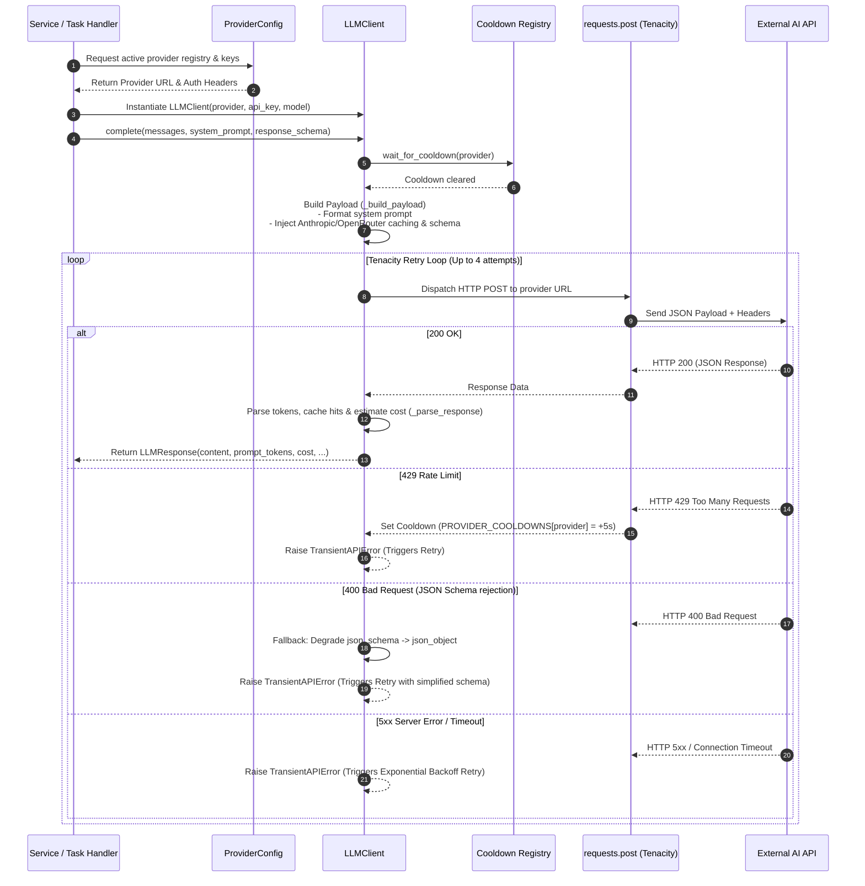

# Worker Provider Communication Architecture & Workflow

This document explains how the background worker connects to external AI/LLM providers (such as OpenAI, Anthropic, Gemini, OpenRouter, DeepSeek, Nvidia, Neurometric, etc.), packages requests, manages failovers/retries, and normalizes responses.

---

## 1. System Architecture Overview

The provider communication sub-system is decoupled into three distinct layers:

1. **Task Execution Layer**: Domain handlers (`translation.py`, `ocr.py`, `qa.py`) process RQ jobs.
2. **Client & Transport Layer**: `LLMClient` manages HTTP connections, payloads, retries, rate limits, and response normalization.
3. **Configuration & Registry Layer**: `ProviderConfigLoader` reads dynamic configurations from `providers.json` and exposes active provider metadata.

```mermaid
graph TD
    subgraph Task Handlers & Services
        TH[Handler / Service<br>e.g., translation.py, ocr.py]
    end

    subgraph Config & Registry Layer
        PJSON[config/providers.json] --> PCL[ProviderConfigLoader<br>provider_config.py]
        PCL --> REG[PROVIDER_REGISTRY]
    end

    subgraph Client & Transport Layer
        TH -->|Instantiates| Client[LLMClient<br>llm_client.py]
        REG -->|Injects Endpoints & Auth| Client
        Client --> RL[Rate Limiter & Cooldown Registry]
        RL --> Retry[Tenacity Retry Loop]
    end

    subgraph External Provider APIs
        Retry -->|HTTP POST| OR[OpenRouter API]
        Retry -->|HTTP POST| OAI[OpenAI API]
        Retry -->|HTTP POST| ANT[Anthropic API]
        Retry -->|HTTP POST| GEM[Google Gemini API]
        Retry -->|HTTP POST| OTH[Other Compatible APIs]
    end

    External Provider APIs -->|JSON Response| Client
    Client -->|Normalized LLMResponse| TH
```

---

## 2. Core Modules & Responsibilities

| Module / File | Component | Description |
| :--- | :--- | :--- |
| [`llm_client.py`](file:///home/sagnik/Projects/docker-composes/manga-library/worker/src/worker/services/llm_client.py) | `LLMClient` & `LLMResponse` | Thin HTTP client responsible for format translation, sending requests via `requests.post`, executing retries, rate limiting, and response parsing. |
| [`provider_config.py`](file:///home/sagnik/Projects/docker-composes/manga-library/worker/src/worker/provider_config.py) | `ProviderConfigLoader` | Parses `providers.json`, interpolates environment variables (API keys), filters active providers, and generates `PROVIDER_REGISTRY`. |
| [`translation.py`](file:///home/sagnik/Projects/docker-composes/manga-library/worker/src/worker/services/translation.py) | Provider Fallback Orchestrator | Iterates over prioritized list of AI providers/models, driving multi-stage translation pipelines. |
| [`ocr.py`](file:///home/sagnik/Projects/docker-composes/manga-library/worker/src/worker/services/ocr.py) | Vision OCR Service | Prepares base64 image/text payloads and invokes vision-capable provider endpoints. |

---

## 3. End-to-End Execution Sequence

The diagram below outlines the sequence of a single completion request sent from the worker to an external provider:



---

## 4. Key Mechanisms & Features

### 1. Unified Payload & Response Normalization

`LLMClient` converts generic internal prompt schemas into provider-native formats:

- **Anthropic**: Formats `system` prompt as a top-level array block with `cache_control: {"type": "ephemeral"}` and uses `max_tokens`.
- **OpenAI / Standard Compatible**: Wraps `system` prompts into the `messages` list and applies `response_format` with `json_schema` or `json_object`.

### 2. Automatic Schema Degradation

If a provider rejects a complex `json_schema` (returning HTTP 400), `LLMClient` automatically downgrades the `response_format` to `{"type": "json_object"}` and retries the request seamlessly.

### 3. Fault Tolerance & Retry Logic

- Uses **Tenacity** (`@retry`) with exponential backoff (`multiplier=2, min=2, max=30`) for transient errors (`TransientAPIError`, HTTP 429, HTTP 5xx, timeouts).
- Maintains a global `PROVIDER_COOLDOWNS` registry. If a provider issues HTTP 429, it sets a cooldown window and pauses subsequent requests to that provider.

### 4. Prompt Caching & Routing Optimization

- **OpenRouter Support**: Automatically injects prompt caching tags on system messages and supports custom routing parameters (`lowest-cost`, `highest-throughput`).
- **Session Tracking**: Propagates `session_id` to providers that support session-level cache continuity.

### 5. Cost & Usage Telemetry

Every completed request calculates total tokens, prompt token usage, completion token usage, cache hit ratio (`cached_tokens / prompt_tokens`), and estimates request cost using `estimate_cost()`.
