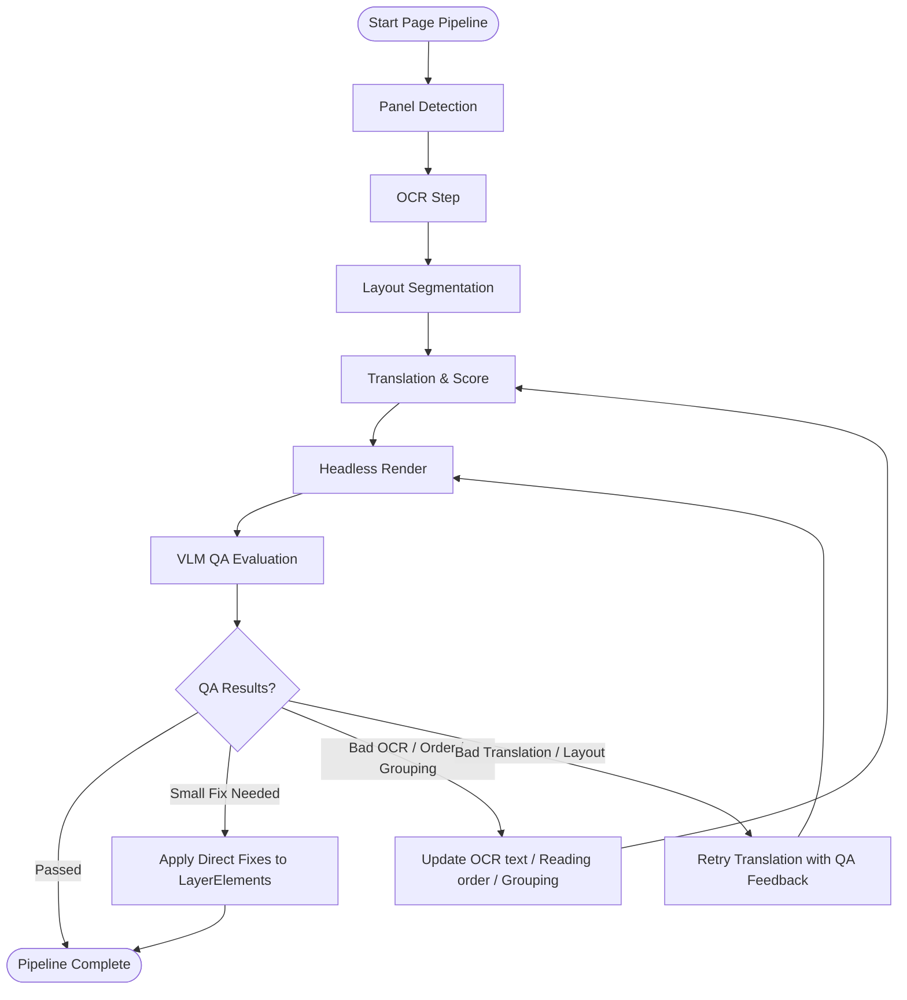

# Implementation Plan - Phase 4: Advanced VLM Processing & Quality Assurance (Updated)

This implementation plan covers the design and execution strategy for Phase 4 of the Manga Translation Platform, focusing on integrating step-by-step scores (OCR, Translation, QA), headless typesetting rendering, VLM Quality Assurance (QA) with direct/escalation feedback loops, and automated re-runs to refine text masks, layouts, and translations.

---

## User Review Required

> [!IMPORTANT]
> **Database Schema Changes**: We are adding `ocr_score`, `translation_score`, `qa_score`, `qa_feedback`, and `qa_status` to the `ocr_regions` table.
>
> **Direct Fixes vs. Full Escalations**:
> - **Direct Fixes**: For small errors (e.g., simple text overflow, minor font sizing/spacing issues), the QA VLM prescribes direct layout parameter fixes (`suggestedFontSize`, `correctedText`). These are applied directly to the database without invoking the translation loop again.
> - **Escalations**: If the QA VLM determines that the OCR text is wrong, or the conversation grouping/reading order is bad, the backend updates the source transcription or order index, then re-runs translation and rendering.

---

## Proposed Changes

We will implement this across three main components:
1. **Database Schema & Entity Models**
2. **Java Backend (Job Orchestration & Callbacks)**
3. **Python Worker (Headless Rendering, QA VLM Prompting, & Translation Scoring)**

---

### 1. Database Schema & Entity Models

We need to persist the OCR detection score (`ocr_score`), the translation score, and the visual QA evaluation results.

#### [MODIFY] [init.sql](file:///home/sagnik/Projects/docker-composes/manga-library/database/init.sql)
Add fields for tracking step-by-step scores and QA state to the `ocr_regions` table:
```sql
ALTER TABLE ocr_regions ADD COLUMN IF NOT EXISTS ocr_score FLOAT;
ALTER TABLE ocr_regions ADD COLUMN IF NOT EXISTS translation_score FLOAT;
ALTER TABLE ocr_regions ADD COLUMN IF NOT EXISTS qa_score FLOAT;
ALTER TABLE ocr_regions ADD COLUMN IF NOT EXISTS qa_feedback TEXT;
ALTER TABLE ocr_regions ADD COLUMN IF NOT EXISTS qa_status TEXT DEFAULT 'pending'; -- 'pending', 'passed', 'failed'
```

#### [MODIFY] [OcrRegion.java](file:///home/sagnik/Projects/docker-composes/manga-library/backend/src/main/java/com/manga/library/model/OcrRegion.java)
Map the new database fields to the JPA Entity:
```java
  @Column(name = "ocr_score")
  private Double ocrScore;

  @Column(name = "translation_score")
  private Double translationScore;

  @Column(name = "qa_score")
  private Double qaScore;

  @Column(name = "qa_feedback")
  private String qaFeedback;

  @Column(name = "qa_status")
  @Builder.Default
  private String qaStatus = "pending";
```

---

### 2. Java Backend (Job Orchestration)

We will update the job pipeline to support direct fixes, OCR/Layout corrections, and job retries.



#### [MODIFY] [JobCoordinatorService.java](file:///home/sagnik/Projects/docker-composes/manga-library/backend/src/main/java/com/manga/library/service/JobCoordinatorService.java)
- In `handleOcrCallback`, save both raw `confidence` and `ocrScore`:
  ```java
  region.setOcrScore(rData.getConfidence());
  ```
- In `handleTranslationCallback`, extract `translationScore` from the payload and save it:
  ```java
  Double translationScore = t.get("translationScore") != null ? ((Number) t.get("translationScore")).doubleValue() : null;
  region.setTranslationScore(translationScore);
  ```
- Change `handleTranslationCallback` to enqueue a `render` job next (it currently runs `render` as a stub).
- Replace `handleRenderCallback` to enqueue a `qa` job:
  ```java
  @Transactional
  public void handleRenderCallback(UUID imageId) {
      log.info("Render completed for image {}. Triggering QA review...", imageId);
      enqueueJob("qa", imageId);
  }
  ```
- Implement `handleQaCallback(UUID imageId, List<Map<String, Object>> qaResults)`:
  - For each region:
    - Save `qaScore`, `qaFeedback`, and `qaStatus` (e.g. `"passed"`, `"failed"`, `"fixed"`).
    - If a region has a direct cosmetic fix in the payload (e.g., `suggestedFontSize` or `correctedText` due to minor spacing/wrapping issues):
      - Update the corresponding `LayerElement` in the translation layer with the new values.
      - Mark the region's `qaStatus` as `"fixed"`.
    - If a region has a structural failure (e.g., bad OCR, incorrect grouping, or incorrect reading order):
      - Mark the region's `qaStatus` as `"failed"`.
      - If it is bad OCR: update the `OcrRegion.text` with the VLM's suggested source text.
      - If it is bad ordering or grouping: update `bubbleReadingOrder` or the region's conversation relationship to match the VLM's correction.
  - Evaluate total failures:
    - If structural failures or bad translation retries exist, and `retries < 2`:
      - Increment the retry counter.
      - Re-enqueue the `translation` job, passing the corrected text, updated reading order, and `qaFeedback`.
    - If all regions are `"passed"` or `"fixed"` (or `retries >= 2`):
      - Finalize the layout, clean up temp retry keys, and mark the pipeline as completed.

#### [MODIFY] [InternalJobController.java](file:///home/sagnik/Projects/docker-composes/manga-library/backend/src/main/java/com/manga/library/controller/InternalJobController.java)
- Add endpoints for worker callbacks:
  - `POST /api/internal/jobs/callback/qa` mapping to `JobCoordinatorService.handleQaCallback`.
- Expose the new fields in `getImageInfo` so the worker receives the previous OCR confidence, translation scores, and any `qaFeedback` from prior iterations when processing retries.

---

### 3. Python Worker

We will update the workers to implement translation self-scoring, headless rendering, and the VLM QA review pass.

#### [MODIFY] [app.py](file:///home/sagnik/Projects/docker-composes/manga-library/unified-workers/app.py)
- Register `queue:qa` and map it to `process_qa`.
- Map `queue:render` to the new rendering implementation `process_render`.

#### [MODIFY] [translation.py](file:///home/sagnik/Projects/docker-composes/manga-library/unified-workers/worker/services/translation.py)
- Add `"translationScore"` (type: number, minimum: 0, maximum: 1) to `TRANSLATION_JSON_SCHEMA`.
- Update system/user prompts to instruct the translation models (standard LLM & VLM) to output a `translationScore` based on coherence, fluency, and translation accuracy.
- When generating translation prompts for retries, append the `qaFeedback` to the prompt:
  ```markdown
  This region failed visual QA check in the previous pass:
  - Previous Translation: "{prev_translation}"
  - QA Feedback: "{qa_feedback}"
  Please adjust the translation to resolve the issues (e.g., shorten it if it overflowed, or clarify tone).
  ```

#### [NEW] [render.py](file:///home/sagnik/Projects/docker-composes/manga-library/unified-workers/worker/handlers/render.py)
Implement `process_render(job_data)`:
- Download the base image.
- Retrieve the layer elements configured for the page.
- Using Pillow (`PIL.Image`, `PIL.ImageDraw`, `PIL.ImageFont`):
  - **Masking**: Render background masks over speech bubble coordinates using the detected `backgroundColor` to cleanly mask the original text. Support contour/elliptical shaping.
  - **Typesetting**: Draw the translated text layers within their bounding boxes. Read the `fontWeight`, `fontStyle`, and calculate automatic scaling to ensure text fits, respecting `wordWrap` configurations.
- Upload the rendered typeset image back to MinIO (e.g. at `rendered/{imageId}.png`).
- Send callback `POST /api/internal/jobs/callback/render` to the Java backend.

#### [NEW] [qa.py](file:///home/sagnik/Projects/docker-composes/manga-library/unified-workers/worker/handlers/qa.py)
Implement `process_qa(job_data)`:
- Download both the base image and the rendered typeset image.
- Retrieve region data: OCR `ocr_score` (detection score) and `translationScore` (translation score).
- Formulate a multimodal VLM payload sending the base image, the typeset image, and metadata:
  ```markdown
  Analyze these two manga page images: the original raw image and the rendered English typeset image.
  
  Evaluate the quality of the English typesetting and translation. We have seeded each text region with its OCR confidence and translation confidence scores. Evaluate the overall page keeping these scores in mind.
  
  Check for:
  1. Text clipping/cutoff at speech bubble or box boundaries.
  2. Overlapping text lines or text boxes.
  3. Text formatting (size, style) alignment relative to the context.
  4. Poor translation quality or awkward flow.
  5. OCR accuracy or reading order issues.
  
  Return your review as a JSON object matching the schema:
  {
    "results": [
      {
        "regionId": "string",
        "qaStatus": "passed" | "failed" | "direct_fix",
        "qaScore": number (0.0 to 1.0),
        "qaFeedback": "Reason for status or details on what needs correction.",
        "directFix": {
          "correctedText": "string (optional: simple text wrap / correction)",
          "suggestedFontSize": number (optional: modified font size)"
        },
        "escalation": {
          "ocrBad": boolean (optional: true if OCR source text is wrong),
          "correctedSourceText": "string (optional: correct Japanese transcription)",
          "orderBad": boolean (optional: true if reading order / conversation grouping is wrong),
          "suggestedReadingOrderIndex": number (optional: corrected bubble order index)
        }
      }
    ]
  }
  ```
- Send payload to Gemini (using `gemini-1.5-flash` or the preferred VLM).
- Send the evaluation results back to the Java backend callback `POST /api/internal/jobs/callback/qa`.

---

## Verification Plan

### Automated Tests
- Create unit tests in Java (`JobCoordinatorServiceTest.java`) to verify the orchestration logic, QA callbacks, direct cosmetic fixes, OCR/Layout escalations, and transition to retry status.
- Create tests in python (`unified-workers/tests/test_qa_feedback_loop.py`) verifying that the translation service correctly handles `qaFeedback` and escalations.

### Manual Verification
- Upload a manga page containing large dialogue bubbles.
- Induce a failure by mocking a low-quality translation or text overflow, verifying that the VLM QA identifies the issue:
  - If a small size/overflow error: check that a `direct_fix` updates the size automatically.
  - If a structural/OCR error: check that an `escalation` triggers a retry loop, adjusts the text/translation, and produces final masks.
- Verify in the workspace that the layers render cleanly and the QA statuses are highlighted correctly.
